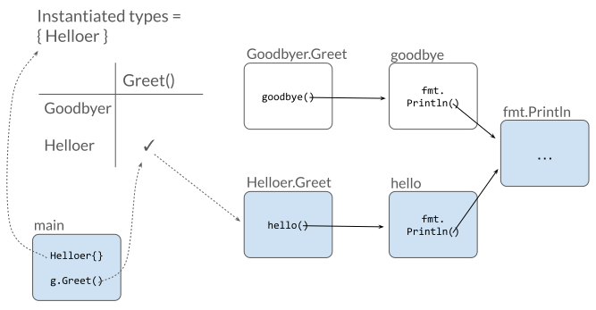

Functions that are part of your project's source code but can never be
reached in any execution are called "dead code", and they exert a drag
on codebase maintenance efforts.
Today we're pleased to share a tool named `deadcode` to help you identify them.

```
$ go install golang.org/x/tools/cmd/deadcode@latest
$ deadcode -help
The deadcode command reports unreachable functions in Go programs.

Usage: deadcode [flags] package...
```

## Example

Over the last year or so, we've been making a lot of changes to the
structure of [gopls](/blog/gopls-scalability), the
language server for Go that powers VS Code and other editors.
A typical change might rewrite some existing function, taking care to
ensure that its new behavior satisfies the needs of all existing callers.
Sometimes, after putting in all that effort, we would discover to our
frustration that one of the callers was never actually reached in any
execution, so it could safely have been deleted.
If we had known this beforehand our refactoring task would have been
easier.

The simple Go program below illustrates the problem:

```
module example.com/greet
go 1.21
```

```
package main

import "fmt"

func main() {
	var g Greeter
	g = Helloer{}
	g.Greet()
}

type Greeter interface{ Greet() }

type Helloer struct{}
type Goodbyer struct{}

var _ Greeter = Helloer{}  // Helloer  implements Greeter
var _ Greeter = Goodbyer{} // Goodbyer implements Greeter

func (Helloer) Greet()  { hello() }
func (Goodbyer) Greet() { goodbye() }

func hello()   { fmt.Println("hello") }
func goodbye() { fmt.Println("goodbye") }
```

When we execute it, it says hello:

```
$ go run .
hello
```

It's clear from its output that this program executes the `hello`
function but not the `goodbye` function.
What's less clear at a glance is that the `goodbye` function can
never be called.
However, we can't simply delete `goodbye`, because it's required by the
`Goodbyer.Greet` method, which in turn is required to implement the
`Greeter` interface whose `Greet` method we can see is called from `main`.
But if we work forwards from main, we can see that no `Goodbyer` values
are ever created, so the `Greet` call in `main` can only reach `Helloer.Greet`.
That's the idea behind the algorithm used by the `deadcode` tool.

When we run deadcode on this program, the tool tells us that the
`goodbye` function and the `Goodbyer.Greet` method are both unreachable:

```
$ deadcode .
greet.go:23: unreachable func: goodbye
greet.go:20: unreachable func: Goodbyer.Greet
```

With this knowledge, we can safely remove both functions,
along with the `Goodbyer` type itself.

The tool can also explain why the `hello` function is live. It responds
with a chain of function calls that reaches `hello`, starting from main:

```
$ deadcode -whylive=example.com/greet.hello .
                  example.com/greet.main
dynamic@L0008 --> example.com/greet.Helloer.Greet
 static@L0019 --> example.com/greet.hello
```

The output is designed to be easy to read on a terminal, but you can
use the `-json` or `-f=template` flags to specify richer output formats for
consumption by other tools.

## How it works

The `deadcode` command
[loads](https://pkg.go.dev/golang.org/x/tools/go/packages),
[parses](https://pkg.go.dev/go/parser),
and [type-checks](https://pkg.go.dev/go/types) the specified packages,
then converts them into an
[intermediate representation](https://pkg.go.dev/golang.org/x/tools/go/ssa)
similar to a typical compiler.

It then uses an algorithm called
[Rapid Type Analysis](https://pkg.go.dev/golang.org/x/tools/go/callgraph/rta) (RTA)
to build up the set of functions that are reachable,
which is initially just the entry points of each `main` package:
the `main` function,
and the package initializer function,
which assigns global variables and calls functions named `init`.

RTA looks at the statements in the body of each reachable function to
gather three kinds of information: the set of functions it calls directly;
the set of dynamic calls it makes through interface methods;
and the set of types it converts to an interface.

Direct function calls are easy: we just add the callee to the set of
reachable functions, and if it's the first time we've encountered the
callee, we inspect its function body the same way we did for main.

Dynamic calls through interface methods are trickier, because we don't
know the set of types that implement the interface. We don't want
to assume that every possible method in the program whose type matches
is a possible target for the call, because some of those types may
be instantiated only from dead code! That's why we gather the set of
types converted to interfaces: the conversion makes each of these
types reachable from `main`, so that its methods are now possible
targets of dynamic calls.

This leads to a chicken-and-egg situation. As we encounter each new
reachable function, we discover more interface method calls and more
conversions of concrete types to interface types.
But as the cross product of these two sets (interface method calls ×
concrete types) grows ever larger, we discover new reachable
functions.
This class of problems, called "dynamic programming", can be solved by
(conceptually) making checkmarks in a large two-dimensional table,
adding rows and columns as we go, until there are no more checks to
add. The checkmarks in the final table tells us what is reachable;
the blank cells are the dead code.

<!--
  Source:
  https://docs.google.com/presentation/d/1DH6Ycdqpt-Zel88lINAuudA6cp0e64ILfHOJq8hJ3v8
  Exported using "File > Download > SVG"
  Cropped using Inkscape "Edit > Resize Page to Selection"
-->  
<div class="image">
<center>
  <br/>  <i>
   The <code>main</code> function causes <code>Helloer</code> to be
   instantiated, and the <code>g.Greet</code> call<br/>
   dispatches to the <code>Greet</code> method of each type instantiated so far.
  </i>
</center>
</div>

Dynamic calls to (non-method) functions are treated similar to
interfaces of a single method.
And calls made [using reflection](https://pkg.go.dev/reflect#Value.Call)
are considered to reach any method of any type used in an interface
conversion, or any type derivable from one using the `reflect` package.
But the principle is the same in all cases.


## Tests

RTA is a whole-program analysis. That means it always starts from a
main function and works forward: you can't start from a library
package such as `encoding/json`.

However, most library packages have tests, and tests have main
functions. We don't see them because they are generated behind the
scenes of `go test`, but we can include them in the analysis using the
`-test` flag.

If this reports that a function in a library package is dead, that's
a sign that your test coverage could be improved.
For example, this command lists all the functions in `encoding/json`
that are not reached by any of its tests:

```
$ deadcode -test -filter=encoding/json encoding/json
encoding/json/decode.go:150:31: unreachable func: UnmarshalFieldError.Error
encoding/json/encode.go:225:28: unreachable func: InvalidUTF8Error.Error
```

(The `-filter` flag restricts the output to packages matching the
regular expression. By default, the tool reports all packages in the
initial module.)


## Soundness

All static analysis tools
[necessarily](https://en.wikipedia.org/wiki/Rice%27s_theorem)
produce imperfect approximations of the possible dynamic
behaviors of the target program.
A tool's assumptions and inferences may be "sound", meaning
conservative but perhaps overly cautious, or "unsound", meaning
optimistic but not always correct.

The deadcode tool is no exception: it must approximate the set of
targets of dynamic calls through function and interface values or
using reflection.
In this respect, the tool is sound. In other words, if it reports a
function as dead code, it means the function cannot be called even
through these dynamic mechanisms. However the tool may fail to report
some functions that in fact can never be executed.

The deadcode tool must also approximate the set of calls made from
functions not written in Go, which it cannot see.
In this respect, the tool is not sound.
Its analysis is not aware of functions called exclusively from
assembly code, or of the aliasing of functions that arises from
the [`go:linkname` directive](https://pkg.go.dev/cmd/compile#hdr-Compiler_Directives).
Fortunately both of these features are rarely used outside the Go runtime.

## Try it out

We run `deadcode` periodically on our projects, especially after
refactoring work, to help identify parts of the program that are no
longer needed.

With the dead code laid to rest, you can focus on eliminating code
whose time has come to an end but that stubbornly remains alive,
continuing to drain your life force. We call such undead functions
"vampire code"!

Please try it out:

```
$ go install golang.org/x/tools/cmd/deadcode@latest
```

We've found it useful, and we hope you do too.
