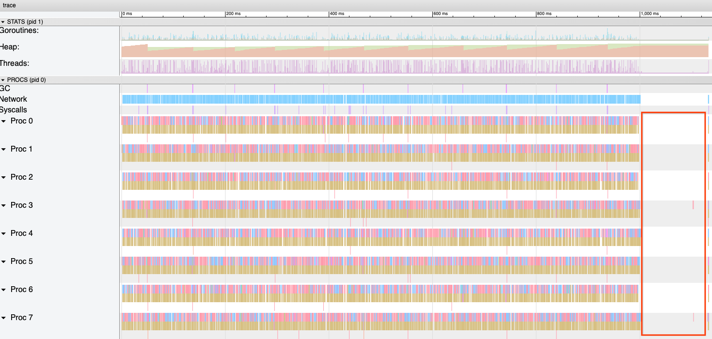
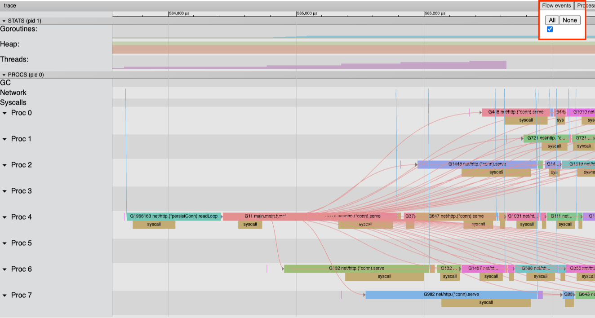
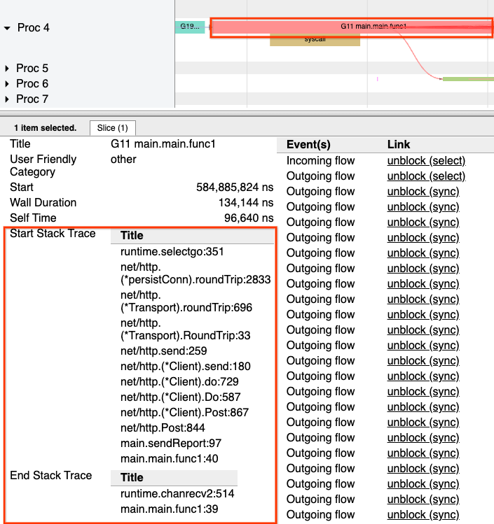
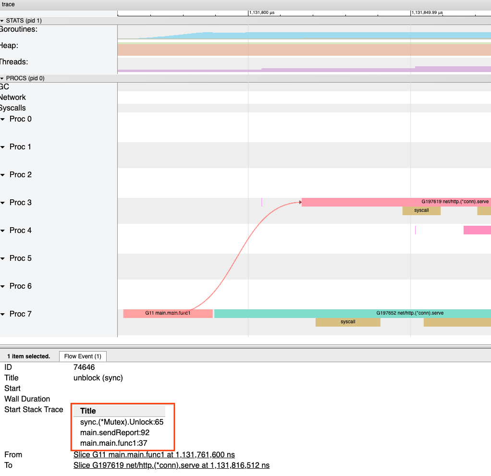

In 2024 we introduced the world to
[more powerful Go execution traces](/blog/execution-traces-2024). In that blog post
we gave a sneak peek into some of the new functionality we could unlock with our new execution
tracer, including *flight recording*. We're happy to announce that flight recording is now
available in Go 1.25, and it's a powerful new tool in the Go diagnostics toolbox.

## Execution traces

First, a quick recap on Go execution traces.

The Go runtime can be made to write a log recording many of the events that happen during
the execution of a Go application. That log is called a runtime execution trace.
Go execution traces contain a plethora of information about how goroutines interact with each
other and the underlying system. This makes them very handy for debugging latency issues, since
they tell you both when your goroutines are executing, and crucially, when they are not.

The [runtime/trace](/pkg/runtime/trace) package provides an API for collecting
an execution trace over a given time window by calling `runtime/trace.Start` and `runtime/trace.Stop`.
This works well if the code you're tracing is just a test, microbenchmark, or command line
tool. You can collect a trace of the complete end-to-end execution, or just the parts you care about.

However, in long-running web services, the kinds of applications Go is known for, that's not
good enough. Web servers might be up for days or even weeks, and collecting a trace of the
entire execution would produce far too much data to sift through. Often just one part
of the program's execution goes wrong, like a request timing out or a failed health
check. By the time it happens it's already too late to call `Start`!

One way to approach this problem is to randomly sample execution traces from across the fleet.
While this approach is powerful, and can help find issues before they become outages, it
requires a lot of infrastructure to get going. Large quantities of execution trace data
would need to be stored, triaged, and processed, much of which won't contain anything
interesting at all. And when you're trying to get to the bottom of a specific issue,
it's a non-starter.

## Flight recording

This brings us to the flight recorder.

A program often knows when something has gone wrong, but the root cause may have happened
long ago. The flight recorder lets you collect a trace of the last few seconds of
execution leading up to the moment a program detects there's been a problem.

The flight recorder collects the execution trace as normal, but instead of writing it out to
a socket or a file, it buffers the last few seconds of the trace in memory. At any point,
the program can request the contents of the buffer and snapshot exactly the problematic
window of time. The flight recorder is like a scalpel cutting directly to the problem area.

## Example

Let's learn how to use the flight recorder with an example. Specifically, let's use it to
diagnose a performance problem with an HTTP server that implements a "guess the number" game.
It exposes a `/guess-number` endpoint that accepts an integer and responds to the caller
informing them if they guessed the right number. There is also a goroutine that, once per
minute, sends a report of all the guessed numbers to another service via an HTTP request.

{{raw `
	// bucket is a simple mutex-protected counter.
	type bucket struct {
		mu      sync.Mutex
		guesses int
	}

	func main() {
		// Make one bucket for each valid number a client could guess.
		// The HTTP handler will look up the guessed number in buckets by
		// using the number as an index into the slice.
		buckets := make([]bucket, 100)

		// Every minute, we send a report of how many times each number was guessed.
		go func() {
			for range time.Tick(1 * time.Minute) {
				sendReport(buckets)
			}
		}()

		// Choose the number to be guessed.
		answer := rand.Intn(len(buckets))

		http.HandleFunc("/guess-number", func(w http.ResponseWriter, r *http.Request) {
			start := time.Now()

			// Fetch the number from the URL query variable "guess" and convert it
			// to an integer. Then, validate it.
			guess, err := strconv.Atoi(r.URL.Query().Get("guess"))
			if err != nil || !(0 <= guess && guess < len(buckets)) {
				http.Error(w, "invalid 'guess' value", http.StatusBadRequest)
				return
			}

			// Select the appropriate bucket and safely increment its value.
			b := &buckets[guess]
			b.mu.Lock()
			b.guesses++
			b.mu.Unlock()

			// Respond to the client with the guess and whether it was correct.
			fmt.Fprintf(w, "guess: %d, correct: %t", guess, guess == answer)

			log.Printf("HTTP request: endpoint=/guess-number guess=%d duration=%s", guess, time.Since(start))
		})
		log.Fatal(http.ListenAndServe(":8090", nil))
	}

	// sendReport posts the current state of buckets to a remote service.
	func sendReport(buckets []bucket) {
		counts := make([]int, len(buckets))

		for index := range buckets {
			b := &buckets[index]
			b.mu.Lock()
			defer b.mu.Unlock()

			counts[index] = b.guesses
		}

		// Marshal the report data into a JSON payload.
		b, err := json.Marshal(counts)
		if err != nil {
			log.Printf("failed to marshal report data: error=%s", err)
			return
		}
		url := "http://localhost:8091/guess-number-report"
		if _, err := http.Post(url, "application/json", bytes.NewReader(b)); err != nil {
			log.Printf("failed to send report: %s", err)
		}
	}
`}}

Here is the full code for the server:
[https://go.dev/play/p/rX1eyKtVglF](/play/p/rX1eyKtVglF), and for a simple client:
[https://go.dev/play/p/2PjQ-1ORPiw](/play/p/2PjQ-1ORPiw). To avoid a third
process, the "client" also implements the report server, though in a real system this would
be separate.

Let's suppose that after deploying the application in production, we received complaints from
users that some `/guess-number` calls were taking longer than expected. When we look at our
logs, we see that sometimes response times exceed 100 milliseconds, while the majority of calls
are on the order of microseconds.

```
2025/09/19 16:52:02 HTTP request: endpoint=/guess-number guess=69 duration=625ns
2025/09/19 16:52:02 HTTP request: endpoint=/guess-number guess=62 duration=458ns
2025/09/19 16:52:02 HTTP request: endpoint=/guess-number guess=42 duration=1.417µs
2025/09/19 16:52:02 HTTP request: endpoint=/guess-number guess=86 duration=115.186167ms
2025/09/19 16:52:02 HTTP request: endpoint=/guess-number guess=0 duration=127.993375ms
```

Before we continue, take a minute and see if you can spot what's wrong!

Regardless of whether you found the problem or not, let's dive deeper and see how we can
find the problem from first principles. In particular, it would be great if we could see
what the application was doing in the time leading up to the slow response. This is exactly
what the flight recorder was built for! We'll use it to capture an execution trace once
we see the first response exceeding 100 milliseconds.

First, in `main`, we'll configure and start the flight recorder:

{{raw `
	// Set up the flight recorder
	fr := trace.NewFlightRecorder(trace.FlightRecorderConfig{
		MinAge:   200 * time.Millisecond,
		MaxBytes: 1 << 20, // 1 MiB
	})
	fr.Start()
`}}

`MinAge` configures the duration for which trace data is reliably retained, and we
suggest setting it to around 2x the time window of the event. For example, if you
are debugging a 5-second timeout, set it to 10 seconds. `MaxBytes` configures the
size of the buffered trace so you don't blow up your memory usage.  On average,
you can expect a few MB of trace data to be produced per second of execution,
or 10 MB/s for a busy service.

Next, we'll add a helper function to capture the snapshot and write it to a file:

{{raw `
	var once sync.Once

	// captureSnapshot captures a flight recorder snapshot.
	func captureSnapshot(fr *trace.FlightRecorder) {
		// once.Do ensures that the provided function is executed only once.
		once.Do(func() {
			f, err := os.Create("snapshot.trace")
			if err != nil {
				log.Printf("opening snapshot file %s failed: %s", f.Name(), err)
				return
			}
			defer f.Close() // ignore error

			// WriteTo writes the flight recorder data to the provided io.Writer.
			_, err = fr.WriteTo(f)
			if err != nil {
				log.Printf("writing snapshot to file %s failed: %s", f.Name(), err)
				return
			}

			// Stop the flight recorder after the snapshot has been taken.
			fr.Stop()
			log.Printf("captured a flight recorder snapshot to %s", f.Name())
		})
	}
`}}

And finally, just before logging a completed request, we'll trigger the snapshot if the request
took more than 100 milliseconds:

```go
// Capture a snapshot if the response takes more than 100ms.
// Only the first call has any effect.
if fr.Enabled() && time.Since(start) > 100*time.Millisecond {
	go captureSnapshot(fr)
}
```

Here's the full code for the server, now instrumented with the flight recorder:
[https://go.dev/play/p/3V33gfIpmjG](/play/p/3V33gfIpmjG)

Now, we run the server again and send requests until we get a slow request that triggers a
snapshot.

Once we've gotten a trace, we'll need a tool that will help us examine it. The Go toolchain
provides a built-in execution trace analysis tool via the
[`go tool trace` command](https://pkg.go.dev/cmd/trace). Run `go tool trace snapshot.trace` to
launch the tool, which starts a local web server, then open the displayed URL in your browser
(if the tool doesn't open your browser automatically).

This tool gives us a few ways to look at the trace, but let's focus on visualizing the trace
to get a sense of what's going on. Click "View trace by proc" to do so.

In this view, the trace is presented as a timeline of events. At the top of the page, in
the "STATS" section, we can see a summary of the application's state, including the
number of threads, the heap size, and the goroutine count.

Below that, in the "PROCS" section, we can see how the execution of goroutines is mapped
onto `GOMAXPROCS` (the number of operating system threads created by the Go application). We
can see when and how each goroutine starts, runs, and finally stops executing.

For now, let's turn our attention to this massive gap in execution on the right side of the
viewer. For a period of time, around 100ms, nothing is happening!

<a href="flight-recorder/flight_recorder_1.png"></a>

By selecting the `zoom` tool (or pressing `3`), we can inspect the section of the trace right
after the gap with more detail.

<a href="flight-recorder/flight_recorder_2.png"></a>

In addition to the activity of each individual goroutine, we can see how goroutines interact
via "flow events." An incoming flow event indicates what happened to make a goroutine start
running. An outgoing flow edge indicates what effect one goroutine had on another. Enabling the
visualization of all flow events often provides clues that hint at the source of a problem.

<a href="flight-recorder/flight_recorder_3.png"></a>

In this case, we can see that many of the goroutines have a direct connection to a single
goroutine right after the pause in activity.

Clicking on the single goroutine shows an event table filled with outgoing flow events, which
matches what we saw when the flow view was enabled.

What happened when this goroutine ran? Part of the information stored in the trace is a view
of the stack trace at different points in time. When we look at the goroutine we can see that
the start stack trace shows that it was waiting for the HTTP request to complete when the
goroutine was scheduled to run. And the end stack trace shows that the `sendReport` function
had already returned and it was waiting for the ticker for the next scheduled time to send
the report.

<a href="flight-recorder/flight_recorder_4.png"></a>

Between the start and the end of this goroutine running, we see a huge number of
"outgoing flows," where it interacts with other goroutines. Clicking on one of the
`Outgoing flow` entries takes us to a view of the interaction.

<a href="flight-recorder/flight_recorder_5.png"></a>

This flow implicates the `Unlock` in `sendReport`:

```go
for index := range buckets {
	b := &buckets[index]
	b.mu.Lock()
	defer b.mu.Unlock()

	counts[index] = b.guesses
}
```

In `sendReport`, we intended to acquire a lock on each bucket and release the lock after
copying the value.

But here's the problem: we don't actually release the lock immediately after copying the
value contained in `bucket.guesses`. Because we used a `defer` statement to release the
lock, that release doesn't happen until the function returns. We hold the lock not just
past the end of the loop, but until after the HTTP request completes. That's a subtle
error that may be difficult to track down in a large production system.

Fortunately, execution tracing helped us pinpoint the problem. However, if we tried
to use the execution tracer in a long-running server without the new flight-recording
mode, it would likely amass a huge amount of execution trace data, which an operator
would have to store, transmit, and sift through. The flight recorder gives us the power
of hindsight. It lets us capture just what went wrong, after it's already happened,
and quickly zero in on the cause.

The flight recorder is just the latest addition to the Go developer's toolbox for
diagnosing the inner workings of running applications. We've steadily been improving
tracing over the past couple of releases. Go 1.21 greatly reduced the run-time overhead
of tracing. The trace format became more robust and also splittable in the Go 1.22
release, leading to features like the flight recorder. Open-source tools like
[gotraceui](https://gotraceui.dev/), and the [forthcoming ability to programmatically
parse execution traces](/issue/62627) are more ways to leverage the power of
execution traces. The [Diagnostics page](/doc/diagnostics) lists many additional
tools at your disposal. We hope you make use of them as you write and refine
your Go applications.

## Thanks

We'd like to take a moment to thank those community members who have been active in the
diagnostics meetings, contributed to the designs, and provided feedback over the years:
Felix Geisendörfer ([@felixge.de](https://bsky.app/profile/felixge.de)),
Nick Ripley ([@nsrip-dd](https://github.com/nsrip-dd)),
Rhys Hiltner ([@rhysh](https://github.com/rhysh)),
Dominik Honnef ([@dominikh](https://github.com/dominikh)),
Bryan Boreham ([@bboreham](https://github.com/bboreham)),
and PJ Malloy ([@thepudds](https://github.com/thepudds)).

The discussions, feedback, and work you've all put in have been instrumental in pushing
us to a better diagnostics future. Thank you!