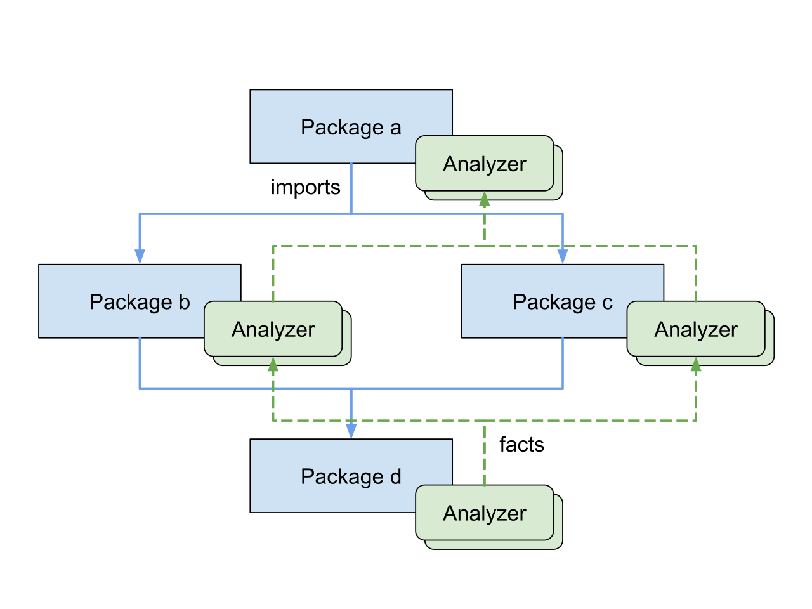

<style>
.beforeafter {
  display: grid;
  font-size: 180%;
  grid-template-columns: 1fr 2em 1fr;
  @media screen and (max-width: 57.7rem) {
    grid-template-columns: 1fr;
  }
}
.beforeafter-arrow {
  place-self: center;
}
.beforeafter-arrow::before {
  content: "⟶";
  @media screen and (max-width: 57.7rem) {
    content: "⇓";
  }
}
</style>


The 1.26 release of Go this month includes a completely rewritten go fix subcommand. Go fix uses a suite of algorithms to identify opportunities to improve your code, often by taking advantage of more modern features of the language and library. In this post, we’ll first show you how to use `go fix` to modernize your Go codebase. Then in the [second section](#go/analysis) we’ll dive into the infrastructure behind it and how it is evolving. Finally, we’ll present the theme of [“self-service”](#self-service) analysis tools to help module maintainers and organizations encode their own guidelines and best practices.

<!-- see https://go.dev/blog/survey2025#challenges -->

## Running go fix

The `go fix` command, like `go build` and `go vet`, accepts a set of patterns that denote packages. This command fixes all packages beneath the current directory:
```
$ go fix ./...
```
On success, it silently updates your source files. It discards any fix that touches [generated files](https://pkg.go.dev/cmd/go#hdr-Generate_Go_files_by_processing_source) since the appropriate fix in that case is to the logic of the generator itself. We recommend running `go fix` over your project each time you update your build to a newer Go toolchain release. Since the command may fix hundreds of files, start from a clean git state so that the change consists only of edits from go fix; your code reviewers will thank you.

To preview the changes the above command would have made, use the `-diff` flag:
```
$ go fix -diff ./...
--- dir/file.go (old)
+++ dir/file.go (new)
-                       eq := strings.IndexByte(pair, '=')
-                       result[pair[:eq]] = pair[1+eq:]
+                       before, after, _ := strings.Cut(pair, "=")
+                       result[before] = after
…
```

You can list the available fixers by running this command:
```
$ go tool fix help
…
Registered analyzers:
    any          replace interface{} with any
    buildtag     check //go:build and // +build directives
    fmtappendf   replace []byte(fmt.Sprintf) with fmt.Appendf
    forvar       remove redundant re-declaration of loop variables
    hostport     check format of addresses passed to net.Dial
    inline       apply fixes based on 'go:fix inline' comment directives
    mapsloop     replace explicit loops over maps with calls to maps package
    minmax       replace if/else statements with calls to min or max
…
```

Adding the name of a particular analyzer shows its complete documentation:
```
$ go tool fix help forvar

forvar: remove redundant re-declaration of loop variables

The forvar analyzer removes unnecessary shadowing of loop variables.
Before Go 1.22, it was common to write `for _, x := range s { x := x ... }`
to create a fresh variable for each iteration. Go 1.22 changed the semantics
of `for` loops, making this pattern redundant. This analyzer removes the
unnecessary `x := x` statement.

This fix only applies to `range` loops.
```
By default, the `go fix` command runs all analyzers. When fixing a large project it may reduce the burden of code review if you apply fixes from the most prolific analyzers as separate code changes. To enable only specific analyzers, use the flags matching their names. For example, to run just the `any` fixer, specify the `-any` flag. Conversely, to run all the analyzers *except* selected ones, negate the flags, for instance `-any=false`.

As with `go build` and `go vet`, each run of the `go fix` command analyzes only a specific build configuration. If your project makes heavy use of files tagged for different CPUs or platforms, you may wish to run the command more than once with different values of `GOARCH` and `GOOS` for better coverage:
```
$ GOOS=linux   GOARCH=amd64 go fix ./...
$ GOOS=darwin  GOARCH=arm64 go fix ./...
$ GOOS=windows GOARCH=amd64 go fix ./...
```
Running the command more than once also provides opportunities for synergistic fixes, as we’ll see below.

### Modernizers

The introduction of [generics](intro-generics) in Go 1.18 marked the end of an era of very few changes to the language spec and the start of a period of more rapid—though still careful—change, especially in the libraries. Many of the trivial loops that Go programmers routinely write, such as to gather the keys of a map into a slice, can now be conveniently expressed as a call to a generic function such as [`maps.Keys`](https://pkg.go.dev/maps#Keys). Consequently these new features create many opportunities to simplify existing code.

In December 2024, during the frenzied adoption of LLM coding assistants, we became aware that such tools tended—unsurprisingly—to produce Go code in a style similar to the mass of Go code used during training, even when there were newer, better ways to express the same idea. Less obviously, the same tools often refused to use the newer ways even when directed to do so in general terms such as “always use the latest idioms of Go 1.25.” In some cases, even when explicitly told to use a feature, the model would deny that it existed. (See my 2025 GopherCon [talk](https://www.youtube.com/watch?v=_VePjjjV9JU&t=3m50s) for more exasperating details.) To ensure that future models are trained on the latest idioms, we need to ensure that these idioms are reflected in the training data, which is to say the global corpus of open-source Go code.

Over the past year, we have built [dozens of analyzers](https://pkg.go.dev/golang.org/x/tools/go/analysis/passes/modernize) to identify opportunities for modernization. Here are three examples of the fixes they suggest:

**minmax** replaces an `if` statement by a use of Go 1.21’s `min` or `max` functions:

<div class="beforeafter">
<pre>
x := f()
if x &lt; 0 {
	x = 0
}
if x > 100 {
	x = 100
}
</pre>
<div class="beforeafter-arrow"></div>
<pre>
x := min(max(f(), 0), 100)
</pre>
</div>

**rangeint** replaces a 3-clause `for` loop by a Go 1.22 `range`-over-int loop:

<div class="beforeafter">
<pre>
for i := 0; i &lt; n; i++ {
	f()
}
</pre>
<div class="beforeafter-arrow"></div>
<pre>
for range n {
	f()
}
</pre>
</div>

**stringscut** (whose `-diff` output we saw earlier) replaces uses of `strings.Index` and slicing by Go 1.18’s `strings.Cut`:

<div class="beforeafter">
<pre>
i := strings.Index(s, ":")
if i >= 0 {
	 return s[:i]
}
</pre>
<div class="beforeafter-arrow"></div>
<pre>
before, _, ok := strings.Cut(s, ":")
if ok {
	return before
}
</pre>
</div>

These modernizers are included in [gopls](/gopls), to provide instant feedback as you type, and in `go fix`, so that you can modernize several entire packages at once in a single command. In addition to making code clearer, modernizers may help Go programmers learn about newer features. As part of the process of approving each new change to the language and standard library, the [proposal](https://go.googlesource.com/proposal/+/master/README.md) review group now considers whether it should be accompanied by a modernizer. We expect to add more modernizers with each release.

## Example: a modernizer for Go 1.26’s new(expr)

Go 1.26 includes a small but widely useful change to the language specification. The built-in `new` function creates a new variable and returns its address. Historically, its sole argument was required to be a type, such as `new(string)`, and the new variable was initialized to its “zero” value, such as `""`. In Go 1.26, the `new` function may be called with any value, causing it to create a variable initialized to that value, avoiding the need for an additional statement. For example:

<div class="beforeafter">
<pre>
ptr := new(string)
*ptr = "go1.25"
</pre>
<div class="beforeafter-arrow"></div>
<pre>
ptr := new("go1.26")
</pre>
</div>

This feature filled a gap that had been discussed for over a decade and resolved one of the most popular [proposals](/issue/45624) for a change to the language. It is especially convenient in code that uses a pointer type `*T` to indicate an optional value of type `T`, as is common when working with serialization packages such as [json.Marshal](https://pkg.go.dev/encoding/json#Marshal) or [protocol buffers](https://protobuf.dev/getting-started/gotutorial/). This is such a common pattern that people often capture it in a helper, such as the `newInt` function below, saving the caller from the need to break out of an expression context to introduce additional statements:
```
type RequestJSON struct {
	URL      string
	Attempts *int  // (optional)
}

data, err := json.Marshal(&RequestJSON{
	URL:      url,
	Attempts: newInt(10),
})

func newInt(x int) *int { return &x }
```

Helpers such as `newInt` are so frequently needed with protocol buffers that the `proto` API itself provides them as [`proto.Int64`](https://pkg.go.dev/google.golang.org/protobuf/proto#Int64), [`proto.String`](https://pkg.go.dev/google.golang.org/protobuf/proto#String), and so on. But Go 1.26 makes all these helpers unnecessary:
```
data, err := json.Marshal(&RequestJSON{
	URL:      url,
	Attempts: new(10),
})
```
To help you take advantage of this feature, the `go fix` command now includes a fixer, [newexpr](https://tip.golang.org/src/cmd/vendor/golang.org/x/tools/go/analysis/passes/modernize/newexpr.go), that recognizes “new-like” functions such as `newInt` and suggests fixes to replace the function body with `return new(x)` and to replace every call, whether in the same package or an importing package, with a direct use of `new(expr)`.

To avoid introducing premature uses of new features, modernizers offer fixes only in files that require at least the minimum appropriate version of Go (1.26 in this instance), either through a [`go 1.26` directive](/ref/mod#versions) in the enclosing go.mod file or a `//go:build go1.26` [build constraint](https://pkg.go.dev/cmd/go#hdr-Build_constraints) in the file itself.

Run this command to update all calls of this form in your source tree:
```
$ go fix -newexpr ./...
```
At this point, with luck, all of your `newInt`-like helper functions will have become unused and may be safely deleted (assuming they aren’t part of a stable published API). A few calls may remain where it would be unsafe to suggest a fix, such as when the name `new` is locally shadowed by another declaration. You can also use the [deadcode](deadcode) command to help identify unused functions.

## Synergistic fixes

Applying one modernization may create opportunities to apply another. For example, this snippet of code, which clamps `x` to the range 0–100, causes the minmax modernizer to suggest a fix to use `max`. Once that fix is applied it suggests a second fix, this time to use `min`.

<div class="beforeafter">
<pre>
x := f()
if x &lt; 0 {
	x = 0
}
if x > 100 {
	x = 100
}
</pre>
<div class="beforeafter-arrow"></div>
<pre>
x := min(max(f(), 0), 100)
</pre>
</div>

Synergies may also occur between different analyzers. For example, a common mistake is to repeatedly concatenate strings within a loop, resulting in quadratic time complexity—a bug and a potential vector for a denial-of-service attack. The `stringsbuilder` modernizer recognizes the problem and suggests using Go 1.10’s `strings.Builder`:

<div class="beforeafter">
<pre>
s := ""
for _, b := range bytes {
	s += fmt.Sprintf("%02x", b)
}
use(s)
</pre>
<div class="beforeafter-arrow"></div>
<pre>
var s strings.Builder
for _, b := range bytes {
	s.WriteString(fmt.Sprintf("%02x", b))
}
use(s.String())
</pre>
</div>

Once this fix is applied, a second analyzer may recognize that the `WriteString` and `Sprintf` operations can be combined as `fmt.Fprintf(&s, "%02x", b)`, which is both cleaner and more efficient, and offer a second fix. (This second analyzer is [QF1012](https://staticcheck.dev/docs/checks#QF1012) from Dominik Honnef’s [staticcheck](https://staticcheck.dev/), which is already enabled in gopls but not yet in `go fix`, though we [plan](/issue/76918) to add staticcheck analyzers to the go command starting in Go 1.27.)

Consequently, it may be worth running `go fix` more than once until it reaches a fixed point; twice is usually enough.

<!-- Aside: The reason the tool does not apply the fixed point iteration itself is that (a) despite our efforts there is a non-zero chance that the transformation breaks the build, preventing most analyzers (those not marked RunDespiteErrors) from running on the second pass, and (b) the transformations in the first round of fixes may add imports for packages whose type information is not available, requiring the “build” to be restarted, which is impossible in many drivers such as Blaze, nogo, Tricorder, etc. Fundamentally this is a consequence of the analysis framework being designed like a distributed build (batch, coarse-grained, distributed pure function) not like an IDE (interactive fine-grained local mutations). -->

### Merging fixes and conflicts

A single run of `go fix` may apply dozens of fixes within the same source file. All fixes are conceptually independent, analogous to a set of git commits with the same parent. The `go fix` command uses a simple three-way merge algorithm to reconcile the fixes in sequence, analogous to the task of merging a set of git commits that edit the same file. If a fix conflicts with the list of edits accumulated so far, it is discarded, and the tool issues a warning that some fixes were skipped and that the tool should be run again.

This reliably detects *syntactic* conflicts arising from overlapping edits, but another class of conflict is possible: a *semantic* conflict occurs when two changes are textually independent but their meanings are incompatible. As an example consider two fixes that each remove the second-to-last use of a local variable: each fix is fine by itself, but when both are applied together the local variable becomes unused, and in Go that’s a compilation error. Neither fix is responsible for removing the variable declaration, but someone has to do it, and that someone is the user of `go fix`.

A similar semantic conflict arises when a set of fixes causes an import to become unused. Because this case is so common, the `go fix` command applies a final pass to detect unused imports and remove them automatically.

Semantic conflicts are relatively rare. Fortunately they usually reveal themselves as compilation errors, making them impossible to overlook. Unfortunately, when they happen, they do demand some manual work after running `go fix`.

Let’s now delve into the infrastructure beneath these tools.

<a name='go/analysis'></a>
## The Go analysis framework

Since the earliest days of Go, the `go` command has had two subcommands for static analysis, `go vet` and `go fix`, each with its own suite of algorithms: “checkers” and “fixers”. A checker reports likely mistakes in your code, such as passing a string instead of an integer as the operand of a `fmt.Printf("%d")` conversion. A fixer safely edits your code to fix a bug or to express the same thing in a better way, perhaps more clearly, concisely, or efficiently. Sometimes the same algorithm appears in both suites when it can both report a mistake and safely fix it.

In 2017 we redesigned the then-monolithic `go vet` program to separate the checker algorithms (now called “analyzers”) from the “driver”, the program that runs them; the result was the [Go analysis framework](https://pkg.go.dev/golang.org/x/tools/go/analysis). This separation enables an analyzer to be written once then run in a diverse range of drivers for different environments, such as:

- [unitchecker](https://pkg.go.dev/golang.org/x/tools/go/analysis/unitchecker), which turns a suite of analyzers into a subcommand that can be run by the go command’s scalable incremental build system, analogous to a compiler in go build. This is the basis of `go fix` and `go vet`.
- [nogo](https://github.com/bazel-contrib/rules_go/blob/master/go/nogo.rst), the analogous driver for alternative build systems such as Bazel and Blaze.
- [singlechecker](https://pkg.go.dev/golang.org/x/tools/go/analysis/singlechecker), which turns an analyzer into a standalone command that loads, parses, and type-checks a set of packages (perhaps a whole program) and then analyzes them. We often use it for ad hoc experiments and measurements over the module mirror ([proxy.golang.org](https://proxy.golang.org/)) corpus.
- [multichecker](https://pkg.go.dev/golang.org/x/tools/go/analysis/multichecker), which does the same thing for a suite of analyzers with a ‘swiss-army knife’ CLI.
- [gopls](/gopls), the [language server](https://microsoft.github.io/language-server-protocol/) behind VS Code and other editors, which provides real-time diagnostics from analyzers after each editor keystroke.
- the highly configurable driver used by the [staticcheck](https://staticcheck.dev/) tool. (Staticcheck also provides a large suite of analyzers that can be run in other drivers.)
- [Tricorder](https://research.google/pubs/tricorder-building-a-program-analysis-ecosystem/), the batch static analysis pipeline used by Google’s monorepo and integrated with its code review system.
- gopls’ [MCP server](/gopls/features/mcp), which makes diagnostics available to LLM-based coding agents, providing more robust “guardrails”.
- [analysistest](https://pkg.go.dev/golang.org/x/tools/go/analysis/analysistest), the analysis framework’s test harness.

One benefit of the framework is its ability to express helper analyzers that don’t report diagnostics or suggest fixes of their own but instead compute some intermediate data structure that may be useful to many other analyzers, amortizing the costs of its construction. Examples include [control-flow graphs](https://pkg.go.dev/golang.org/x/tools/go/analysis/passes/ctrlflow), the [SSA representation](https://pkg.go.dev/golang.org/x/tools/go/analysis/passes/buildssa) of function bodies, and data structures for [optimized AST navigation](https://pkg.go.dev/golang.org/x/tools/go/analysis/passes/inspect).

Another benefit of the framework is its support for making deductions across packages. An analyzer can attach a “[fact](https://pkg.go.dev/golang.org/x/tools/go/analysis#hdr-Modular_analysis_with_Facts)” to a function or other symbol so that information learned while analyzing the function’s body can be used when later analyzing a call to the function, even if the call appears in another package or the later analysis occurs in a different process. This makes it easy to define scalable interprocedural analyses. For example, the printf checker can tell when a function such as `log.Printf` is really just a wrapper around `fmt.Printf`, so it knows that calls to `log.Printf` should be checked in a similar manner. This process works by induction, so the tool will also check calls to further wrappers around `log.Printf`, and so on. An example of an analyzer that makes heavy use of facts is [Uber’s nilaway](https://github.com/uber-go/nilaway), which reports potential mistakes resulting in nil pointer dereferences.



The process of “separate analysis” in `go fix`  is analogous to the process of separate compilation in `go build`. Just as the compiler builds packages starting from the bottom of the dependency graph and passing type information up to importing packages, the analysis framework works from the bottom of the dependency graph up, passing facts (and types) up to importing packages.

In 2019, as we started developing [gopls](/gopls), the language server for Go, we added the ability for an analyzer to suggest a [fix](https://pkg.go.dev/golang.org/x/tools/go/analysis#SuggestedFix) when reporting a diagnostic. The printf analyzer, for example, offers to replace `fmt.Printf(msg)` with `fmt.Printf("%s", msg)` to avoid misformatting should the dynamic `msg` value contain a `%` symbol. This mechanism has become the basis for many of the quick fixes and refactoring features of gopls.

While all these developments were happening to `go vet`, `go fix` remained stuck as it was back before the [Go compatibility promise](/doc/go1compat), when early adopters of Go used it to maintain their code during the rapid and sometimes incompatible evolution of the language and libraries.

The Go 1.26 release brings the Go analysis framework to `go fix`. The `go vet` and `go fix` commands have converged and are now almost identical in implementation. The only differences between them are the criteria for the suites of algorithms they use, and what they do with computed diagnostics. Go [vet analyzers](https://cs.opensource.google/go/go/+/refs/tags/go1.26rc1:src/cmd/vet/main.go;l=62) must detect likely mistakes with low false positives; their diagnostics are reported to the user. Go [fix analyzers](https://cs.opensource.google/go/go/+/refs/tags/go1.26rc1:src/cmd/fix/main.go;l=46) must generate fixes that are safe to apply without regression in correctness, performance, or style; their diagnostics may not be reported, but the fixes are directly applied. Aside from this difference of emphasis, the task of developing a fixer is no different from that of developing a checker.

### Improving analysis infrastructure

As the number of analyzers in `go vet` and `go fix` continues to grow, we have been investing in infrastructure both to improve the performance of each analyzer and to make it easier to write each new analyzer.

For example, most analyzers start by traversing the syntax trees of each file in the package looking for a particular kind of node such as a range statement or function literal. The existing [inspector](https://pkg.go.dev/golang.org/x/tools/go/ast/inspector) package makes this scan efficient by pre-computing a compact index of a complete traversal so that later traversals can quickly skip subtrees that don’t contain any nodes of interest. Recently we extended it with the [Cursor](https://pkg.go.dev/golang.org/x/tools/go/ast/inspector#Cursor) datatype to allow flexible and efficient navigation between nodes in all four cardinal directions—up, down, left, and right, similar to navigating the elements of an HTML DOM—making it easy and efficient to express a query such as “find each go statement that is the first statement of a loop body”:
```
	var curFile inspector.Cursor = ...

	// Find each go statement that is the first statement of a loop body.
	for curGo := range curFile.Preorder((*ast.GoStmt)(nil)) {
		kind, index := curGo.ParentEdge()
		if kind == edge.BlockStmt_List && index == 0 {
			switch curGo.Parent().ParentEdgeKind() {
			case edge.ForStmt_Body, edge.RangeStmt_Body:
				...
			}
		}
	}
```
Many analyzers start by searching for calls to a specific function, such as `fmt.Printf`. Function calls are among the most numerous expressions in Go code, so rather than search every call expression and test whether it is a call to `fmt.Printf`, it is much more efficient to pre-compute an index of symbol references, which is done by [typeindex](https://pkg.go.dev/golang.org/x/tools/internal/typesinternal/typeindex) and its [helper](https://pkg.go.dev/golang.org/x/tools@v0.41.0/internal/analysis/typeindex) analyzer. Then the calls to `fmt.Printf` can be enumerated directly, making the cost proportional to the number of calls instead of to the size of the package. For an analyzer such as [hostport](https://pkg.go.dev/golang.org/x/tools/go/analysis/passes/hostport) that seeks an infrequently used symbol (`net.Dial`), this can easily make it [1,000× faster](/cl/657958).

Some other infrastructural improvements over the past year include:

- a **dependency graph of the standard library** that analyzers can consult to avoid introducing import cycles. For example, we can’t introduce a call to `strings.Cut` in a package that is itself imported by `strings`.
- support for **querying the effective Go version** of a file as determined by the enclosing go.mod file and build tags, so that analyzers don’t insert uses of features that are “too new”.
- a richer **library of refactoring primitives** (e.g. “delete this statement”) that correctly handle adjacent comments and other tricky edge cases.

We have come a long way, but there remains much to do. Fixer logic can be tricky to get right. Since we expect users to apply hundreds of suggested fixes with only cursory review, it's critical that fixers are correct even in obscure edge cases. As just one example (see my GopherCon [talk](https://www.youtube.com/watch?v=_VePjjjV9JU&t=13m17s) for several more), we built a modernizer that replaces calls such as `append([]string{}, slice...)` by the clearer `slices.Clone(slice)` only to discover that, when `slice` is empty, the result of Clone is nil, a subtle behavior change that in rare cases can cause bugs; so we had to exclude [that modernizer](https://pkg.go.dev/golang.org/x/tools/go/analysis/passes/modernize#hdr-Analyzer_appendclipped) from the `go fix` suite.

Some of these difficulties for authors of analyzers can be ameliorated with better documentation (both for humans and LLMs), particularly checklists of surprising edge cases to consider and test. A pattern-matching engine for syntax trees, similar to those in [staticcheck](https://pkg.go.dev/honnef.co/go/tools/pattern) and [Tree Sitter](https://tree-sitter.github.io/tree-sitter/using-parsers/queries/index.html), could simplify the fiddly task of efficiently identifying the locations that need fixing. A richer library of operators for computing accurate fixes would help avoid common mistakes. A better test harness would let us check that fixes don’t break the build, and preserve dynamic properties of the target code. These are all on our roadmap.

<a name='self-service'></a>
## The “self-service” paradigm

More fundamentally, we are turning our attention in 2026 to a “self-service” paradigm.

The `newexpr` analyzer we saw earlier is a typical modernizer: a bespoke algorithm tailored to a particular feature. The bespoke model works well for features of the language and standard library, but it doesn’t really help update uses of third-party packages. Although there’s nothing to stop you from writing a modernizer for your own public APIs and running it on your own project, there’s no automatic way to get users of your API to run it too. Your modernizer probably wouldn’t belong in gopls or the `go vet` suite unless your API is particularly widely used across the Go ecosystem. Even in that case you would have to obtain code reviews and approvals and then wait for the next release.

Under the self-service paradigm, Go programmers would be able to define modernizations for their own APIs that their users can apply without all the bottlenecks of the current centralized paradigm. This is especially important as the Go community and global Go corpus are growing much faster than the ability of our team to review analyzer contributions.

The `go fix` command in Go 1.26 includes a preview of the first fruits of this new paradigm: the **annotation-driven source-level inliner**, which we’ll describe in an upcoming companion blog post next week. In the coming year, we plan to investigate two more approaches within this paradigm.

<!-- TODO(adonovan): update the reference above when this post is ready: [//go:fix inline and source-level inliner](https://docs.google.com/document/d/16n29TcxMnZoEZtIo8BZcz6PSnh2dakWLSaa6UkROIEQ/edit?resourcekey=0-8QYiy7RDd2QbVAgKDOycoQ) -->

First, we will be exploring the possibility of [dynamically loading](/issue/59869) modernizers from the source tree and securely executing them, either in gopls or `go fix`. In this approach a package that provides an API for, say, a SQL database could additionally provide a checker for misuses of the API, such as SQL injection vulnerabilities or failure to handle critical errors. The same mechanism could be used by project maintainers to encode internal housekeeping rules, such as avoiding calls to certain problematic functions or enforcing stronger coding disciplines in critical parts of the code.

Second, many existing checkers can be informally described as “don’t forget to X after you Y!”, such as “close the file after you open it”, “cancel the context after you create it”, “unlock the mutex after you lock it”, “break out of the iterator loop after yield returns false”, and so on. What such checkers have in common is that they enforce certain invariants on all execution paths. We plan to explore generalizations and unifications of these control-flow checkers so that Go programmers can easily apply them to new domains, without complex analytical logic, simply by annotating their own code.

We hope that these new tools will save you effort during maintenance of your Go projects and help you learn about and benefit from newer features sooner. Please try out `go fix` on your projects and [report](/issue/new) any problems you find, and do share any ideas you have for new modernizers, fixers, checkers, or self-service approaches to static analysis.

<!--
Local Variables:
indent-tabs-mode: nil
tab-width: 4
End:
-->
