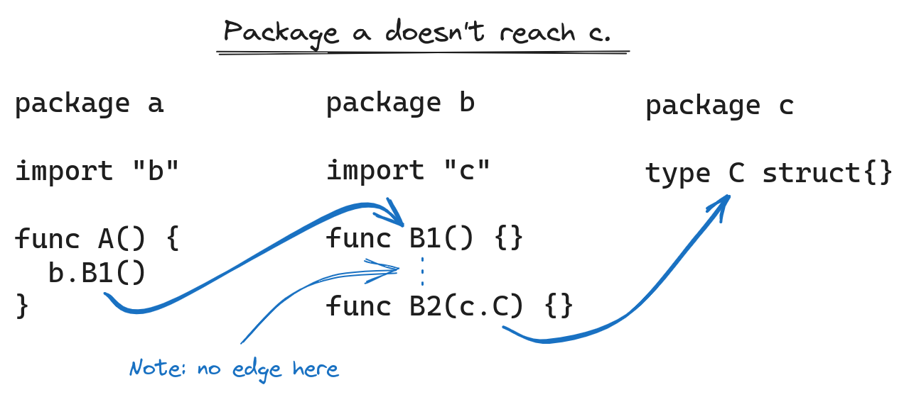

<style type="text/css" scoped>
  .chart {
    width: 100%;
  }
  @media (prefers-color-scheme: dark) {
    .chart {
      border-radius: 8px;
    }
  }
</style>

Earlier this summer, the Go team released version [v0.12](https://go.dev/s/gopls-v0.12)
of [gopls](https://pkg.go.dev/golang.org/x/tools/gopls),
the [language server](https://microsoft.github.io/language-server-protocol/) for Go, featuring a rewrite of its core that allows
it to scale to larger codebases.
This is the culmination of a year-long effort,
and we're excited to share our progress, as well as talk a little bit about
the new architecture and what it means for the future of gopls.

Since the v0.12 release, we've fine-tuned the new design,
focusing on making interactive queries (such as auto-completion or finding
references) as fast as they were with v0.11,
despite holding so much less state in memory.
If you haven't already, we hope you'll try it out:

```
$ go install golang.org/x/tools/gopls@latest
```

We'd love to hear about your experience with it via this [brief survey](https://google.qualtrics.com/jfe/form/SV_4SnGxpcSKN33WZw?s=blog).

## Reductions in memory use and startup time {#results}

Before we dive into the details, let's look at the results!
The chart below shows the change to startup time and memory usage for 28
of the most popular Go repositories on GitHub.
These measurements were taken after opening a randomly selected Go file
and waiting for gopls to fully load its state,
and since we assume that the initial indexing is amortized over many editing sessions,
we take these measurements the _second_ time we open the file.

<div class="image">

</div>

Across these repos, the savings average around 75%,
but memory reductions are non-linear:
as projects get larger, so does the relative decrease in memory usage.
We'll explain this in more detail below.

## Gopls and the evolving Go ecosystem {#background}

Gopls provides language-agnostic editors with IDE-like features such as auto-completion,
formatting, cross-references, and refactoring.
Since its beginnings in 2018, gopls has consolidated many disparate command-line
tools such as [guru](https://pkg.go.dev/golang.org/x/tools/cmd/guru),
[gorename](https://pkg.go.dev/golang.org/x/tools/cmd/gorename),
and [goimports](https://pkg.go.dev/golang.org/x/tools/cmd/goimports) and
has become the [default backend for the VS Code Go extension](https://go.dev/blog/gopls-vscode-go)
as well as many other editors and LSP plugins.
Perhaps you’ve been using gopls through your editor without even knowing
it---that’s the goal!

Five years ago, gopls offered improved performance merely by maintaining a stateful session.
Whereas older command-line tools had to start from scratch each time they executed,
gopls could save intermediate results to significantly reduce latency.
But all that state came with a cost, and over time we increasingly [heard from users](https://github.com/golang/go/issues?q=is%3Aissue+is%3Aclosed+in%3Atitle+gopls+memory)
that gopls's high memory usage was barely tolerable.

Meanwhile, the Go ecosystem was growing, with more code being written in
larger repositories.
[Go workspaces](https://go.dev/blog/get-familiar-with-workspaces) allowed
developers to work on multiple modules simultaneously,
and [containerized development](https://code.visualstudio.com/docs/devcontainers/containers)
put language servers in increasingly resource-constrained environments.
Codebases were getting larger, and developer environments were getting smaller.
We needed to change the way gopls scaled in order to keep up.

## Revisiting gopls's compiler origins {#origins}

In many ways, gopls resembles a compiler:
it has to read, parse, type-check, and analyze Go source files,
for which it uses many of the compiler [building blocks](https://github.com/golang/example/tree/master/gotypes#introduction)
provided by the [Go standard library](https://pkg.go.dev/go) and [golang.org/x/tools](https://pkg.go.dev/golang.org/x/tools) module.
These building blocks use the technique of "symbolic programming":
in a running compiler there is a single object or "symbol" that stands for
each function such as `fmt.Println`.
Any reference to a function is represented as a pointer to its symbol.
To test whether two references are talking about the same symbol,
you don’t need to think about names.
You just compare pointers. A pointer is much smaller than a string,
and pointer comparison is very cheap, so symbols are an efficient way to
represent a structure as complex as a program.

In order to respond quickly to requests, gopls v0.11 held all these symbols in memory,
as though gopls was **compiling your entire program at once**.
The result was a memory footprint that was proportional to and much larger
than the source code being edited (for example,
typed syntax trees are typically 30x larger than the source text!).
<!-- deps(gopls) = 18.5MB source, 542MB RAM -->

## Separate compilation {#separate-compilation}

The designers of the first compilers in the 1950s quickly discovered the
limits of monolithic compilation.
Their solution was to break the program into units and compile each unit separately.
Separate compilation makes it possible to build a program that does not fit in memory,
by doing it in small pieces.
In Go, the units are packages. Compilation of different packages cannot
be completely separated:
when compiling a package P, the compiler still needs information about what's
provided by the packages that P imports.
To arrange this, the Go build system compiles all of P's imported packages before P itself,
and the Go compiler writes a compact summary of each package's exported API.
The summaries of P's imported packages are provided as inputs to the compilation of P itself.

Gopls v0.12 brings separate compilation to gopls,
reusing the same package summary format used by the compiler.
The idea is simple, but there’s subtlety in the details.
We rewrote each algorithm that previously inspected the data structure representing the entire program,
so that it now works on one package at a time and saves per-package results to files,
just like a compiler emitting object code.
For example, finding all references to a function used to be as easy as
searching the program data structure for all occurrences of a particular pointer value.
Now, when gopls processes each package, it must construct and save an index
that associates each identifier location in the source code with the name
of the symbol to which it refers.
At query time, gopls loads and searches these indexes.
Other global queries, such as "find implementations",
use similar techniques.

Like the `go build` command, gopls now uses a [file-based cache](https://cs.opensource.google/go/x/tools/+/master:gopls/internal/lsp/filecache/filecache.go;l=5;drc=6f567c8090cb88f13a71b19595bf88c6b27dbeed)
store to record summaries of information computed from each package,
including the type of each declaration, the index of cross-references,
and the method set of each type.
Since the cache is persisted across processes,
you’ll notice that the second time you start gopls in your workspace,
it becomes ready to serve much more quickly,
and if you run two gopls instances, they work together synergistically.

<div class="image">

</div>

The result of this change is that gopls's memory use is proportional to
the number of open packages and their direct imports.
This is why we observe sublinear scaling in the chart above:
as repositories get larger, the fraction of the project observed by any
one open package gets smaller.

## Fine-grained invalidation {#invalidation}

When you make a change in one package, it's only necessary to recompile
the packages that import that one,
directly or indirectly.
This idea is the basis of all incremental build systems since Make in the 1970s,
and gopls has been using it since its inception.
In effect, every keystroke in your LSP-enabled editor starts an incremental build!
However, in a large project, indirect dependencies add up,
making these incremental rebuilds too slow.
It turns out that a lot of this work isn't strictly necessary,
because most changes, such as adding a statement within an existing function,
don't affect the import summaries.

If you make a small change in one file, we have to recompile its package,
but if the change does not affect the import summary, we don't have to compile any other packages.
The effect of the change is "pruned". A change that does affect the import
summary requires recompiling the packages that directly import that package,
but most such changes won't affect the import summaries of _those_ packages,
in which case the effect is still pruned and avoids recompiling indirect importers.
Thanks to this pruning, it is rare for a change in a low-level package to
require recompiling _all_ the packages that indirectly depend on that package.
Pruned incremental rebuilds make the amount of work proportional to the
scope of each change.
This is not a new idea: it was introduced by [Vesta](https://www.hpl.hp.com/techreports/Compaq-DEC/SRC-RR-177.pdf)
and also used in [`go build`](https://go.dev/doc/go1.10#build).

The v0.12 release introduces a similar pruning technique to gopls,
going one step further to implement a faster pruning heuristic based on syntactic analysis.
By keeping a simplified graph of symbol references in memory,
gopls can quickly determine whether a change in package `c` can possibly
affect package `a` through a chain of references.

<div class="image">

</div>

In the example above, there's no chain of references from `a` to `c`,
so a is not exposed to changes in c even though it indirectly depends on it.

## New possibilities {#new-possibilities}

While we're happy with the performance improvements we've achieved,
we're also excited about several gopls features that are feasible now that
gopls is no longer constrained by memory.

The first is robust static analysis. Previously,
our static analysis driver had to operate on gopls's in-memory representation of packages,
so it couldn't analyze dependencies:
doing so would pull in too much additional code.
With that requirement removed, we were able to include a new analysis driver
in gopls v0.12 that analyzes all dependencies,
resulting in greater precision.
For example, gopls now reports diagnostics for `Printf` formatting mistakes
even in your user-defined wrappers around `fmt.Printf`.
Notably, `go vet` has provided this level of precision for years,
but gopls was unable to do this in real time after each edit. Now it can.

The second is [simpler workspace configuration](https://go.dev/issue/57979)
and [improved handling for build tags](https://go.dev/issue/29202).
These two features both amount to gopls "doing the right thing" when you
open any Go file on your machine,
but both were infeasible without the optimization work because (for example)
each build configuration multiplies the memory footprint!

## Try it out! {#try}

In addition to scalability and performance improvements,
we've also fixed [numerous](https://github.com/golang/go/milestone/282?closed=1)
[reported bugs](https://github.com/golang/go/milestone/318?closed=1) and
many unreported ones that we discovered while improving test coverage during the transition.

To install the latest gopls:

```
$ go install golang.org/x/tools/gopls@latest
```

Please try it out and fill out the [survey](https://google.qualtrics.com/jfe/form/SV_4SnGxpcSKN33WZw?s=blog) ---
and if you should encounter a bug,
[report it](https://github.com/golang/go/issues/new/choose) and we will fix it.
