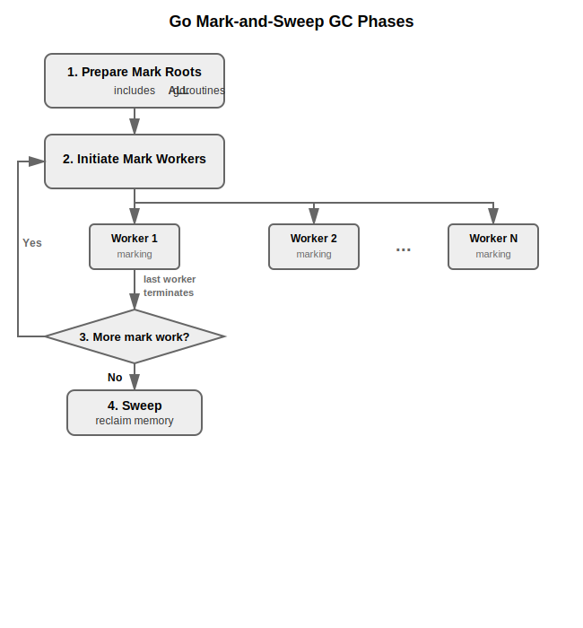
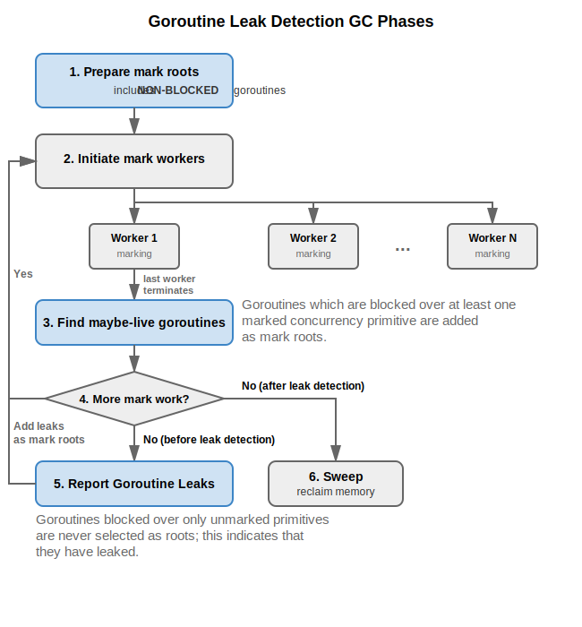
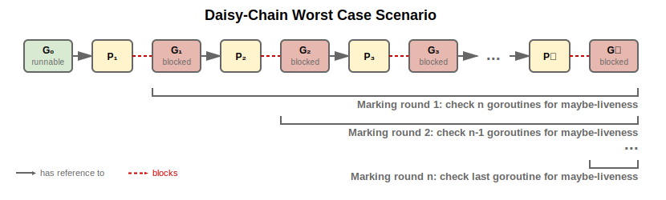

Go's concurrency features are powerful and easy to use, but
that same ease can sometimes lead even seasoned developers to make
mistakes.
Fortunately, the Go ecosystem comes equipped with useful tools for
debugging, e.g., the deadlock and
the [data race](/doc/articles/race_detector) detectors.

However, existing tools may still miss some concurrency bugs,
the most prominent of which is the _goroutine leak_.
Goroutines synchronize or exchange information
via shared concurrency primitives, e.g., channels, locks, wait groups.
In the process, goroutines often _block_, i.e., are
put into a waiting state;
ubiquitous examples include waiting to acquire a held mutex,
or receive a message over a channel.

A goroutine is only _leaked_ if it is
blocked permanently, irrespective of what the other
goroutines are doing (plenty of examples below).
For the purposes of this article, we further limit ourserlves
to blocking behavior of channels or primitives in the
[`sync`](/pkg/sync) package.
The definition of goroutine leaks can be broadened
to include goroutines that are blocked for an unreasonable
amount of time, as well as networking or IO operations.
However, these fall outside the scope of the approach presented here.

Regardless, goroutine leaks are undesirable, especially in long-running systems,
where their accumulation degrades performance.
Leaked goroutines and all their referenced heap objects
can turn a signficant amount of memory unusable,
to the point of eventually running the system dry.
Excessive CPU utilization is also a possibility, as the garbage collector
needlessly inspects unused memory and may trigger more frequently.

Goroutine leaks can be notoriously difficult to detect.
In unit testing, the most significant breakthroughs include
the open-source library [`goleak`](https://github.com/uber-go/goleak),
which can instrument individual tests to signal any
un-terminated goroutines after the test wraps up as suspicious.
Similarly, Go 1.24 introduced [`synctest`](/blog/synctest) to
the standard library; it can significantly improve
the quality of unit tests in concurrent code by giving
Go developers more control over the ordering of concurrent events
in order to reliably test hard-to-reproduce scenarios.

Unfortunately, neither approach can check for goroutine leaks
in production systems, especially at larger scales,
which might behave in ways tests might not have accounted for.
So far, goroutine profiles have been used to check for operations with a
high concentrations of blocked goroutines, or analyze growth
trends.
However, goroutine profiles cannot distinguish between
goroutines which are leaked, and those which are blocked by design.
A high number of blocked goroutines in, e.g., a microservice,
can either indicate a real leak, or simply have coincided with
a temporary increase in traffic.
Likewise, leaks which are low in number may slip by undetected for many years.

Finally, Go 1.26 introduces specialized goroutine
leak profiles, a flexible and lightweigth mechanism for finding
goroutine leaks in running Go programs, including production systems.
In the followsings sections, we showcase how to use the feature, followed by
some additional examples of detectable leaks, and a description of the
underlying implementation and trade-offs.

## Example: A common goroutine leak

Let's look at a realistic goroutine leak example.
While we will explain nuances, some familiarity with basic Go
[concurrency features](/tour/concurrency/1) is encouraged.
Consider a function that processes work items in parallel:

```go
type result struct {
	res workResult
	err error
}

func processWorkItems(ws []workItem) ([]workResult, error) {
	// Process work items in parallel, aggregating results in ch.
	ch := make(chan result)
	for _, w := range ws {
		go func() {
			res, err := processWorkItem(w)
			ch <- result{res, err}
		}()
	}

	// Collect the results from ch, or return an error if one is found.
	var results []workResult
	for range len(ws) {
		r := <-ch
		if r.err != nil {
			// This early return may cause goroutine leaks.
			return nil, r.err
		}
		results = append(results, r.res)
	}
	return results, nil
}
```
Because `ch` is an unbuffered channel, each worker goroutine blocks when sending
its result until the main goroutine receives from the channel.
If `processWorkItems` returns early due to an error, the receiving loop terminates,
and all remaining sender goroutines block forever.

## Enabling goroutine leak profiles

Goroutine leak profiles are available as an experiment in Go 1.26.
To enable it, build your program with:

```
$ GOEXPERIMENT=goroutineleakprofile go build [...]
```

Once enabled, the profile becomes available through the [`runtime/pprof`](/pkg/runtime/pprof)
package, as the `goroutineleak` profile type, or by exposing an
HTTP endpoint with [`net/http/pprof`](/pkg/net/http/pprof).

### Example set up

In the following section, we demonstrate how to use the goroutine leak profile to
detect the leak in the example above.

Copy the following simple program in `main.go`:

```go
package main

import (
	"errors"
	"log"
	"net/http"
	_ "net/http/pprof"
	"time"
)

type workItem int
type workResult int

func processWorkItem(w workItem) (workResult, error) {
	time.Sleep(10 * time.Millisecond)
	if w == 5 {
		return 0, errors.New("simulated error")
	}
	return workResult(w * 2), nil
}

type result struct {
	res workResult
	err error
}

func processWorkItems(ws []workItem) ([]workResult, error) {
	ch := make(chan result)
	for _, w := range ws {
		w := w // capture for closure
		go func() {
			res, err := processWorkItem(w)
			ch <- result{res, err}
		}()
	}

	var results []workResult
	for range len(ws) {
		r := <-ch
		if r.err != nil {
			return nil, r.err
		}
		results = append(results, r.res)
	}
	return results, nil
}

func main() {
	// Start pprof server
	go func() {
		log.Println(http.ListenAndServe("localhost:6060", nil))
	}()

	// Repeatedly trigger the leak
	for {
		items := []workItem{1, 2, 3, 4, 5, 6, 7, 8, 9, 10}
		_, err := processWorkItems(items)
		if err != nil {
			log.Printf("Error processing items: %v", err)
		}

		time.Sleep(time.Second)
	}
}
```

Build and run with the experiment enabled:

```
$ GOEXPERIMENT=goroutineleakprofile go build -o leaky
$ ./leaky
```

### Collecting the profile

It won't take long for the program to start accumulating
leaks, which you can then view by using the web UI
at http://localhost:6060/debug/pprof.

Alternatively, you can collect the goroutine
leak profile using `curl`, and then examine it with `go tool pprof`:
```
$ curl http://localhost:6060/debug/pprof/goroutineleak > leak.prof
$ go tool pprof leak.prof
Type: goroutineleak
Time: 2026-03-01 13:19:49 UTC
Entering interactive mode (type "help" for commands, "o" for options)
(pprof) list processWorkItems
Total: 116
ROUTINE ======================== main.processWorkItems.func1 in .../main.go
         0        116 (flat, cum)   100% of Total
         .          .     31:           go func() {
         .          .     32:                   res, err := processWorkItem(w)
         .        116     33:                   ch <- result{res, err}
         .          .     34:           }()
```
The profile reveals the goroutines leaked at
`ch <- result{res, err}` (line 33), pinpointing the culprit operation.
Notably, the longer the program is running, the larger the number of leaked
goroutines.

### Addressing the leak

This leak can be simply fixed by giving `ch` a **buffer**:
```go
ch := make(chan result, len(ws))
```
This allows all the work item goroutines to send a message without blocking
in the event of a premature return of `processWorkItems`.

## Other examples

Goroutine leaks come in various forms, so in the following section,
we present a few common examples of coding patterns that lead to leaks
observed in industrial-scale codebases and open source projects,
in ascending order of complexity.

You can quickly test drive the goroutine leak detector on them in
[the Go playground](/play/p/3C71z4Dpav-?v=gotip), and even
experiment with your own leaks.

### Double send

Some of the simplest leaks occur when more messages
are sent over a channel than expected.
Below, a goroutine is expected to send one message to the main goroutine
over an unbuffered channel.
However, the `return` statement is missing after a the send operation
in the error case.
For every error, the sender will, therefore, attempt to send two messages,
which causes a leak.
```go
func DoubleSend() {
	ch := make(chan any)
	go func(err error) {
		if err != nil {
			// In case of an error, send nil.
			ch <- nil
			// Return statement is missing.
		}
		// Otherwise, continue with normal behaviour.
		// This send is still executed, which causes a leak in the error case.
		ch <- struct{}{}
	}(fmt.Errorf("error"))
	// Retrieve only one message.
	<-ch
}
```
While the profile does not explicitly highlight the missing `return`
as the cause, it at least directs you to the faulty function, by
highlighting the leaking send operation.
```
(pprof) list DoubleSend
Total: 1
ROUTINE ======================== main.DoubleSend.func1 in .../main.go
         0          1 (flat, cum)   100% of Total
         .          .    118:   go func(err error) {
         .          .    119:           if err != nil {
         .          .    121:                   ch <- nil
         .          .    123:           }
         .          1    126:           ch <- struct{}{}
         .          .    127:   }(fmt.Errorf("error"))
         .          .    129:   <-ch
```
This leak can be addressed simply by adding a `return` statement after the
send operation in the error case.

### Early return

The inverse situation is just as common, where the receiver
omits communication on some control flow paths,
in what is effectively a simplified version of the introductory example.
```go
// Incoming error simulates an error produced internally.
func EarlyReturn(err error) {
	ch := make(chan any)

	// Create a worker goroutine.
	go func() {
		// Send something to the channel.
		// Leaks if the parent goroutine terminates early.
		ch <- struct{}{}
	}()

	if err != nil {
		// The parent goroutine quits too early in case of an error.
		// Sender leaks.
		return
	}

	// Receive is only executed if there is no error.
	<-ch
}
```
The goroutine leak is exposed by the profile:
```
ROUTINE ======================== main.EarlyReturn.func1 in .../main.go
         0          1 (flat, cum)   100% of Total
         .          .    140:   go func() {
         .          1    143:           ch <- struct{}{}
         .          .    144:   }()
         .          .    145:
         .          .    146:   if err != nil {
```
The leak can be addressed by giving `ch` a buffer of size 1.

### Timeout

A variation of the **Early return** pattern above involves contexts
and non-deterministic choice (`select` statements):
```go
func Timeout(ctx context.Context) {
	// An unbuffered channel is used to coordinate
	// a worker and parent thread
	ch := make(chan any)

	// Create worker goroutine
	go func() {
		// Perform some work then signal to the parent thread.
		ch <- struct{}{}
	}()

	// Wait for message from worker or context
	// to be cancelled or timed out.
	select {
	case <-ch: // Receive message from worker
	case <-ctx.Done():
		// Sender leaks because there is no
		// future rendez-vous over the channel.
	}
}
```
If the context is cancelled before the sender synchronizes with the parent,
the sender will leak:
```
(pprof) list Timeout
Total: 10
ROUTINE ======================== main.Timeout.func1.1 in .../main.go
         0         10 (flat, cum)   100% of Total
         .          .    198:           go func() {
         .         10    201:                   ch <- struct{}{}
         .          .    202:           }()
```
As in the previous example, the fix is to give the channel
buffer of size 1.

### Range over channel without closing

One slightly esoteric concurrency feature is
[iterating over channels](/tour/concurrency/4) by using `range`.
This allows you to repeatedly receive values from a channel in a loop,
until the channel is closed and all values that have been enqueued
in the channel's buffer have been received, upon which the loop exits.

Importantly, **if the channel is never closed**, a `range` loop will block
the executing goroutine forever.
Omitting the `close` operation is a common mistake, as below:
```go
// Incoming list of items and the number of workers.
func noCloseRange(list []any, workers int) {
	// Create a channel that distributes work items.
	ch := make(chan any)

	// Create the worker goroutines.
	for i := 0; i < workers; i++ {
		go func() {
			// Each worker pulls items from the channel
			// and then processes it.
			for item := range ch {
				// Process each item
				_ = item
			}
		}()
	}

	// Queue items to the workers by using the channel.
	for _, item := range list {
		// The parent leaks by sending an item if workers == 0
		// or if all the workers panic, but the panic is recovered.
		ch <- item
	}
	// Otherwise, the channel is never closed, so workers
	// leak once there are no more items left to process.
}

...
go noCloseRange([]any{1, 2, 3}, 3) // Leaks all 3 workers
```
A goroutine leak profile for such a program would include the following:
```
Type: goroutineleak
(pprof) list noCloseRange.func1
Total: 4
ROUTINE ======================== main.noCloseRange.func1 in .../main.go
         0          3 (flat, cum) 75.00% of Total
         .          .     82:           go func() {
         .          3     84:                   for item := range ch {
         .          .     86:                           _ = item
         .          .     87:                   }
         .          .     88:           }()
```
We see the 3 workers blocked at the `range ch` operation, which
gives an ample hint as to the cause of the leak.

**Bonus!** This particular leak is another leak scenario in this case,
if the number of workers is mistakenly set to zero,
which will lead the parent sender to leak:
```go
go noCloseRange([]any{1, 2, 3}, 0) // Sender leaks with 0 workers
```
This is also captured by the profile:
```
(pprof) list noCloseRange$
Total: 4
ROUTINE ======================== main.noCloseRange in .../main.go
         0          1 (flat, cum) 25.00% of Total
         .          .     76:func noCloseRange(list []any, workers int) {
...
         .          .     92:   for _, item := range list {
         .          1     95:           ch <- item
         .          .     96:   }
```

The `range` leak can be addressed by simply closing the channel once
all messages have been sent:
```go
	for _, item := range list {
		ch <- item
	}
	// All items have been sent. It is now safe to close.
	close(ch)
```
While `workers > 0` can be assumed to hold in realistic production systems,
goroutine leak profiles can nevertheless be used to implicitly monitor for off-chance
violations without conservative `workers <= 0` checks.

### Method contract violations

The patterns seen so far have been relatively constrained in their lexical scope.
However, as functionality is spread out across functions, methods and packages, and
implementations are obfuscated by interfaces, the difficulty of manually detecting
leaks drastically increases.

Such a case is exemplified in this section, with the custom `worker` type that embeds two channel
fields, `ch` and `done` and creates a looping goroutine with its `Start` method that
reads from both channels with a `select` statement.
Said goroutine can only be terminated by receiving a message through the `done` channel,
which is closed by the `Stop` method.

The `Start` method can be invoked any number of times, but if it is invoked
at least once, `Stop` should eventually be called.

As a result, `Start` and `Stop` form an implicit contract that dictates the order
in which the methods should be invoked.
Breaking that contract can lead to undesirable behavior,
in this case, goroutine leaks:
```go
func MethodContractViolation() {
	items := make([]any, 10)
	// Create a new worker
	w := NewWorker()

	// Start worker
	w.Start()

	// Operate on worker
	for _, item := range items {
		w.AddToQueue(item)
	}
	// Exits without calling ’Stop’.
}

type worker struct {
	once *sync.Once

	ch   chan any
	done chan any
}

type Worker interface {
	Start()
	Stop()
	AddToQueue(item any)
}

func NewWorker() Worker {
	return &worker{
		once: &sync.Once{},

		ch:   make(chan any),
		done: make(chan any),
	}
}

// Start spawns a background goroutine that extracts items pushed to the queue.
func (w *worker) Start() {
	go func() {
		for {
			select {
			case <-w.ch: // Normal workflow
			case <-w.done:
				return // Shut down
			}
		}
	}()
}

func (w *worker) Stop() {
	// Allows goroutine created by Start to terminate
	w.once.Do(func() {
		close(w.done)
	})
}

func (w *worker) AddToQueue(item any) {
	w.ch <- item
}
```
This issue is further exacerbated in practice, where such custom types are only
exported as interfaces, in this case, through the non-descript
`Worker` type.
Clients may not even be aware of the underlying implementation and,
consequently, violate the implicit contract without realizing.

Fortunately, soliciting a goroutine leak profile can reveal the defect:
```
(pprof) list Start
Total: 1
ROUTINE ======================== main.(*worker).Start.func1 in .../main.go
         0          1 (flat, cum)   100% of Total
         .          .    266:   go func() {
         .          .    267:           for {
         .          1    268:                   select {
         .          .    269:                   case <-w.ch:
         .          .    270:                   case <-w.done:
         .          .    271:                           return
```
Naturally, the fix involves following the trail to the `Start` call
and adding an invocation of `Stop`.

### Cockroach/584

The following real-world example is taken from the open-source
project [cockroachdb](https://github.com/cockroachdb/cockroach/pull/584/files).
It involves acquiring and releasing a lock in a loop, but forgetting to unlock it
before executing a `break` statement:
```go
type Gossip struct {
	mu     sync.Mutex // L1
	closed bool
}

func (g *Gossip) bootstrap() {
	for {
		g.mu.Lock()
		if g.closed {
			// Missing g.mu.Unlock
			break
		}
		g.mu.Unlock()
	}
}

func (g *Gossip) manage() {
	for {
		g.mu.Lock()
		if g.closed {
			// Missing g.mu.Unlock
			break
		}
		g.mu.Unlock()
	}
}

...
	g := &Gossip{
		closed: true,
	}
	// ...
	g.bootstrap()
	g.manage()
...
```
In such a case, the goroutine will leak when failing to acquire the lock.
```
(pprof) list Gossip
Total: 1
ROUTINE ======================== main.(*Gossip).bootstrap in .../main.go
         0          1 (flat, cum)   100% of Total
         .          .    165:func (g *Gossip) bootstrap() {
         .          .    166:   for {
         .          1    167:           g.mu.Lock()
         .          .    168:           if g.closed {
         .          .    170:                   break
         .          .    171:           }
         .          .    172:           g.mu.Unlock()
```

### Moby/38463

Another real-world example in [moby](https://github.com/moby/moby/pull/28462)
showcases how leaks can appear as a result of the
interplay between channels and locks.
```go
type (
	State struct {
		Health *Health
	}
	Container struct {
		sync.Mutex
		State *State
	}

	Store struct {
		ctr *Container
	}

	Daemon struct {
		containers Store
	}

	Health struct {
		stop chan struct{}
	}
)

func (d *Daemon) StateChanged() {
	c := d.containers.ctr
	c.Lock()
	d.updateHealthMonitorElseBranch(c)
	defer c.Unlock()
}/

func (d *Daemon) updateHealthMonitorElseBranch(c *Container) {
	c.State.Health.CloseMonitorChannel()
}

func (s *Health) CloseMonitorChannel() {
	if s.stop != nil {
		s.stop <- struct{}{}
	}
}

func monitor(c *Container, stop chan struct{}) {
	for {
		select {
		case <-stop:
			return
		default:
			handleProbeResult(c)
		}
	}
}

func handleProbeResult(c *Container) {
	c.Lock()
	defer c.Unlock()
}

func NewDaemonAndContainer() (*Daemon, *Container) {
	c := &Container{
		State: &State{&Health{
			stop: make(chan struct{}),
		}},
	}
	d := &Daemon{Store{c}}
	return d, c
}

func Moby28462() {
	d, c := NewDaemonAndContainer()
	go monitor(c, c.State.Health.stop) // G1
	go d.StateChanged()
}
```
In this case, one goroutine may acquire a lock and try to send a message
over channel `stop`, while the other will try to acquire the same lock.
With the wrong ordering, both goroutines will leak:
```
(pprof) list .CloseMonitorChannel 
Total: 2
ROUTINE ======================== main.(*Health).CloseMonitorChannel in .../main.go
         0          1 (flat, cum) 50.00% of Total
         .          .     66:func (s *Health) CloseMonitorChannel() {
         .          .     67:   if s.stop != nil {
         .          1     68:           s.stop <- struct{}{}
         .          .     69:   }
(pprof) list main.handleProbeResult
Total: 2
ROUTINE ======================== main.handleProbeResult in .../main.go
         0          1 (flat, cum) 50.00% of Total
         .          .     83:func handleProbeResult(c *Container) {
         .          1     84:   c.Lock()
         .          .     85:   defer c.Unlock()
         .          .     86:}
```

## Implementation {#implementation}

This section is for those interested in the underlying machinations
of the leak detector.
If you are, instead, looking for capabilities and performance,
skip ahead to [limitations](/blog/goroutine-leak-profiles#limitations).

### Core concept

Let's start with an initial observation: if a goroutine
is blocked over some concurrency primitive that no other goroutine has access to,
then it is obviously leaked.

This observation, while simplified, already gives us a strong lead on how to
reliably detect goroutine leaks at runtime.
Our goal now is to achieve it in practice, by expanding upon
this observation and generalizing it into a proper definition.
We, therefore, define _maybe-runnability_, as an inductive property
of goroutines, defined thusly:
> A goroutine is maybe-runnable if:
> 1. it is not blocked, or
> 2. at least one concurrency primitive that blocks it is referenced
	by another maybe-runnable goroutine.

In the first case, goroutines which are not blocked are obviously
not leaked.
For a goroutine that matches the second case, the assumption is that
it may unblocked if another goroutine that references the blocking
primitive uses it.

As a corollary, any goroutine which is not maybe-runnable is definitely leaked.

Our goal is, therefore, to determine which goroutines in the system
are maybe-runnable.
The core strategy is to, starting from non-blocked goroutines,
incrementally check whether blocked goroutines are maybe-runnable.
This can be simply achieved by tracing references from a goroutine's
stacks, i.e., local variables, to concurrency primitives,
effectively reducing the problem to memory reachability.

Fortunately for us, the Go runtime already computes memory reachability
through the [garbage collector](/doc/gc-guide) (GC).
The Go runtime uses a concurrent tri-color mark-and-sweep garbage collector,
now with the [Green Tea](/blog/greenteagc) variant!

Considering all this, the next step is to adapt the GC to suit our purposes.
You can quickly compare the two GCs with the following diagrams:

<div class="centered">
<button type="button" id="greentea-prev" class="scroll-button scroll-button-left" hidden disabled>← Prev</button>
<button type="button" id="greentea-next" class="scroll-button scroll-button-right" hidden>Next →</button>
<div id="goroutineleakgc" class="carousel">
	<figure class="carouselitem">
		
	</figure>
	<figure class="carouselitem">
		
	</figure>
</div>
</div>

Fortunately for us, a complete overhaul of the GC is not necessary, as
its MO already neatly aligns with our goals.
Only a few key changes were needed:
1. In the initial phases, the regular GC uses all goroutines (and global variables)
	as mark roots, i.e., objects which are never considered garbage.
	We instead change it to only include non-blocked goroutines,
	as these are the only goroutine which are guaranteed to be maybe-runnable,
	initially.
2. This is followed by the marking phase, where the GC traces objects referenced
	(transitively) by the marking roots, and "marks" them as usable memory.
	Even though we do not modify this phase directly, the changes in step 1. ensure that
	the GC only marks memory referenced by maybe-runnable goroutines.
3. The marking phase is finalized by checking for more maybe-runable goroutines.
	These are goroutines that are blocked by at least one concurrency
	primitive that has been marked in step 2. All newly discovered maybe-runnable
	goroutines are added as mark roots, in which case, the GC resumes the marking phase.
	This coincides with the inductive step in the definition
	of maybe-runnability.
4. Once all maybe-runnable goroutines have been discovered, the only remaining
	goroutines are leaked, because they are blocked by concurrency primitives that
	no maybe-runnable goroutine has access to, so they can be reported. In our case, their
	status is set to leaked, such that they may be included in the
	goroutine leak profile.
5. The marking phase then resumes one last time with all the leaked goroutines
	added	as mark roots. All the remaining memory is marked, the same as
	the GC in the regular runtime.


### Limitations {#limitations}

The examples above demonstrate the usefulness of goroutine leak profiles.
Nevertheless, relying on the garbage collector does impose some limitations
that may lead it to miss leaks:

1. **Memory overreach**: if a concurrency primitive is
	consistently reachable through **global variables** or **runnable goroutines**,
	then goroutines blocking on it are never reported as leaked, even if
	that is the case in practice.
	
	This can be alleviated by better delineating the lifecycle of
	concurrency resources, and more strictly regimenting which
	parties may acquire their references.

2. **Non-standard blocking**: 
	For the sake of correctness, goroutine leak detection is strictly limited
	to Go first-class concurrency primitives, which includes: channel-based
	concurrency, such as send and receive operations, including
	over `nil` channels, as well as blocking `select` statements (i.e., without a
	`default` case), including with no cases, and specific members of the
	[`sync`](/pkg/sync) package, specifically `Mutex`,
	`RWMutex`, `WaitGroup` and `Cond`.
	
	Goroutines blocked for any reason that
	does not involve first-class concurrency primitives, e.g.,
	netpollers or semaphores internal to the runtime, are never considered as leaking.
	This likewise applies for custom, user-defined concurrency operations
	(e.g., spin locks), unless they rely on the primitives outlined above.

3. **Non-determinism**: leaks can only be detected after
they have occurred; they cannot be predicted.
		Reproducing and diagnosing leaks in flaky programs
		continues to be a challenge.
		For the best results, we encourage mixing approaches, by strategically using
		both goroutine leak profiles at various layers, including production, as well
		as comprehensive test suites instrumented with `goleak` and `synctest`.

### Performance impact {#performance}

Goroutine leak detection are carefully designed to minimize
performance impact, but there are, nevertheless, some costs.

#### Memory

Leak detection predominantly minimizes memory overhead through
constant-sized additions required for book-keeping.
However, one scaling factor is the introduction of _maybe-traceable pointers_,
which prevent some references from being traced prematurely,
and ensures that the GC behaves according to our specifications.

These are objects that carry the same reference twice: once as an
untraceable pointer-as-an-integer value, `vu`, and once as an
actual reference that is understood as such by the GC, `vp`.
A maybe-traceable pointer, therefore, doubles the size of
its regular counterpart.

Untraceable pointers come in 3 valid states:
1. `vu` and `vp` are unset, which is analogous to a `nil` pointer,
2. `vu` and `vp` are set (and equal), which is analogous to a regular reference
that can be traced by the GC,
3. `vu` is set, but `vp` is unset (`nil`), which preserves the reference,
	but "hides" it from the GC.

Maybe-traceable pointers are relevant for `sudog`s,
objects which pair individual goroutines and concurrency primitive.
One concurrency primitive can block multiple goroutines,
and, likewise, one goroutine can be blocked on multiple concurrency primitives
(because of `select` statements).
Therefore, the maximum number of active `sudog` objects at any given point is
the product of the number of goroutines and concurrency primitives on the heap.

Each `sudog` holds, among other things, references to its
blocking concurrency primitive.
However, `sudog`s are also globally reachable through the `sudog`
cache, which exposes these references to the GC during the marking phase,
as well as the globally available list of all goroutines.
This goes against our goal of only tracing these references
reachable from a maybe-runnable goroutine.
Therefore, in order to prevent the GC from tracing them, we update
these references in `sudog` to be maybe-traceable pointers.
Maybe-traceable pointers are set as untraceable at the start of
goroutine leak detection, and only updated to traceable once
the goroutine paired to the same `sudog` is scheduled for marking.

While the asymptotic complexity remains unchanged, a modest cost
is nevertheless incurred, which is at its worst when every goroutine
is blocked on every concurrency primitive in the system.
Fortunately, this is pathological case that rarely
applies to realistic Go programs.

#### Computational overhead

The current implementation of goroutine leak detection is more
computationally expensive than the regular GC.
This is best illustrated by looking at a pathological case we
will call the "daisy-chain":

In this example without leaks, runnable goroutine G₀ has a
reference to primitive P₁ which blocks G₁, and so on in a daisy chain
pattern.

This implies that proving maybe-runnability for some Pᵢ₊₁,
requires proving maybe-runnability for Pᵢ, which introduces
two costs:
1. The marking phase is effectively serialized relative to the
	order in which goroutines can be scanned, as all the memory reachable
	from some Pᵢ must be marked before Pᵢ₊₁ can be added as a root.
2. The inspection currently traverses the entire tail of blocked goroutines
	at the end of each marking round, which takes O(n²) steps.

The second point can be addressed over time, but the first point of contention
is an intrinsic limitation that cannot be circumvented.

Regardless, if a goroutine leak can be observed at some point in time, then it
can also be observed at any future point in the same Go program's execution.

Periodic profiling infrastructures can therefore tune profiling frequency,
e.g., every 4 hours, for virtually no loss in leak detection capabilities,
while simultaneously only sporadically incurring the execution
overhead.

## Next steps

The goroutine leak profile is available as an experiment in Go 1.26, enabled with `GOEXPERIMENT=goroutineleakprofile`.
We encourage developers to try it in testing, continuous integration, and production environments.

The implementation is production-ready; the experimental status is solely to gather feedback on the API design.
We plan to enable goroutine leak profiles by default in Go 1.27, making automatic leak detection available to all Go programs without any build flags.

Please share your experiences and feedback on the [proposal issue](/issue/74609)!

## Acknowledgements

Goroutine leak detection is the result of a research collaboration between
Aarhus University, Washington University in St. Louis, and Uber, as presented in
["Dynamic Partial Deadlock Detection and Recovery via Garbage Collection"](https://dl.acm.org/doi/pdf/10.1145/3676641.3715990)
(Saioc et al., ASPLOS 2025).

The transition from academic prototype to actual Go feature was made possible
with the guidance of Michael Knyszek and Michael Pratt in the Go team at Google, and
[@thepudds](https://github.com/thepudds).

<script src="greenteagc/carousel.js"></script>