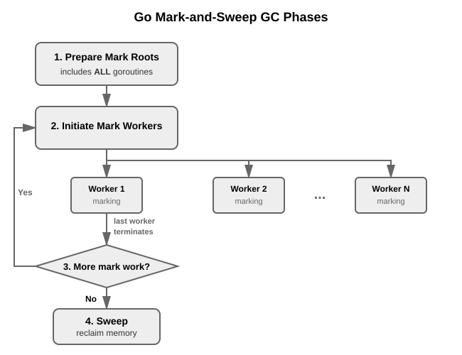
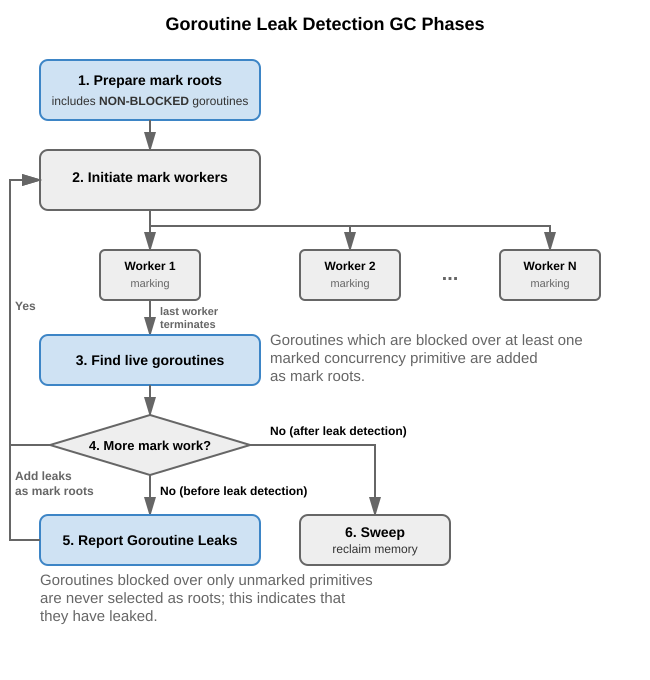
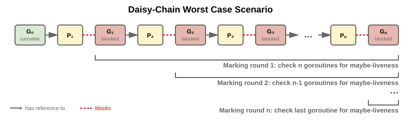

Go's [concurrency features](/tour/concurrency/1) are powerful and easy to use, but
that same ease can sometimes lead even seasoned developers to make
mistakes.
Fortunately, the Go ecosystem comes equipped with useful tools for
debugging, e.g., the [race detector](/doc/articles/race_detector),
but even existing tools may miss some concurrency bugs,
such as the topic of this article, the _goroutine leak_.

Goroutines synchronize or exchange information
via shared concurrency primitives, e.g., channels, locks, and wait groups.
While communicating, goroutines often _block_ on these primitives,
as in, wait until some condition is met;
ubiquitous examples include waiting to acquire a held mutex,
or receive a message over a channel.
Goroutines can also block on operating system operations, like reading from a network socket or a file.

We may consider a goroutine leaked if it is blocked,
but the conditions needed to unblock it can never be met.
Over time, an accumulation of leaked goroutines degrades
performance through excessive memory usage (by the leaked
goroutines themselves or the memory they reference), as well as
CPU usage from the garbage collector, especially
if `GOMEMLIMIT` is in use.

Goroutine leaks can be notoriously difficult to detect.
In unit testing, the most significant breakthroughs include
the [open-source library `goleak`](https://github.com/uber-go/goleak),
which can instrument individual tests to signal any
un-terminated goroutines after the test wraps up as suspicious.
Similarly, Go 1.25 introduced the [`synctest` package](/blog/testing-time) to
the standard library; it can significantly improve
the quality of unit tests in concurrent code by giving
Go developers more control over the ordering of concurrent events
in order to reliably test hard-to-reproduce scenarios.

Unfortunately, neither approach can check for goroutine leaks
in production systems, especially at larger scales,
which may behave in ways unaccounted for by tests.
Goroutine profiles are a rudimentary way to check for operations
that block too many goroutines, or analyze growth trends.
However, goroutine profiles cannot distinguish between
goroutines which are leaked, and those which are temporarily blocked
in high numbers by design, e.g., as caused by increased
traffic in a microservice.
Likewise, leaks which are low in number may slip by undetected for many years.

Go 1.27 introduces the **goroutine leak profiler**,
a flexible and lightweight mechanism for finding
goroutine leaks in running Go programs, including production systems.
Unlike previous approaches, which require human analysis,
this mechanism is precise and generates little-to-no false positives.
The trade-off is that it is limited to a subset of goroutine leaks:
goroutines permanently blocked on channels or primitives
in the [`sync` package](/pkg/sync).
Luckily for us, this already covers a very large subset of goroutine leaks,
as we'll see in our examples.

In the following sections, we showcase how to use the feature, followed by
some additional examples of detectable leaks, and a description of the
underlying implementation and trade-offs.

## Example: concurrent workers

Consider a function that processes work items concurrently:

```go
type result struct {
	res workResult
	err error
}

func processWorkItems(ws []workItem) ([]workResult, error) {
	// Process work items in parallel, aggregating results in ch.
	ch := make(chan result)
	for _, w := range ws {
		go func() {
			res, err := processWorkItem(w)
			ch <- result{res, err}
		}()
	}

	// Collect the results from ch, or return an error if one is found.
	var results []workResult
	for range len(ws) {
		r := <-ch
		if r.err != nil {
			// This early return may cause goroutine leaks.
			return nil, r.err
		}
		results = append(results, r.res)
	}
	return results, nil
}
```
Because `ch` is an unbuffered channel, each worker goroutine blocks when sending
its result until the main goroutine receives from the channel.
If `processWorkItems` returns early due to an error, the receiving loop terminates,
and all remaining sender goroutines block forever.

This example is emblematic of a common mistake discovered in real Go programs,
including Uber production services.
Let's see how we can find these leaks by using the
new goroutine leak profiler.

### Debugging with the goroutine leak profiler

The profile is available through the
[`runtime/pprof` package](/pkg/runtime/pprof), as the
`goroutineleak` profile type, or by installing the profile handlers defined
by the [`net/http/pprof` package](/pkg/net/http/pprof).
If you already have `net/http/pprof` set up in your service,
then you don't need to do anything else! The profile will be
automatically made available for collection at the `/debug/pprof/goroutineleak`
endpoint on whatever host and port the handlers are installed.

Let's put our concurrency bug in context and set up the `net/http/pprof` package.
This way, you can try it yourself!

```go
package main

import (
	"errors"
	"log"
	"net/http"
	_ "net/http/pprof"
	"time"
)

type workItem int
type workResult int

func processWorkItem(w workItem) (workResult, error) {
	time.Sleep(10 * time.Millisecond)
	if w == 5 {
		return 0, errors.New("simulated error")
	}
	return workResult(w * 2), nil
}

type result struct {
	res workResult
	err error
}

func processWorkItems(ws []workItem) ([]workResult, error) {
	ch := make(chan result)
	for _, w := range ws {
		go func() {
			res, err := processWorkItem(w)
			ch <- result{res, err}
		}()
	}

	var results []workResult
	for range len(ws) {
		r := <-ch
		if r.err != nil {
			return nil, r.err
		}
		results = append(results, r.res)
	}
	return results, nil
}

func main() {
	// Start pprof server
	go func() {
		log.Println(http.ListenAndServe("localhost:6060", nil))
	}()

	// Repeatedly trigger the leak
	for {
		items := []workItem{1, 2, 3, 4, 5, 6, 7, 8, 9, 10}
		_, err := processWorkItems(items)
		if err != nil {
			log.Printf("Error processing items: %v", err)
		}

		time.Sleep(time.Second)
	}
}
```

Build the program above with the experiment enabled, then run it:

```
$ GOEXPERIMENT=goroutineleakprofile go build -o leaky
$ ./leaky
```

### Collecting the profile

It won't take long for the program to start accumulating
leaks, which you can then view by using the web UI
at http://localhost:6060/debug/pprof.

Alternatively, you can collect the goroutine
leak profile using `curl`, and then examine it with `go tool pprof`:
```
$ curl http://localhost:6060/debug/pprof/goroutineleak > leak.prof
$ go tool pprof leak.prof
Type: goroutineleak
Time: 2026-03-01 13:19:49 UTC
Entering interactive mode (type "help" for commands, "o" for options)
(pprof) list processWorkItems
Total: 116
ROUTINE ======================== main.processWorkItems.func1 in .../main.go
         0        116 (flat, cum)   100% of Total
         .          .     31:           go func() {
         .          .     32:                   res, err := processWorkItem(w)
         .        116     33:                   ch <- result{res, err}
         .          .     34:           }()
```
The profile reveals the goroutines leaked at
`ch <- result{res, err}` (line 33), pinpointing the culprit operation.
Notably, the longer the program is running, the larger the number of leaked
goroutines.

### Addressing the leak

This leak can be simply fixed by giving `ch` a **buffer**:
```go
ch := make(chan result, len(ws))
```
This allows all the work item goroutines to send a message without blocking
in the event of a premature return of `processWorkItems`.

## Other examples

Goroutine leaks come in various forms, so in the following section,
we present a few common coding patterns that lead to leaks
observed in industrial-scale codebases and open source projects,
in ascending order of complexity.

You can quickly test drive the goroutine leak detector on them in
[the Go playground](/play/p/S4Uw66sMbpj-), and even
experiment with your own leaks.

### Example: Double send

Some of the simplest leaks occur when more messages
are sent over a channel than expected.
Below, a goroutine is expected to send one message to the main goroutine
over an unbuffered channel.
However, the `return` statement is missing after the send operation
in the error case.
For every error, the sender will, therefore, attempt to send two messages,
which causes a leak.
```go
func DoubleSend() {
	ch := make(chan any)
	go func(err error) {
		if err != nil {
			// In case of an error, send nil.
			ch <- nil
			// Return statement is missing.
		}
		// Otherwise, continue with normal behaviour.
		// This send is still executed, which causes a leak in the error case.
		ch <- struct{}{}
	}(fmt.Errorf("error"))
	// Receive only one message.
	<-ch
}
```
While the profile does not explicitly highlight the missing `return`
as the cause, it at least directs you to the faulty function, by
highlighting the leaking send operation.
```
(pprof) list DoubleSend
Total: 1
ROUTINE ======================== main.DoubleSend.func1 in .../main.go
         0          1 (flat, cum)   100% of Total
         .          .    118:   go func(err error) {
         .          .    119:           if err != nil {
         .          .    121:                   ch <- nil
         .          .    123:           }
         .          1    126:           ch <- struct{}{}
         .          .    127:   }(fmt.Errorf("error"))
         .          .    129:   <-ch
```
This leak can be addressed simply by adding a `return` statement after the
send operation in the error case.

### Example: Early return

The inverse situation is just as common, where the receiver
omits communication on some control flow paths,
in what is effectively a simplified version of the introductory example.
```go
// Incoming error simulates an error produced internally.
func EarlyReturn(err error) {
	ch := make(chan any)

	// Create a worker goroutine.
	go func() {
		// Send something to the channel.
		// Leaks if the parent goroutine terminates early.
		ch <- struct{}{}
	}()

	if err != nil {
		// The parent goroutine quits too early in case of an error.
		// Sender leaks.
		return
	}

	// Receive is only executed if there is no error.
	<-ch
}
```
The goroutine leak is exposed by the profile:
```
ROUTINE ======================== main.EarlyReturn.func1 in .../main.go
         0          1 (flat, cum)   100% of Total
         .          .    140:   go func() {
         .          1    143:           ch <- struct{}{}
         .          .    144:   }()
         .          .    145:
         .          .    146:   if err != nil {
```
The leak can be addressed by giving `ch` a buffer of size 1.

### Example: Timeout

A variation of the **Early return** pattern above involves contexts
and non-deterministic choice (`select` statements):
```go
func Timeout(ctx context.Context) {
	// An unbuffered channel is used to coordinate
	// a worker and parent thread
	ch := make(chan any)

	// Create worker goroutine
	go func() {
		// Perform some work then signal to the parent thread.
		ch <- struct{}{}
	}()

	// Wait for message from worker or context
	// to be cancelled or timed out.
	select {
	case <-ch: // Receive message from worker
	case <-ctx.Done():
		// Sender leaks because there is no
		// future rendezvous over the channel.
	}
}
```
If the context is cancelled before the sender synchronizes with the parent,
the sender will leak:
```
(pprof) list Timeout
Total: 10
ROUTINE ======================== main.Timeout.func1.1 in .../main.go
         0         10 (flat, cum)   100% of Total
         .          .    198:           go func() {
         .         10    201:                   ch <- struct{}{}
         .          .    202:           }()
```
As in the previous example, the fix is to give the channel
buffer of size 1.

### Example: Range over channel without closing

[Iterating over channels](/tour/concurrency/4) by using `range`
allows you to repeatedly receive values from a channel in a loop.
Once the channel is closed and all values that have been enqueued
in the channel's buffer have been received, the loop exits.

Importantly, **if the channel is never closed**, a `range` loop will block
the executing goroutine forever.
Omitting the `close` operation is a common mistake, as below:
```go
// Incoming list of items and the number of workers.
func noCloseRange(list []any, workers int) {
	// Create a channel that distributes work items.
	ch := make(chan any)

	// Create the worker goroutines.
	for i := 0; i < workers; i++ {
		go func() {
			// Each worker pulls items from the channel
			// and then processes it.
			for item := range ch {
				// Process each item
				_ = item
			}
		}()
	}

	// Queue items to the workers by using the channel.
	for _, item := range list {
		// The parent leaks by sending an item if workers == 0
		// or if all the workers panic, but the panic is recovered.
		ch <- item
	}
	// Otherwise, the channel is never closed, so workers
	// leak once there are no more items left to process.
}

...
go noCloseRange([]any{1, 2, 3}, 3) // Leaks all 3 workers
```
A goroutine leak profile for such a program would include the following:
```
Type: goroutineleak
(pprof) list noCloseRange.func1
Total: 4
ROUTINE ======================== main.noCloseRange.func1 in .../main.go
         0          3 (flat, cum) 75.00% of Total
         .          .     82:           go func() {
         .          3     84:                   for item := range ch {
         .          .     86:                           _ = item
         .          .     87:                   }
         .          .     88:           }()
```
We see the 3 workers blocked at the `range ch` operation, which
gives an ample hint as to the cause of the leak. The leak can be
addressed by simply closing the channel once all messages have been sent:
```go
	for _, item := range list {
		ch <- item
	}
	// All items have been sent. It is now safe to close.
	close(ch)
```

**Bonus!** Eagle-eyed readers may have spotted another potential
leak in this example, if the number of workers is mistakenly set to zero,
which will lead the parent sender to leak:
```go
go noCloseRange([]any{1, 2, 3}, 0) // Sender leaks with 0 workers
```
This is also captured by the profile:
```
(pprof) list noCloseRange$
Total: 4
ROUTINE ======================== main.noCloseRange in .../main.go
         0          1 (flat, cum) 25.00% of Total
         .          .     76:func noCloseRange(list []any, workers int) {
...
         .          .     92:   for _, item := range list {
         .          1     95:           ch <- item
         .          .     96:   }
```
While `workers > 0` can be assumed to hold in realistic production systems,
goroutine leak profiles can nevertheless be used to implicitly monitor for off-chance
violations without conservative `workers <= 0` checks.

### Example: Method contract violations

The patterns seen so far have been relatively constrained in their lexical scope.
However, as functionality is spread out across functions, methods and packages, and
implementations are obfuscated by interfaces, the difficulty of manually detecting
leaks drastically increases.

Such a case is exemplified in this section, with the custom `worker` type that embeds two channel
fields, `ch` and `done` and creates a looping goroutine with its `Start` method that
reads from both channels with a `select` statement.
Said goroutine can only be terminated by receiving a message through the `done` channel,
which is closed by the `Stop` method.

The `Start` method can be invoked any number of times, but if it is invoked
at least once, `Stop` should eventually be called.

As a result, `Start` and `Stop` form an implicit contract that dictates the order
in which the methods should be invoked.
Breaking that contract can lead to undesirable behavior,
in this case, goroutine leaks:
```go
func MethodContractViolation() {
	items := make([]any, 10)
	// Create a new worker
	w := NewWorker()

	// Start worker
	w.Start()

	// Operate on worker
	for _, item := range items {
		w.AddToQueue(item)
	}
	// Exits without calling ’Stop’.
}

type worker struct {
	ch   chan any
	done chan any
}

type Worker interface {
	Start()
	Stop()
	AddToQueue(item any)
}

func NewWorker() Worker {
	return &worker{
		once: sync.Once{},

		ch:   make(chan any),
		done: make(chan any),
	}
}

// Start spawns a background goroutine that extracts items pushed to the queue.
func (w *worker) Start() {
	go func() {
		for {
			select {
			case <-w.ch: // Normal workflow
			case <-w.done:
				return // Shut down
			}
		}
	}()
}

func (w *worker) Stop() {
	// Allows goroutine created by Start to terminate
	close(w.done)
}

func (w *worker) AddToQueue(item any) {
	w.ch <- item
}
```
This issue is further exacerbated in practice, where such custom types are only
exported as interfaces, in this case, through the non-descript
`Worker` type.
Clients may not even be aware of the underlying implementation and,
consequently, violate the implicit contract without realizing.

Fortunately, soliciting a goroutine leak profile can reveal the defect:
```
(pprof) list Start
Total: 1
ROUTINE ======================== main.(*worker).Start.func1 in .../main.go
         0          1 (flat, cum)   100% of Total
         .          .    266:   go func() {
         .          .    267:           for {
         .          1    268:                   select {
         .          .    269:                   case <-w.ch:
         .          .    270:                   case <-w.done:
         .          .    271:                           return
```
Naturally, the fix involves following the trail to the `Start` call
and adding an invocation of `Stop`.

### Example: Cockroach/584 missing unlock

The following real-world
[example](https://github.com/cockroachdb/cockroach/pull/584)
is taken from [CockroachDB](https://github.com/cockroachdb/cockroach).
It involves acquiring and releasing a lock in a loop,
but forgetting to unlock it
before executing a `break` statement:
```go
type Gossip struct {
	mu     sync.Mutex
	closed bool
}

func (g *Gossip) bootstrap() {
	for {
		g.mu.Lock()
		if g.closed {
			// Missing g.mu.Unlock
			break
		}
		g.mu.Unlock()
	}
}

func Cockroach584() {
	g := &Gossip{
		closed: true,
	}
	// ...
	g.bootstrap()
	g.bootstrap() // Causes a leak
}
```
In such a case, the goroutine will leak when failing to acquire the lock.
```
(pprof) list Gossip
Total: 1
ROUTINE ======================== main.(*Gossip).bootstrap in .../main.go
         0          1 (flat, cum)   100% of Total
         .          .    165:func (g *Gossip) bootstrap() {
         .          .    166:   for {
         .          1    167:           g.mu.Lock()
         .          .    168:           if g.closed {
         .          .    170:                   break
         .          .    171:           }
         .          .    172:           g.mu.Unlock()
```
Adding a call to `Unlock` before the `break` addresses the issue.

### Example: Etcd/6857 channel operation ordering

This [example](https://github.com/etcd-io/etcd/pull/6857),
found in [ETCD](https://github.com/etcd-io/etcd),
shows how an unexpected ordering between channel
operations can lead to a goroutine leak:
```go
type node struct {
	status chan chan struct{}
	stop   chan struct{}
	done   chan struct{}
}

func (n *node) Status() struct{} {
	c := make(chan struct{})
	n.status <- c
	return <-c
}

func (n *node) run() {
	for {
		select {
		case c := <-n.status:
			c <- struct{}{}
		case <-n.stop:
			close(n.done)
			return
		}
	}
}

func (n *node) Stop() {
	select {
	case n.stop <- struct{}{}:
	case <-n.done:
		return
	}
	<-n.done
}

func Etcd6857() {
	n := &node{
		status: make(chan chan struct{}),
		stop:   make(chan struct{}),
		done:   make(chan struct{}),
	}
	go n.run()
	go n.Status()
	go n.Stop()
}
```
The `run` method fires a loop which expects to
repeatedly receive messages over the `status` channel
(sent by invoking the `Status` method).
At the same time, it can also receive one message over the
`stop` channel (sent via the `Stop` method),
at which point it closes the `done` channel and exits.
The `Stop` method itself then waits to receive message
over `done`, which is unblocked once `done` is closed.

A leak may occur if the `run`, `Status`, and `Stop` methods
run concurrently.
The `Stop` and `run` goroutines can synchronize
and exit without receiving the message issued
by `Status`, causing it to block forever.

```
(pprof) list Status
Total: 8
ROUTINE ======================== main.(*node).Status in .../main.go
         0          8 (flat, cum)   100% of Total
         .          .     16:func (n *node) Status() struct{} {
         .          .     17:   c := make(chan struct{})
         .          8     18:   n.status <- c
         .          .     19:   return <-c
         .          .     20:}
```
Wrapping the send to `status` in a `select` statement
where the other `case` branch tries to receive a message
over `done` allows the goroutine running to `Status`
to gracefully exit if it lost the race with a `Stop`
call.

### Example: Kubernetes/6632 mixing locks and channels

This [example](https://github.com/kubernetes/kubernetes/pull/6632)
occurs in [Kubernetes](https://github.com/kubernetes/kubernetes),
as a result of mixing channels and locks:
```go
type Connection struct {
	closeChan chan bool
}

type idleAwareFramer struct {
	resetChan chan bool
	writeLock sync.Mutex
	conn      *Connection
}

func (i *idleAwareFramer) monitor() {
	var resetChan = i.resetChan
	for range i.conn.closeChan {
		i.writeLock.Lock()
		close(resetChan)
		i.resetChan = nil
		i.writeLock.Unlock()
		break
	}
}

func (i *idleAwareFramer) WriteFrame() {
	i.writeLock.Lock()
	defer i.writeLock.Unlock()
	if i.resetChan == nil {
		return
	}
	i.resetChan <- true
}

func NewIdleAwareFramer() *idleAwareFramer {
	return &idleAwareFramer{
		resetChan: make(chan bool),
		conn: &Connection{
			closeChan: make(chan bool),
		},
	}
}

func Kubernetes6632() {
	i := NewIdleAwareFramer()

	go func() {
		i.conn.closeChan <- true
	}()
	go i.monitor()
	go i.WriteFrame()
}
```
The goroutine running `WriteFrame` may acquire the
idle-aware framer lock, followed by sending a message over the
`resetChan` channel, while the `monitor` goroutine
waits to receive a message over the `closeChan` channel.
Once a message has been dispatched, the `monitor` goroutine
will attempt to acquire the same lock.
However, since there isn't any traffic over `resetChan`, the send operation
blocks forever, preventing the `monitor` goroutine from releasing
the lock.
This, in turn, causes both goroutines to leak.
```
(pprof) list AwareFramer
Total: 200
ROUTINE ======================== main.(*idleAwareFramer).WriteFrame in .../main.go
         0        100 (flat, cum) 50.00% of Total
         .          .     32:func (i *idleAwareFramer) WriteFrame() {
         .          .     33:   i.writeLock.Lock()
         .          .     34:   defer i.writeLock.Unlock()
         .          .     35:   if i.resetChan == nil {
         .          .     36:           return
         .          .     37:   }
         .        100     38:   i.resetChan <- true
         .          .     39:}
ROUTINE ======================== main.(*idleAwareFramer).monitor in .../main.go
         0        100 (flat, cum) 50.00% of Total
         .          .     21:func (i *idleAwareFramer) monitor() {
         .          .     22:   var resetChan = i.resetChan
         .          .     23:   for range i.conn.closeChan {
         .        100     24:           i.writeLock.Lock()
         .          .     25:           close(resetChan)
```
The fix is to set up a separate goroutine after a message is received
over `closeChan` in the `monitor` goroutine that drains the `resetChan`
before attempting to acquire the lock.

### Example: Moby/25384 `sync.WaitGroup` misuse

The [following example](https://github.com/moby/moby/pull/25384) in
[Moby](https://github.com/moby/moby) showcases how wait groups may
cause leaks:
```go
type Manager struct {
	plugins []int
}

func (pm *Manager) init() {
	var group sync.WaitGroup
	group.Add(len(pm.plugins))
	for _, p := range pm.plugins {
		go func(p int) {
			defer group.Done()
		}(p)
		group.Wait() // Block here
	}
}

func Moby25384() {
	pm := &Manager{
		plugins: []int{1, 2},
	}
	go pm.init()
}
```
The `group` wait group increments its counter
depending on the number of plugins held by the
plugin manager `pm`, then iterates over each plugin
and spawns a goroutine.
Each goroutine decrements the counter once it finishes
its task with the `Done` method.
However, `group` erroneously invokes `Wait` inside
the loop body, instead of after it!
This will cause any goroutine running the `init` method
when the manager has more than one plugin to leak.
```
(pprof) list init
Total: 1
ROUTINE ======================== main.(*Manager).init in .../main.go
         0          1 (flat, cum)   100% of Total
         .          .     17:   group.Add(len(pm.plugins))
         .          .     18:   for _, p := range pm.plugins {
         .          .     19:           go func(p int) {
         .          .     20:                   defer group.Done()
         .          .     21:           }(p)
         .          1     22:           group.Wait() // Block here
         .          .     23:   }
```
This can be easily addressed by moving the `Wait` outside
the loop.

### Example: Moby/28462

Another [example](https://github.com/moby/moby/pull/28462)
in [Moby](https://github.com/moby/moby)
showcases a mixed channel-lock leak:
```go
type (
	State struct {
		Health *Health
	}
	Container struct {
		sync.Mutex
		State *State
	}

	Store struct {
		ctr *Container
	}

	Daemon struct {
		containers Store
	}

	Health struct {
		stop chan struct{}
	}
)

func (d *Daemon) StateChanged() {
	c := d.containers.ctr
	c.Lock()
	d.updateHealthMonitorElseBranch(c)
	defer c.Unlock()
}

func (d *Daemon) updateHealthMonitorElseBranch(c *Container) {
	c.State.Health.CloseMonitorChannel()
}

func (s *Health) CloseMonitorChannel() {
	if s.stop != nil {
		s.stop <- struct{}{}
	}
}

func monitor(c *Container, stop chan struct{}) {
	for {
		select {
		case <-stop:
			return
		default:
			handleProbeResult(c)
		}
	}
}

func handleProbeResult(c *Container) {
	c.Lock()
	// Additional work...
	defer c.Unlock()
}

func NewDaemonAndContainer() (*Daemon, *Container) {
	c := &Container{
		State: &State{&Health{
			stop: make(chan struct{}),
		}},
	}
	d := &Daemon{Store{c}}
	return d, c
}

func Moby28462() {
	d, c := NewDaemonAndContainer()
	go monitor(c, c.State.Health.stop)
	go d.StateChanged()
}
```
The goroutine invoking `StateChanged` may acquire the lock
of the container stored by the daemon, then invoke
the `updateHealthMonitorElseBranch` method on
the daemon, which attempts to send a message over
the `stop` channel of the container.
However, the goroutine running `monitor`
may fail to receive a message over `stop`, if the message
is not already in-flight, and instead unblock by picking
the `default` case of the `select` statement.
This will lead it to try to acquire the same container
lock that is already held by the `StateChanged`
goroutine, leading both goroutines to leak.
```
(pprof) list .CloseMonitorChannel
Total: 2
ROUTINE ======================== main.(*Health).CloseMonitorChannel in .../main.go
         0          1 (flat, cum) 50.00% of Total
         .          .     66:func (s *Health) CloseMonitorChannel() {
         .          .     67:   if s.stop != nil {
         .          1     68:           s.stop <- struct{}{}
         .          .     69:   }
         .          .     70:}
(pprof) list main.handleProbeResult
Total: 2
ROUTINE ======================== main.handleProbeResult in .../main.go
         0          1 (flat, cum) 50.00% of Total
         .          .     83:func handleProbeResult(c *Container) {
         .          1     84:   c.Lock()
         .          .     85:   // Additional work...
         .          .     86:   defer c.Unlock()
         .          .     87:}
```
The fix is to close the `stop` channel instead
of sending a message over it.
Since closing a channel is not a blocking operation,
the `StateChanged` goroutine is then able to release
the lock.
In turn, this unblocks the `monitor` goroutine,
which may now terminate by picking unblocked
`<-stop` case branch in the `select` statement
on the next loop iteration.

## Implementation {#implementation}

This section is for those interested how leak detection
works under the hood of the goroutine leak profiler.
For details strictly pertaining to performance overhead and limitations,
skip ahead to [this section](/blog/goroutine-leak-profiles#limitations).

### Core concept

Let's start with an initial observation: if a goroutine
is blocked over some concurrency primitive that no other goroutine has access to
(in this case, via a reference in memory), then it is obviously leaked.
This is already a strong lead, we can generalize it further into a definition
for when a goroutine is _not_ leaked, a property we term as _liveness_.
We formally define liveness as an inductive property
as follows:
> A goroutine is _live_ if:
> 1. it is not blocked by a concurrency primitive, or
> 2. at least one concurrency primitive that blocks it is referenced
	by another live goroutine.

In the trivial case, goroutines which are not blocked are obviously
not leaked.
In the inductive case, the underlying assumption is that
any goroutine which is not leaked may eventually use
concurrency primitives it references to unblock any
other goroutines blocked by those primitives.

To find all live goroutines, we start from the obviously live,
unblocked goroutines and trace any references 
they hold, i.e., through their local variables, to see
which concurrency primitives they have access to.
We then incrementally include any goroutines blocked over those
primitives as live, and repeat the process until no
more live goroutines are discovered.

Fortunately for us, the Go runtime already computes memory reachability
through the [garbage collector](/doc/gc-guide) (GC),
so the next step is to adapt the GC to suit our purposes.
You can quickly compare the two GCs with the following diagrams:

<div class="centered">
<div id="goroutineleakgc" class="carousel">
	<figure class="carouselitem">
		
	</figure>
	<figure class="carouselitem">
		
	</figure>
</div>
</div>

A complete overhaul of the GC is not necessary.
The Go runtime uses a concurrent tri-color mark-and-sweep garbage collector,
(now with the [Green Tea](/blog/greenteagc) variant!),
so its MO already neatly aligns with our goals.
Only a few key changes were needed:
1. In the initial phases, the regular GC marks **all** goroutines (and global variables)
	as reachable, i.e., they are _mark roots_, such that they would never be considered garbage.
	We change it to instead **only** include unblocked goroutines,
	as these are the only ones which are guaranteed to be live,
	initially.
2. This is followed by the marking phase, where the GC traces objects referenced
	(transitively) by the mark roots, and _marks_ them as usable memory.
	Even though we do not modify this phase directly, the changes in step 1. ensure that
	the GC only marks memory referenced by live goroutines.
3. The marking phase is finalized by inspecting all the blocked
	goroutines not included as mark roots in step 1.
	If a goroutine is blocked by at least one concurrency
	primitive that has been marked in step 2., it is added as a mark root,
	and the GC resumes the marking phase from step 2.
	This coincides with the inductive step in the definition
	of liveness.
4. Once all live goroutines have been discovered, any goroutine
	which has not been added as a mark root has its status set to leaked.
5. The marking phase then resumes one last time with all the leaked goroutines
	added	as mark roots, allowing the GC to mark all the memory it would have
	marked during a regular run.

Once the GC cycle is complete, the goroutine leak profiler picks up
like in a regular goroutine profile, and filters for strictly
leaked goroutines.

### Limitations {#limitations}

The examples above demonstrate the usefulness of goroutine leak profiles.
Nevertheless, the garbage collector has some limitations that may lead
it to miss leaks:

1. **Memory overreach**: if a concurrency primitive is
	consistently reachable through **global variables** or **runnable goroutines**,
	then goroutines blocking on it are never reported as leaked, even if
	that concurrency primitive is never used in the future.

	This can be alleviated by better regimenting access to
	concurrency primitive references, and more clearly
	delineating their lifecycle.

2. **Non-standard blocking**:
	For the sake of correctness, goroutine leak detection is strictly limited
	to Go first-class concurrency primitives, which includes:
	channel send and receive operations (including over `nil` channels),
	blocking `select` statements, i.e., with no `default` case, up to, and including
	`select` statements with no cases, and members of the
	[`sync`](/pkg/sync) package, specifically `Mutex`,
	`RWMutex`, `WaitGroup` and `Cond`.

	Goroutines blocked for any other reason, e.g.,
	file or network IO or semaphores internal to the Go runtime
	are never considered as leaked.
	This likewise applies for custom, user-defined concurrency,
	e.g., spin locks, unless they rely on the primitives outlined above
	for their underlying implementation.

3. **Non-determinism**: leaks can be detected only after
	they have occurred, but cannot be otherwise predicted,
	so reproducing and diagnosing leaks in flaky programs
	continues to be a challenge.
	For the best results, we encourage mixing approaches, by using
	goroutine leak profiles at various layers, up to, and including production,
	as well as comprehensive test suites instrumented with `goleak` and `synctest`.

### Performance impact {#performance}

Goroutine leak detection is carefully designed to minimize
performance impact, but there are, nevertheless, some costs.

While memory overhead is negligible, only limited to small additions
required for bookkeeping, goroutine leak detection can be slower
than the regular GC.
This is best illustrated through a pathological case we
call the "daisy-chain":

In this leak-free example, runnable goroutine G₀ has a
reference to primitive P₁ which blocks G₁, and so on.

This implies that proving liveness for some Pᵢ₊₁,
requires proving liveness for Pᵢ, which introduces
two costs:
1. The GC marking phase is effectively serialized relative to the
	order in which goroutines can be scanned, as all the memory reachable
	from some Pᵢ must be marked before Pᵢ₊₁ can be added as a root.
2. The inspection currently checks all blocked goroutines
	at the end of each marking round, for a worst-case of O(n²) steps for one
	GC cycle, where n is the total number of goroutines.

While the second point can eventually be optimized for, 
the first point is an intrinsic limitation that cannot be circumvented.

Regardless, we remind the reader that, unless configured otherwise
via runtime flags, the GC still operates concurrently with user code.
Furthermore, if a goroutine leak can be observed at some point in time, then it
can also be observed at any future point during the same execution.
Periodic profiling infrastructures can therefore tune profiling frequency,
e.g., every 4 hours, to minimize overhead at virtually no cost in
leak detection capabilities,

## Acknowledgements

Goroutine leak detection is the result of a research collaboration between
Aarhus University, Washington University in St. Louis, and Uber, as presented in
["Dynamic Partial Deadlock Detection and Recovery via Garbage Collection"](https://dl.acm.org/doi/pdf/10.1145/3676641.3715990)
(Saioc et al., ASPLOS 2025).

The transition from academic prototype to actual Go feature was made possible
with the guidance of Michael Knyszek and Michael Pratt on the Go team at Google, and
[@thepudds](https://github.com/thepudds).

<script src="greenteagc/carousel.js"></script>