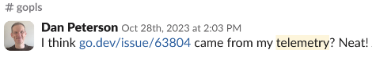
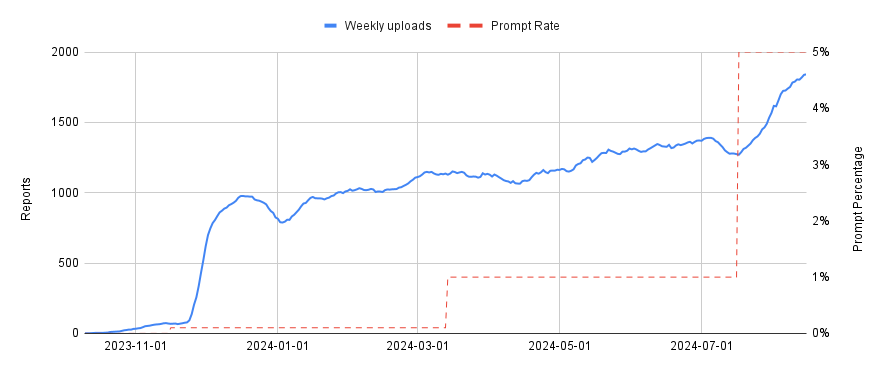
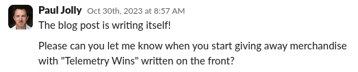

<style type="text/css" scoped>
  #blog #content img#prompt {
    max-width: 500px;
  }
  .centered {
    display: flex;
    flex-direction: column;
    align-items: center;
  }
  .chart {
    width: 100%;
  }
  @media (prefers-color-scheme: dark) {
    .chart {
      border-radius: 8px;
    }
  }
  figure.captioned {
    display: table;
  }
  figure.captioned figcaption {
    display: table-caption;
    caption-side: bottom;
    font-style: italic;
    font-size: small;
    text-align: center;
  }
</style>

Go 1.23 provides a new way for you to help improve the Go toolchain. By
enabling [telemetry uploading](/doc/go1.23#telemetry), you can elect to share
data about toolchain programs and their usage with the Go team. This data will
help Go contributors fix bugs, avoid regressions, and make better decisions.

By default, Go telemetry data is stored only on your local computer. If you
enable uploading, a [limited](/doc/telemetry#proposals) subset of your data
is published weekly to [telemetry.go.dev](https://telemetry.go.dev).

Starting with Go 1.23, you can enable uploading of your local telemetry data
with the following command:

```
go telemetry on
```

To disable even local telemetry data collection, run the following command:

```
go telemetry off
```

The [telemetry documentation](/doc/telemetry) contains a more detailed
description of the implementation.

## A brief history of Go telemetry

While software telemetry is not a new idea, the Go team went through many
iterations in search of a telemetry implementation that met Go's requirements
for performance, portability, and transparency.

The initial [design](https://research.swtch.com/telemetry-design) aimed to be
so unobtrusive, open, and privacy-preserving that it would be acceptable to
enable by default, but many users raised concerns in a lengthy [public
discussion](/issue/58409), and the design was ultimately
[changed](https://research.swtch.com/telemetry-opt-in#campaign) to require
explicit user consent for remote uploading.

The new design was [accepted](/issue/58894) in April 2023, and implemented over
that summer.

### Telemetry in gopls

The first iteration of Go telemetry shipped in
[v0.14](https://github.com/golang/tools/releases/tag/gopls%2Fv0.14.0)
of the Go language server
[`gopls`](https://go.googlesource.com/tools/+/refs/heads/master/gopls/), in
October 2023. Following the launch, around 100 users enabled uploading,
perhaps motivated by release notes or discussion in the
[Gophers Slack](https://gophers.slack.com/messages/gopls/) channel, and data
started to trickle in. It wasn't long before telemetry found its first bug in
gopls:

<div class="image">
<div class="centered">
<figure class="captioned">

<figcaption>
A stack trace Dan noticed in his uploaded telemetry data led to a bug being
reported and fixed. It's worth pointing out that we had no idea who had
reported the stack.
</figcaption>
</figure>
</div>
</div>


### IDE Prompting

While it was great to see telemetry working in practice, and we appreciated the
support of those early adopters, 100 participants isn't enough to measure the
types of things we want to measure.

As Russ Cox [pointed out](https://research.swtch.com/telemetry-opt-in#campaign)
in his original blog posts, a drawback of the off-by-default approach for
telemetry is the continuous need to encourage participation. It takes outreach
to maintain a sample of users that's big enough for meaningful quantitative
data analysis, and representative of the user population. While blog posts and
release notes can boost participation (and we'd appreciate it if you would
enable telemetry after reading this!), they lead to a skewed sample. For
example, we received almost no data for `GOOS=windows` from early adopters of
telemetry in gopls.

To help reach more users, we introduced a [prompt](/doc/telemetry#ide) in the
[VS Code Go plugin](https://marketplace.visualstudio.com/items?itemName=golang.go)
asking users if they want to enable telemetry:

<div class="image">
<div class="centered">
<figure class="captioned">

<figcaption>
The telemetry prompt, as displayed by VS Code.
</figcaption>
</figure>
</div>
</div>

As of this blog post, the prompt has rolled out to 5% of VS Code Go users, and
the telemetry sample has grown to around 1800 weekly participants:

<div class="image">
<div class="centered">
<figure class="captioned">

<figcaption>Prompting helps reach more users.</figcaption>
</figure>
</div>
</div>

(The initial bump is likely due to prompting *all* users of the
[VS Code Go nightly](https://marketplace.visualstudio.com/items?itemName=golang.go-nightly)
extension).

However, it has introduced a noticeable skew toward VS Code users, as compared
to the [most recent Go survey results](survey2024-h1-results.md):

<div class="image">
<div class="centered">
<figure class="captioned">

<figcaption>We suspect that VS Code is overrepresented in telemetry data.</figcaption>
</figure>
</div>
</div>

We're planning to address this skew by [prompting all LSP-capable editors that
use gopls](/issue/67821), using a feature of the language server protocol
itself.

### Telemetry wins

Out of caution, we proposed the collection of only a few basic metrics for the
initial launch of telemetry in gopls. One of those was the
[`gopls/bug`](/issue/62249) [stack counter](/doc/telemetry#stack-counters),
which records unexpected or "impossible" conditions encountered by gopls. In
effect, it's a kind of assertion, but instead of stopping the program, it
records in telemetry that it was reached in some execution, along with the
stack.

During our [gopls scalability](gopls-scalability.md) work, we had added many
assertions of this kind, but we rarely observed them to fail in tests or in our
own usage of gopls. We expected that almost all of these assertions were
unreachable.

As we started prompting random users in VS Code to enable telemetry, we saw
that many of these conditions *were* reached in practice, and the context of
the stack trace was often sufficient for us to reproduce and fix long-standing
bugs. We started collecting these issues under the
[`gopls/telemetry-wins`](https://github.com/golang/go/issues?q=is%3Aissue+label%3Agopls%2Ftelemetry-wins)
label, to keep track of "wins" facilitated by telemetry.

I've come to think of "telemetry wins" with a second meaning: when comparing
gopls development with and without telemetry, *telemetry wins*.

<div class="image">
<div class="centered">
<figure class="captioned">

<figcaption>Thank you Paul for the suggestions.</figcaption>
</figure>
</div>
</div>

The most surprising aspect of the bugs coming from telemetry was how many of
them were *real*. Sure, some of them were invisible to users, but a good number
of them were actual misbehaviors of gopls--things like missing cross
references, or subtly inaccurate completion under certain rare conditions. They
were exactly the sort of things that a user might be mildly annoyed by but
probably wouldn't bother to report as an issue. Perhaps the user would assume
that the behavior was intended. If they did report an issue, they might not be
sure how to reproduce the bug, or we'd need a long back-and-forth on the issue
tracker to capture a stack trace. Without telemetry, there is
*no reasonable way* that most of these bugs would have been discovered, much
less fixed.

And all this was from only a few counters. We'd only instrumented stack traces
for the potential bugs _we knew about_. What about problems we didn't
anticipate?

### Automated crash reporting

Go 1.23 includes a new
[`runtime.SetCrashOutput`](/doc/go1.23#runtimedebugpkgruntimedebug) API that
can be used to implement automated crash reporting via a watchdog process.
Starting with
[v0.15.0](https://github.com/golang/tools/releases/tag/gopls%2Fv0.15.0), gopls
reports a `crash/crash` stack counter when it crashes, *provided gopls itself
is built with Go 1.23*.

When we released gopls@v0.15.0, only a handful of users in our sample had built
gopls using an unreleased development build of Go 1.23, yet the new
`crash/crash` counter still found
[two bugs](https://github.com/golang/tools/releases/tag/gopls%2Fv0.15.2).

## Telemetry in the Go toolchain and beyond

Given how useful telemetry has proven with only a tiny amount of
instrumentation and a fraction of our target sample, the future looks bright.

Go 1.23 records telemetry within the Go toolchain, including the `go` command
and other tools such as the compiler, linker, and `go vet`. We've added
telemetry to `vulncheck` and the VS Code Go plugin, and
[we propose](/issue/68384) to add it to `delve` as well.

The original telemetry blog series brainstorms
[many ideas](https://research.swtch.com/telemetry-uses) for how telemetry could
be used to improve Go. We're looking forward to exploring those ideas and more.

Within gopls, we plan to use telemetry to improve reliability and inform
decision making and prioritization. With the automated crash reporting enabled
by Go 1.23, we expect to catch many more crashes in prerelease testing. Going
forward, we'll add more counters to measure the user experience--latency of key
operations, frequency of use of various features--so that we can focus our
efforts where they will most benefit Go developers.

Go turns 15 this November, and both the language and its ecosystem continue to
grow. Telemetry will play a critical role in helping Go contributors move
faster and more safely, in the right direction.
