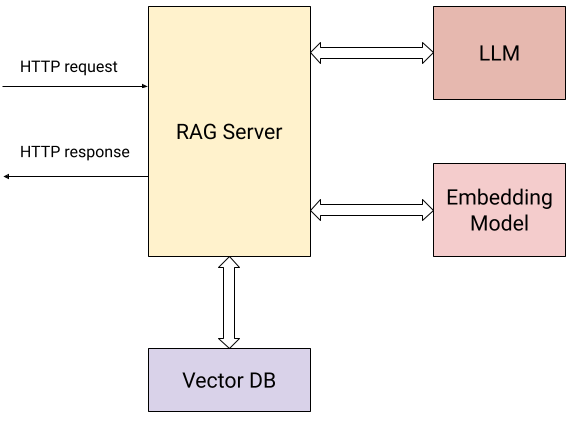

As the capabilities of LLMs (Large Language Models) and adjacent tools like
embedding models grew significantly over the past year, more and more developers
are considering integrating LLMs into their applications.

Since LLMs often require dedicated hardware and significant compute resources,
they are most commonly packaged as network services that provide APIs for
access. This is how the APIs for leading LLMs like OpenAI or Google Gemini work;
even run-your-own-LLM tools like [Ollama](https://ollama.com/) wrap
the LLM in a REST API for local consumption. Moreover, developers who take
advantage of LLMs in their applications often require supplementary tools like
Vector Databases, which are most commonly deployed as network services as
well.

In other words, LLM-powered applications are a lot like other modern
cloud-native applications: they require excellent support for REST and RPC
protocols, concurrency and performance. These just so happen to be the areas
where Go excels, making it a fantastic language for writing LLM-powered
applications.

This blog post works through an example of using Go for a simple LLM-powered
application. It starts by describing the problem the demo application is
solving, and proceeds by presenting several variants of the application that
all accomplish the same task, but use different packages to implement it. All
the code for the demos of this post
[is available online](https://github.com/golang/example/tree/master/ragserver).

## A RAG server for Q&A

A common LLM-powered application technique is RAG -
[Retrieval Augmented Generation](https://en.wikipedia.org/wiki/Retrieval-augmented_generation).
RAG is one of the most scalable ways of customizing an LLM's knowledge base
for domain-specific interactions.

We're going to build a *RAG server* in Go. This is an HTTP server that provides
two operations to users:

* Add a document to the knowledge base
* Ask an LLM a question about this knowledge base

In a typical real-world scenario, users would add a corpus of documents to
the server, and proceed to ask it questions. For example, a company can fill up
the RAG server's knowledge base with internal documentation and use it to
provide LLM-powered Q&A capabilities to internal users.

Here's a diagram showing the interactions of our server with the external
world:

<div class="image"><div class="centered">
<figure>

</figure>
</div></div>

In addition to the user sending HTTP requests (the two operations described
above), the server interacts with:

* An embedding model to calculate [vector embeddings](https://en.wikipedia.org/wiki/Sentence_embedding)
  for the submitted documents and for user questions.
* A Vector Database for storing and retrieving embeddings efficiently.
* An LLM for asking questions based on context collected from the knowledge
  base.

Concretely, the server exposes two HTTP endpoints to users:

`/add/: POST {"documents": [{"text": "..."}, {"text": "..."}, ...]}`: submits
a sequence of text documents to the server, to be added to its knowledge base.
For this request, the server:

1. Calculates a vector embedding for each document using the embedding model.
2. Stores the documents along with their vector embeddings in the vector DB.

`/query/: POST {"content": "..."}`: submits a question to the server. For this
request, the server:

1. Calculates the question's vector embedding using the embedding model.
2. Uses the vector DB's similarity search to find the most relevant documents
   to the question in the knowledge database.
3. Uses simple prompt engineering to reformulate the question with the most
   relevant documents found in step (2) as context, and sends it to the LLM,
   returning its answer to the user.

The services used by our demo are:

* [Google Gemini API](https://ai.google.dev/) for the LLM and embedding model.
* [Weaviate](https://weaviate.io/) for a locally-hosted vector DB; Weaviate
  is an open-source vector database
  [implemented in Go](https://github.com/weaviate/weaviate).

It should be very simple to replace these by other, equivalent services. In
fact, this is what the second and third variants of the server are all about!
We'll start with the first variant which uses these tools directly.

## Using the Gemini API and Weaviate directly

Both the Gemini API and Weaviate have convenient Go SDKs (client libraries),
and our first server variant uses these directly. The full code of this
variant is [in this directory](https://github.com/golang/example/tree/master/ragserver/ragserver).

We won't reproduce the entire code in this blog post, but here are some notes
to keep in mind while reading it:

**Structure**: the code structure will be familiar to anyone who's written an
HTTP server in Go. Client libraries for Gemini and for Weaviate are initialized
and the clients are stored in a state value that's passed to HTTP handlers.

**Route registration**: the HTTP routes for our server are trivial to set up
using the [routing enhancements](/blog/routing-enhancements) introduced in
Go 1.22:

```Go
mux := http.NewServeMux()
mux.HandleFunc("POST /add/", server.addDocumentsHandler)
mux.HandleFunc("POST /query/", server.queryHandler)
```

**Concurrency**: the HTTP handlers of our server reach out
to other services over the network and wait for a response. This isn't a problem
for Go, since each HTTP handler runs concurrently in its own goroutine. This
RAG server can handle a large number of concurrent requests, and the code of
each handler is linear and synchronous.

**Batch APIs**: since an `/add/` request may provide a large number of documents
to add to the knowledge base, the server leverages *batch APIs* for both
embeddings (`embModel.BatchEmbedContents`) and the Weaviate DB
(`rs.wvClient.Batch`) for efficiency.

## Using LangChain for Go

Our second RAG server variant uses LangChainGo to accomplish the same task.

[LangChain](https://www.langchain.com/) is a popular Python framework for
building LLM-powered applications.
[LangChainGo](https://github.com/tmc/langchaingo) is its Go equivalent. The
framework has some tools to build applications out of modular components, and
supports many LLM providers and vector databases in a common API. This allows
developers to write code that may work with any provider and change providers
very easily.

The full code for this variant is [in this directory](https://github.com/golang/example/tree/master/ragserver/ragserver-langchaingo).
You'll notice two things when reading the code:

First, it's somewhat shorter than the previous variant. LangChainGo takes care
of wrapping the full APIs of vector databases in common interfaces, and less
code is needed to initialize and deal with Weaviate.

Second, the LangChainGo API makes it fairly easy to switch providers. Let's say
we want to replace Weaviate by another vector DB; in our previous variant, we'd
have to rewrite all the code interfacing the vector DB to use a new API. With
a framework like LangChainGo, we no longer need to do so. As long as LangChainGo
supports the new vector DB we're interested in, we should be able to replace
just a few lines of code in our server, since all the DBs implement a
[common interface](https://pkg.go.dev/github.com/tmc/langchaingo@v0.1.12/vectorstores#VectorStore):

```Go
type VectorStore interface {
	AddDocuments(ctx context.Context, docs []schema.Document, options ...Option) ([]string, error)
	SimilaritySearch(ctx context.Context, query string, numDocuments int, options ...Option) ([]schema.Document, error)
}
```

## Using Genkit for Go

Earlier this year, Google introduced [Genkit for Go](https://developers.googleblog.com/en/introducing-genkit-for-go-build-scalable-ai-powered-apps-in-go/) -
a new open-source framework for building LLM-powered applications. Genkit shares
some characteristics with LangChain, but diverges in other aspects.

Like LangChain, it provides common interfaces that may be implemented by
different providers (as plugins), and thus makes switching from one to the other
simpler. However, it doesn't try to prescribe how different LLM components
interact; instead, it focuses on production features like prompt management and
engineering, and deployment with integrated developer tooling.

Our third RAG server variant uses Genkit for Go to accomplish the same task.
Its full code is [in this directory](https://github.com/golang/example/tree/master/ragserver/ragserver-genkit).

This variant is fairly similar to the LangChainGo one - common interfaces for
LLMs, embedders and vector DBs are used instead of direct provider APIs, making
it easier to switch from one to another. In addition, deploying an LLM-powered
application to production is much easier with Genkit; we don't implement this
in our variant, but feel free to read [the documentation](https://firebase.google.com/docs/genkit-go/get-started-go)
if you're interested.

## Summary - Go for LLM-powered applications

The samples in this post provide just a taste of what's possible for building
LLM-powered applications in Go. It demonstrates how simple it is to build
a powerful RAG server with relatively little code; most important, the samples
pack a significant degree of production readiness because of some fundamental
Go features.

Working with LLM services often means sending REST or RPC requests to a network
service, waiting for the response, sending new requests to other services based
on that and so on. Go excels at all of these, providing great tools for managing
concurrency and the complexity of juggling network services.

In addition, Go's great performance and reliability as a Cloud-native language
makes it a natural choice for implementing the more fundamental building blocks
of the LLM ecosystem. For some examples, see projects like
[Ollama](https://ollama.com/), [LocalAI](https://localai.io/),
[Weaviate](https://weaviate.io/) or [Milvus](https://zilliz.com/what-is-milvus).
