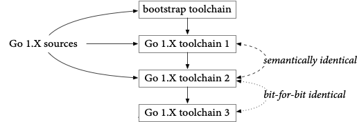
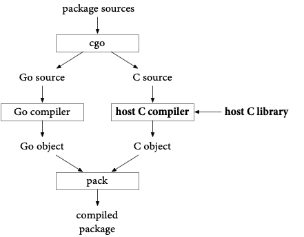
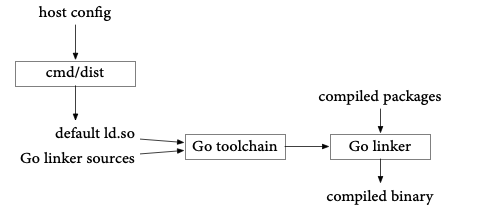
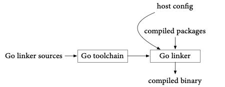

One of the key benefits of open-source software is that anyone can read
the source code and inspect what it does.
And yet most software, even open-source software,
is downloaded in the form of compiled binaries,
which are much more difficult to inspect.
If an attacker wanted to run a [supply chain attack](https://cloud.google.com/software-supply-chain-security/docs/attack-vectors)
on an open-source project,
the least visible way would be to replace the binaries being served while
leaving the source code unmodified.

The best way to address this kind of attack is to make open-source software
builds _reproducible_,
meaning that a build that starts with the same sources produces the same
outputs every time it runs.
That way, anyone can verify that posted binaries are free of hidden changes
by building from authentic sources and checking that the rebuilt binaries
are bit-for-bit identical to the posted binaries.
That approach proves the binaries have no backdoors or other changes not
present in the source code,
without having to disassemble or look inside them at all.
Since anyone can verify the binaries, independent groups can easily detect
and report supply chain attacks.

As supply chain security becomes more important,
so do reproducible builds, because they provide a simple way to verify the
posted binaries for open-source projects.

Go 1.21.0 is the first Go toolchain with perfectly reproducible builds.
Earlier toolchains were possible to reproduce,
but only with significant effort, and probably no one did:
they just trusted that the binaries posted on [go.dev/dl](/dl/) were the correct ones.
Now it’s easy to “trust but verify.”

This post explains what goes into making builds reproducible,
examines the many changes we had to make to Go to make Go toolchains reproducible,
and then demonstrates one of the benefits of reproducibility by verifying
the Ubuntu package for Go 1.21.0.

## Making a Build Reproducible {#how}

Computers are generally deterministic, so you might think all builds would
be equally reproducible.
That’s only true from a certain point of view.
Let’s call a piece of information a _relevant input_ when the output of
a build can change depending on that input.
A build is reproducible if it can be repeated with all the same relevant inputs.
Unfortunately, lots of build tools turn out to incorporate inputs that we
would usually not realize are relevant and that might be difficult to recreate
or provide as input.
Let’s call an input an _unintentional input_ when it turns out to be relevant
but we didn’t mean it to be.

The most common unintentional input in build systems is the current time.
If a build writes an executable to disk, the file system records the current
time as the executable’s modification time.
If the build then packages that file using a tool like “tar” or “zip”,
the modification time is written into the archive.
We certainly didn’t want our build to change based on the current time, but it does.
So the current time turns out to be an unintentional input to the build.
Worse, most programs don’t let you provide the current time as an input,
so there is no way to repeat this build.
To fix this, we might set the time stamps on created files to Unix time
0 or to a specific time read from one of the build’s source files.
That way, the current time is no longer a relevant input to the build.

Common relevant inputs to a build include:

  - the specific version of the source code to build;
  - the specific versions of dependencies that will be included in the build;
  - the operating system running the build, which may affect path names in the resulting binaries;
  - the architecture of the CPU on the build system,
    which may affect which optimizations the compiler uses or the layout of certain data structures;
  - the compiler version being used, as well as compiler options passed to it, which affect how the code is compiled;
  - the name of the directory containing the source code, which may appear in debug information;
  - the user name, group name, uid, and gid of the account running the build, which may appear in file metadata in an archive;
  - and many more.

To have a reproducible build, every relevant input must be configurable in the build,
and then the binaries must be posted alongside an explicit configuration
listing every relevant input.
If you’ve done that, you have a reproducible build. Congratulations!

We’re not done, though. If the binaries can only be reproduced if you
first find a computer with the right architecture,
install a specific operating system version,
compiler version, put the source code in the right directory,
set your user identity correctly, and so on,
that may be too much work in practice for anyone to bother.

We want builds to be not just reproducible but _easy to reproduce_.
To do that, we need to identify relevant inputs and then,
instead of documenting them, eliminate them.
The build obviously has to depend on the source code being built,
but everything else can be eliminated.
When a build’s only relevant input is its source code,
let’s call that _perfectly reproducible_.

## Perfectly Reproducible Builds for Go {#go}

As of Go 1.21, the Go toolchain is perfectly reproducible:
its only relevant input is the source code for that build.
We can build a specific toolchain (say, Go for Linux/x86-64) on a Linux/x86-64 host,
or a Windows/ARM64 host, or a FreeBSD/386 host,
or any other host that supports Go, and we can use any Go bootstrap compiler,
including bootstrapping all the way back to Go 1.4’s C implementation,
and we can vary any other details.
None of that changes the toolchains that are built.
If we start with the same toolchain source code,
we will get the exact same toolchain binaries out.

This perfect reproducibility is the culmination of efforts dating back originally to Go 1.10,
although most of the effort was concentrated in Go 1.20 and Go 1.21.
This section highlights some of the most interesting relevant inputs that we eliminated.

### Reproducibility in Go 1.10 {#go110}

Go 1.10 introduced a content-aware build cache that decides whether targets
are up-to-date based on a fingerprint of the build inputs instead of file modification times.
Because the toolchain itself is one of those build inputs,
and because Go is written in Go, the [bootstrap process](/s/go15bootstrap)
would only converge if the toolchain build on a single machine was reproducible.
The overall toolchain build looks like this:

We start by building the sources for the current Go toolchain using an earlier Go version,
the bootstrap toolchain (Go 1.10 used Go 1.4, written in C;
Go 1.21 uses Go 1.17).
That produces “toolchain1”, which we use to build everything again,
producing “toolchain2”, which we use to build everything again,
producing “toolchain3”.

Toolchain1 and toolchain2 have been built from the same sources but with
different Go implementations (compilers and libraries),
so their binaries are certain to be different.
However, if both Go implementations are non-buggy,
correct implementations, toolchain1 and toolchain2 should behave exactly the same.
In particular, when presented with the Go 1.X sources,
toolchain1’s output (toolchain2) and toolchain2’s output (toolchain3)
should be identical,
meaning toolchain2 and toolchain3 should be identical.

At least, that’s the idea. Making that true in practice required removing a couple unintentional inputs:

**Randomness.** Map iteration and running work in multiple goroutines serialized
with locks both introduce randomness in the order that results may be generated.
This randomness can make the toolchain produce one of several different
possible outputs each time it runs.
To make the build reproducible, we had to find each of these and sort the
relevant list of items before using it to generate output.

**Bootstrap Libraries.** Any library used by the compiler that can choose
from multiple different correct outputs might change its output from one
Go version to the next.
If that library output change causes a compiler output change,
then toolchain1 and toolchain2 will not be semantically identical,
and toolchain2 and toolchain3 will not be bit-for-bit identical.

The canonical example is the [`sort`](/pkg/sort/) package,
which can place elements that compare equal in [any order it likes](/blog/compat#output).
A register allocator might sort to prioritize commonly used variables,
and the linker sorts symbols in the data section by size.
To completely eliminate any effect from the sorting algorithm,
the comparison function used must never report two distinct elements as equal.
In practice, this invariant turned out to be too onerous to impose on every
use of sort in the toolchain,
so instead we arranged to copy the Go 1.X `sort` package into the source
tree that is presented to the bootstrap compiler.
That way, the compiler uses the same sort algorithm when using the bootstrap
toolchain as it does when built with itself.

Another package we had to copy was [`compress/zlib`](/pkg/compress/zlib/),
because the linker writes compressed debug information,
and optimizations to compression libraries can change the exact output.
Over time, we’ve [added other packages to that list too](https://go.googlesource.com/go/+/go1.21.0/src/cmd/dist/buildtool.go#55).
This approach has the added benefit of allowing the Go 1.X compiler to use
new APIs added to those packages immediately,
at the cost that those packages must be written to compile with older versions of Go.

### Reproducibility in Go 1.20 {#go120}

Work on Go 1.20 prepared for both easy reproducible builds and [toolchain management](toolchain)
by removing two more relevant inputs from the toolchain build.

**Host C toolchain.** Some Go packages, most notably `net`,
default to [using `cgo`](cgo) on most operating systems.
In some cases, such as macOS and Windows,
invoking system DLLs using `cgo` is the only reliable way to resolve host names.
When we use `cgo`, though, we invoke the host C toolchain (meaning a specific
C compiler and C library),
and different toolchains have different compilation algorithms and library code,
producing different outputs.
The build graph for a `cgo` package looks like:

The host C toolchain is therefore a relevant input to the pre-compiled `net.a`
that ships with the toolchain.
For Go 1.20, we decided to fix this by removing `net.a` from the toolchain.
That is, Go 1.20 stopped shipping pre-compiled packages to seed the build cache with.
Now, the first time a program uses package `net`,
the Go toolchain compiles it using the local system’s C toolchain and caches that result.
In addition to removing a relevant input from toolchain builds and making
toolchain downloads smaller,
not shipping pre-compiled packages also makes toolchain downloads more portable.
If we build package `net` on one system with one C toolchain and then compile
other parts of the program on a different system with a different C toolchain,
in general there is no guarantee that the two parts can be linked together.

One reason we shipped the pre-compiled `net` package in the first place
was to allow building programs that used package net even on systems without
a C toolchain installed.
If there’s no pre-compiled package, what happens on those systems? The
answer varies by operating system,
but in all cases we arranged for the Go toolchain to continue to work well
for building pure Go programs without a host C toolchain.

  - On macOS, we rewrote package net using the underlying mechanisms that cgo would use,
    without any actual C code.
    This avoids invoking the host C toolchain but still emits a binary that
    refers to the required system DLLs.
    This approach is only possible because every Mac has the same dynamic libraries installed.
    Making the non-cgo macOS package net use the system DLLs also meant that
    cross-compiled macOS executables now use the system DLLs for network access,
    resolving a long-standing feature request.

  - On Windows, package net already made direct use of DLLs without C code, so nothing needed to be changed.

  - On Unix systems, we cannot assume a specific DLL interface to network code,
    but the pure Go version works fine for systems that use typical IP and DNS setups.
    Also, it is much easier to install a C toolchain on Unix systems than it
    is on macOS and especially Windows.
    We changed the `go` command to enable or disable `cgo` automatically based
    on whether the system has a C toolchain installed.
    Unix systems without a C toolchain fall back to the pure Go version of package net,
    and in the rare cases where that’s not good enough,
    they can install a C toolchain.

Having dropped the pre-compiled packages,
the only part of the Go toolchain that still depended on the host C toolchain
was binaries built using package net,
specifically the `go` command.
With the macOS improvements, it was now viable to build those commands with `cgo` disabled,
completely removing the host C toolchain as an input,
but we left that final step for Go 1.21.

**Host dynamic linker.** When programs use `cgo` on a system using dynamically linked C libraries,
the resulting binaries contain the path to the system’s dynamic linker,
something like `/lib64/ld-linux-x86-64.so.2`.
If the path is wrong, the binaries don’t run.
Typically each operating system/architecture combination has a single correct
answer for this path.
Unfortunately, musl-based Linuxes like Alpine Linux use a different dynamic
linker than glibc-based Linuxes like Ubuntu.
To make Go run at all on Alpine Linux, in Go bootstrap process looked like this:

The bootstrap program cmd/dist inspected the local system’s dynamic linker
and wrote that value into a new source file compiled along with the rest
of the linker sources,
effectively hard-coding that default into the linker itself.
Then when the linker built a program from a set of compiled packages,
it used that default.
The result is that a Go toolchain built on Alpine is different from a toolchain built on Ubuntu:
the host configuration is a relevant input to the toolchain build.
This is a reproducibility problem but also a portability problem:
a Go toolchain built on Alpine doesn’t build working binaries or even
run on Ubuntu, and vice versa.

For Go 1.20, we took a step toward fixing the reproducibility problem by
changing the linker to consult the host configuration when it is running,
instead of having a default hard-coded at toolchain build time:

This fixed the portability of the linker binary on Alpine Linux,
although not the overall toolchain, since the `go` command still used package
`net` and therefore `cgo` and therefore had a dynamic linker reference in its own binary.
Just as in the previous section, compiling the `go` command without `cgo`
enabled would fix this,
but we left that change for Go 1.21.
(We didn’t feel there was enough time left in the Go 1.20 cycle to test
such that change properly.)

### Reproducibility in Go 1.21 {#go121}

For Go 1.21, the goal of perfect reproducibility was in sight,
and we took care of the remaining, mostly small,
relevant inputs that remained.

**Host C toolchain and dynamic linker.** As discussed above,
Go 1.20 took important steps toward removing the host C toolchain and dynamic
linker as relevant inputs.
Go 1.21 completed the removal of these relevant inputs by building the toolchain
with `cgo` disabled.
This improved portability of the toolchain too:
Go 1.21 is the first Go release where the standard Go toolchain runs unmodified
on Alpine Linux systems.

Removing these relevant inputs made it possible to cross-compile a Go toolchain
from a different system without any loss in functionality.
That in turn improved the supply chain security of the Go toolchain:
we can now build Go toolchains for all target systems using a trusted Linux/x86-64 system,
instead of needing to arrange a separate trusted system for each target.
As a result, Go 1.21 is the first release to include posted binaries for
all systems at [go.dev/dl/](/dl/).

**Source directory.** Go programs include full paths in the runtime and debugging metadata,
so that when a program crashes or is run in a debugger,
stack traces include the full path to the source file,
not just the name of the file in an unspecified directory.
Unfortunately, including the full path makes the directory where the source
code is stored a relevant input to the build.
To fix this, Go 1.21 changed the release toolchain builds to install commands
like the compiler using `go install -trimpath`,
which replaces the source directory with the module path of the code.
If a released compiler crashes, the stack trace will print paths like `cmd/compile/main.go`
instead of `/home/user/go/src/cmd/compile/main.go`.
Since the full paths would refer to a directory on a different machine anyway,
this rewrite is no loss.
On the other hand, for non-release builds,
we keep the full path, so that when developers working on the compiler itself cause it to crash,
IDEs and other tools reading those crashes can easily find the correct source file.

**Host operating system.** Paths on Windows systems are backslash-separated,
like `cmd\compile\main.go`.
Other systems use forward slashes, like `cmd/compile/main.go`.
Although earlier versions of Go had normalized most of these paths to use forward slashes,
one inconsistency had crept back in, causing slightly different toolchain builds on Windows.
We found and fixed the bug.

**Host architecture.** Go runs on a variety of ARM systems and can emit
code using a software library for floating-point math (SWFP) or using hardware
floating-point instructions (HWFP).
Toolchains defaulting to one mode or the other will necessarily differ.
Like we saw with the dynamic linker earlier,
the Go bootstrap process inspected the build system to make sure that the
resulting toolchain worked on that system.
For historical reasons, the rule was “assume SWFP unless the build is
running on an ARM system with floating-point hardware”,
with cross-compiled toolchains assuming SWFP.
The vast majority of ARM systems today do have floating-point hardware,
so this introduced an unnecessary difference between natively compiled and
cross-compiled toolchains,
and as a further wrinkle, Windows ARM builds always assumed HWFP,
making the decision operating system-dependent.
We changed the rule to be “assume HWFP unless the build is running on
an ARM system without floating-point hardware”.
This way, cross-compilation and builds on modern ARM systems produce identical toolchains.

**Packaging logic.** All the code to create the actual toolchain archives
we post for download lived in a separate Git repository,
golang.org/x/build, and the exact details of how archives get packaged does change over time.
If you wanted to reproduce those archives,
you needed to have the right version of that repository.
We removed this relevant input by moving the code to package the archives
into the main Go source tree, as `cmd/distpack`.
As of Go 1.21, if you have the sources for a given version of Go,
you also have the sources for packaging the archives.
The golang.org/x/build repository is no longer a relevant input.

**User IDs.** The tar archives we posted for download were built from a
distribution written to the file system,
and using [`tar.FileInfoHeader`](/pkg/archive/tar/#FileInfoHeader) copies
the user and group IDs from the file system into the tar file,
making the user running the build a relevant input.
We changed the archiving code to clear these.

**Current time.** Like with user IDs, the tar and zip archives we posted
for download had been built by copying the file system modification times into the archives,
making the current time a relevant input.
We could have cleared the time, but we thought it would look surprising
and possibly even break some tools to use the Unix or MS-DOS zero time.
Instead, we changed the go/VERSION file stored in the repository to add
the time associated with that version:

	$ cat go1.21.0/VERSION
	go1.21.0
	time 2023-08-04T20:14:06Z
	$

The packagers now copy the time from the VERSION file when writing files to archives,
instead of copying the local file’s modification times.

**Cryptographic signing keys.** The Go toolchain for macOS won’t run on
end-user systems unless we sign the binaries with an Apple-approved signing key.
We use an internal system to get them signed with Google’s signing key,
and obviously we cannot share that secret key in order to allow others to
reproduce the signed binaries.
Instead, we wrote a verifier that can check whether two binaries are identical
except for their signatures.

**OS-specific packagers.** We use the Xcode tools `pkgbuild` and `productbuild`
to create the downloadable macOS PKG installer,
and we use WiX to create the downloadable Windows MSI installer.
We don’t want verifiers to need the same exact versions of those tools,
so we took the same approach as for the cryptographic signing keys,
writing a verifier that can look inside the packages and check that the
toolchain files are exactly as expected.

## Verifying the Go Toolchains {#verify}

It’s not enough to make Go toolchains reproducible once.
We want to make sure they stay reproducible,
and we want to make sure others can reproduce them easily.

To keep ourselves honest, we now build all Go distributions on both a trusted
Linux/x86-64 system and a Windows/x86-64 system.
Except for the architecture, the two systems have almost nothing in common.
The two systems must produce bit-for-bit identical archives or else we do
not proceed with the release.

To allow others to verify that we’re honest,
we’ve written and published a verifier,
[`golang.org/x/build/cmd/gorebuild`](https://pkg.go.dev/golang.org/x/build/cmd/gorebuild).
That program will start with the source code in our Git repository and rebuild the
current Go versions, checking that they match the archives posted on [go.dev/dl](/dl/).
Most archives are required to match bit-for-bit.
As mentioned above, there are three exceptions where a more relaxed check is used:

  - The macOS tar.gz file is expected to differ,
    but then the verifier compares the contents inside.
    The rebuilt and posted copies must contain the same files,
    and all the files must match exactly, except for executable binaries.
    Executable binaries must match exactly after stripping code signatures.

  - The macOS PKG installer is not rebuilt. Instead,
    the verifier reads the files inside the PKG installer and checks that they
    match the macOS tar.gz exactly,
    again after code signature stripping.
    In the long term, the PKG creation is trivial enough that it could potentially
    be added to cmd/distpack,
    but the verifier would still have to parse the PKG file to run the signature-ignoring
    code executable comparison.

  - The Windows MSI installer is not rebuilt.
    Instead, the verifier invokes the Linux program `msiextract` to extract
    the files inside and check that they match the rebuilt Windows zip file exactly.
    In the long term, perhaps the MSI creation could be added to cmd/distpack,
    and then the verifier could use a bit-for-bit MSI comparison.

We run `gorebuild` nightly, posting the results at [go.dev/rebuild](/rebuild),
and of course anyone else can run it too.

## Verifying Ubuntu’s Go Toolchain {#ubuntu}

The Go toolchain’s easily reproducible builds should mean that the binaries
in the toolchains posted on go.dev match the binaries included in other packaging systems,
even when those packagers build from source.
Even if the packagers have compiled with different configurations or other changes,
the easily reproducible builds should still make it easy to reproduce their binaries.
To demonstrate this, let’s reproduce the Ubuntu `golang-1.21` package
version `1.21.0-1` for Linux/x86-64.

To start, we need to download and extract the Ubuntu packages,
which are [ar(1) archives](https://linux.die.net/man/1/ar) containing zstd-compressed tar archives:

{{raw `
	$ mkdir deb
	$ cd deb
	$ curl -LO http://mirrors.kernel.org/ubuntu/pool/main/g/golang-1.21/golang-1.21-src_1.21.0-1_all.deb
	$ ar xv golang-1.21-src_1.21.0-1_all.deb
	x - debian-binary
	x - control.tar.zst
	x - data.tar.zst
	$ unzstd < data.tar.zst | tar xv
	...
	x ./usr/share/go-1.21/src/archive/tar/common.go
	x ./usr/share/go-1.21/src/archive/tar/example_test.go
	x ./usr/share/go-1.21/src/archive/tar/format.go
	x ./usr/share/go-1.21/src/archive/tar/fuzz_test.go
	...
	$
`}}

That was the source archive. Now the amd64 binary archive:

{{raw `
	$ rm -f debian-binary *.zst
	$ curl -LO http://mirrors.kernel.org/ubuntu/pool/main/g/golang-1.21/golang-1.21-go_1.21.0-1_amd64.deb
	$ ar xv golang-1.21-src_1.21.0-1_all.deb
	x - debian-binary
	x - control.tar.zst
	x - data.tar.zst
	$ unzstd < data.tar.zst | tar xv | grep -v '/$'
	...
	x ./usr/lib/go-1.21/bin/go
	x ./usr/lib/go-1.21/bin/gofmt
	x ./usr/lib/go-1.21/go.env
	x ./usr/lib/go-1.21/pkg/tool/linux_amd64/addr2line
	x ./usr/lib/go-1.21/pkg/tool/linux_amd64/asm
	x ./usr/lib/go-1.21/pkg/tool/linux_amd64/buildid
	...
	$
`}}

Ubuntu splits the normal Go tree into two halves,
in /usr/share/go-1.21 and /usr/lib/go-1.21.
Let’s put them back together:

	$ mkdir go-ubuntu
	$ cp -R usr/share/go-1.21/* usr/lib/go-1.21/* go-ubuntu
	cp: cannot overwrite directory go-ubuntu/api with non-directory usr/lib/go-1.21/api
	cp: cannot overwrite directory go-ubuntu/misc with non-directory usr/lib/go-1.21/misc
	cp: cannot overwrite directory go-ubuntu/pkg/include with non-directory usr/lib/go-1.21/pkg/include
	cp: cannot overwrite directory go-ubuntu/src with non-directory usr/lib/go-1.21/src
	cp: cannot overwrite directory go-ubuntu/test with non-directory usr/lib/go-1.21/test
	$

The errors are complaining about copying symlinks, which we can ignore.

Now we need to download and extract the upstream Go sources:

	$ curl -LO https://go.googlesource.com/go/+archive/refs/tags/go1.21.0.tar.gz
	$ mkdir go-clean
	$ cd go-clean
	$ curl -L https://go.googlesource.com/go/+archive/refs/tags/go1.21.0.tar.gz | tar xzv
	...
	x src/archive/tar/common.go
	x src/archive/tar/example_test.go
	x src/archive/tar/format.go
	x src/archive/tar/fuzz_test.go
	...
	$

To skip some trial and error, it turns out that Ubuntu builds Go with `GO386=softfloat`,
which forces the use of software floating point when compiling for 32-bit x86,
and strips (removes symbol tables from) the resulting ELF binaries.
Let’s start with a `GO386=softfloat` build:

	$ cd src
	$ GOOS=linux GO386=softfloat ./make.bash -distpack
	Building Go cmd/dist using /Users/rsc/sdk/go1.17.13. (go1.17.13 darwin/amd64)
	Building Go toolchain1 using /Users/rsc/sdk/go1.17.13.
	Building Go bootstrap cmd/go (go_bootstrap) using Go toolchain1.
	Building Go toolchain2 using go_bootstrap and Go toolchain1.
	Building Go toolchain3 using go_bootstrap and Go toolchain2.
	Building commands for host, darwin/amd64.
	Building packages and commands for target, linux/amd64.
	Packaging archives for linux/amd64.
	distpack: 818d46ede85682dd go1.21.0.src.tar.gz
	distpack: 4fcd8651d084a03d go1.21.0.linux-amd64.tar.gz
	distpack: eab8ed80024f444f v0.0.1-go1.21.0.linux-amd64.zip
	distpack: 58528cce1848ddf4 v0.0.1-go1.21.0.linux-amd64.mod
	distpack: d8da1f27296edea4 v0.0.1-go1.21.0.linux-amd64.info
	---
	Installed Go for linux/amd64 in /Users/rsc/deb/go-clean
	Installed commands in /Users/rsc/deb/go-clean/bin
	*** You need to add /Users/rsc/deb/go-clean/bin to your PATH.
	$

That left the standard package in `pkg/distpack/go1.21.0.linux-amd64.tar.gz`.
Let’s unpack it and strip the binaries to match Ubuntu:

	$ cd ../..
	$ tar xzvf go-clean/pkg/distpack/go1.21.0.linux-amd64.tar.gz
	x go/CONTRIBUTING.md
	x go/LICENSE
	x go/PATENTS
	x go/README.md
	x go/SECURITY.md
	x go/VERSION
	...
	$ elfstrip go/bin/* go/pkg/tool/linux_amd64/*
	$

Now we can diff the Go toolchain we’ve created on our Mac with the Go toolchain that Ubuntu ships:

{{raw `
	$ diff -r go go-ubuntu
	Only in go: CONTRIBUTING.md
	Only in go: LICENSE
	Only in go: PATENTS
	Only in go: README.md
	Only in go: SECURITY.md
	Only in go: codereview.cfg
	Only in go: doc
	Only in go: lib
	Binary files go/misc/chrome/gophertool/gopher.png and go-ubuntu/misc/chrome/gophertool/gopher.png differ
	Only in go-ubuntu/pkg/tool/linux_amd64: dist
	Only in go-ubuntu/pkg/tool/linux_amd64: distpack
	Only in go/src: all.rc
	Only in go/src: clean.rc
	Only in go/src: make.rc
	Only in go/src: run.rc
	diff -r go/src/syscall/mksyscall.pl go-ubuntu/src/syscall/mksyscall.pl
	1c1
	< #!/usr/bin/env perl
	---
	> #! /usr/bin/perl
	...
	$
`}}

We’ve successfully reproduced the Ubuntu package’s executables and identified
the complete set of changes that remain:

  - Various metadata and supporting files have been deleted.
  - The `gopher.png` file has been modified. On closer inspection the two are
    identical except for an embedded timestamp that Ubuntu has updated.
    Perhaps Ubuntu’s packaging scripts recompressed the png with a tool that
    rewrites the timestamp even when it cannot improve on the existing compression.
  - The binaries `dist` and `distpack`, which are built during bootstrap but
    not included in standard archives,
    have been included in the Ubuntu package.
  - The Plan 9 build scripts (`*.rc`) have been deleted, although the Windows build scripts (`*.bat`) remain.
  - `mksyscall.pl` and seven other Perl scripts not shown have had their headers changed.

Note in particular that we’ve reconstructed the toolchain binaries bit-for-bit:
they do not show up in the diff at all.
That is, we proved that the Ubuntu Go binaries correspond exactly to the
upstream Go sources.

Even better, we proved this without using any Ubuntu software at all:
these commands were run on a Mac, and [`unzstd`](https://github.com/rsc/tmp/blob/master/unzstd/)
and [`elfstrip`](https://github.com/rsc/tmp/blob/master/elfstrip/) are short Go programs.
A sophisticated attacker might insert malicious code into an Ubuntu package
by changing the package-creation tools.
If they did, reproducing the Go Ubuntu package from clean sources using
those malicious tools would still produce bit-for-bit identical copies of
the malicious packages.
This attack would be invisible to that kind of rebuild,
much like [Ken Thompson’s compiler attack](https://dl.acm.org/doi/10.1145/358198.358210).
Verifying the Ubuntu packages using no Ubuntu software at all is a much
stronger check.
Go’s perfectly reproducible builds, which don’t depend on unindented
details like the host operating system,
host architecture, and host C toolchain, are what make this stronger check possible.

(As an aside for the historical record, Ken Thompson told me once that his
attack was in fact detected,
because the compiler build stopped being reproducible.
It had a bug: a string constant in the backdoor added to the compiler was
imperfectly handled and grew by a single NUL byte each time the compiler compiled itself.
Eventually someone noticed the non-reproducible build and tried to find the cause by compiling to assembly.
The compiler’s backdoor did not reproduce itself into assembly output at all,
so assembling that output removed the backdoor.)

## Conclusion

Reproducible builds are an important tool for strengthening the open-source supply chain.
Frameworks like [SLSA](https://slsa.dev/) focus on provenance and a software
chain of custody that can be used to inform decisions about trust.
Reproducible builds complement that approach by providing a way to verify
that the trust is well-placed.

Perfect reproducibility (when the source files are the build’s only relevant
input) is only possible for programs that build themselves,
like compiler toolchains.
It is a lofty but worthwhile goal precisely because self-hosting compiler
toolchains are otherwise quite difficult to verify.
Go’s perfect reproducibility means that,
assuming packagers don’t modify the source code,
every repackaging of Go 1.21.0 for Linux/x86-64 (substitute your favorite
system) in any form should be distributing exactly the same binaries,
even when they all build from source.
We’ve seen that this is not quite true for Ubuntu Linux,
but perfect reproducibility still lets us reproduce the Ubuntu packaging
using a very different, non-Ubuntu system.

Ideally all open source software distributed in binary form would have easy-to-reproduce builds.
In practice, as we’ve seen in this post,
it is very easy for unintended inputs to leak into builds.
For Go programs that don’t need `cgo`, a reproducible build is as simple
as compiling with `CGO_ENABLED=0 go build -trimpath`.
Disabling `cgo` removes the host C toolchain as a relevant input,
and `-trimpath` removes the current directory.
If your program does need `cgo`, you need to arrange for a specific host
C toolchain version before running `go build`,
such as by running the build in a specific virtual machine or container image.

Moving beyond Go, the [Reproducible Builds](https://reproducible-builds.org/)
project aims to improve reproducibility of all open source and is a good
starting point for more information about making your own software builds reproducible.

