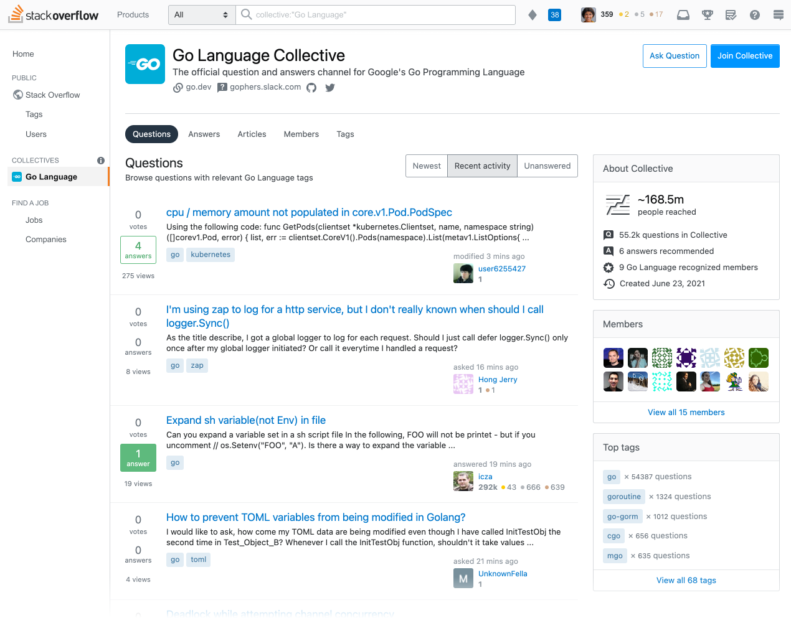

Since the earliest days of Go,
Stack Overflow has been a significant part of the Go user experience.
For the past five years, the [Go user survey](https://blog.golang.org/survey2020-results)
has consistently identified Stack Overflow as
the #1 place users go to find answers to their Go questions.

We are excited to share [the Go Collective](https://stackoverflow.com/collectives/go),
the very first open source project in Collectives™ on Stack Overflow,
which came as a result of a partnership between Go & Stack Overflow.

Stack Overflow’s mission for the community is to help make the most out
of Stack Overflow as a tool for knowledge reusability.
For the millions of users in the Go community,
the [Go Collective](https://stackoverflow.com/collectives/go)
will be an improved Stack Overflow experience.
It will retain the great question and answer experience
we’ve all come to appreciate from Stack Overflow.
But it will also provide a home for gophers and
an opportunity for Go community leaders to have a voice and help establish best practices.

The benefits of the Go Collective will be:

- **Find trusted answers faster**:
  we understand developers often have to test multiple solutions to a problem before finding the right one.
  With the Go Collective, you’ll now see answers that are recommended by the Go team
  or provided by Recognized Members, meaning Go team members,
  Go Google Developer Experts, and Stack Overflow users who have been recognized
  by Stack Overflow as subject matter experts on Go ecosystem technologies.
  These users will have a badge identifying them as Recognized Members
  when they post or edit a question, provide an answer, or write an article.

- **Get product information all in one place**:
  the Go Collectives page on Stack Overflow centralizes all of the questions and answers
  and content associated with Go and related tags.
  There will be links from the collective to critical Go websites,
  and Go websites will direct viewers to the Go Collective on Stack Overflow.

- **Explore new content formats**:
  stay up-to-date on our technologies and find more in-depth product information
  with articles, long-form content like how-to guides and announcements
  that can be found on the Go Collective page.

- **Earn recognition**:
  Collectives on Stack Overflow also gives us a way
  to recognize you for your contributions to the community.
  There’s a leaderboard you can access via the Go Collective
  (see [the “Members” tab](https://stackoverflow.com/collectives/go?tab=members))
  that will help identify trusted contributors designated as Recognized Members.
  If you are interested in becoming a Recognized Member,
  please email stackoverflow@golang.org.

Today Google Cloud is launching their own collective alongside the Go Collective.
We are excited to take this step together:
Go is the best language for building cloud infrastructure and applications,
and Google Cloud is the best place to run Go applications.
And now Stack Overflow is the best place to find answers to your Go and Cloud questions.

To read more about this see
[Stack Overflow's blog post](https://stackoverflow.blog/2021/06/23/collectives-stack-overflow/)
and
[Google Cloud's blog post](https://cloud.google.com/blog/topics/developers-practitioners/investing-heart-google-cloud-our-developer-and-customer-communities).

