## A huge thank you to the community for the amazing response!

In 2021, we ran the Go Developer Survey from Oct 26th to Nov 16th and had 11,840 responses—the largest turnout so far in the 6 years we’ve been running the survey! Thank you for putting in the time to provide the community with these insights on your experiences using Go. 

## Highlights {#highlights}

- Most responses were consistent with prior years. For example, [satisfaction with Go is still very high at 92%](#satisfaction) and 75% of respondents use Go at work.
- This year we [randomly sampled](#changes) some participants using the Go VS Code plugin, which resulted in some shifts in who responded to the survey.
- Missing critical libraries, language features and infrastructure were the most [common barriers to using Go](#adoption). (note: this survey ran prior to the release of Go 1.18 with generics, the #1 most reported missing feature)
- Respondents want to [prioritize improvements](#prioritization) to debugging and dependency management.
- The [biggest challenges when using modules](#modules) concerned versioning, using private repos and multi-module workflows. (note: this survey was run prior to Go 1.18 which introduced workspaces addressing many of these concerns).
- 81% of respondents are [confident in the long term direction of the Go project](#satisfaction).

## Who did we hear from? {#demographics}

Our demographics have been pretty stable year over year ([See 2020 results](https://go.dev/blog/survey2020-results)). Consistent with previous years, Go is primarily used in the tech industry. 70% of respondents were software developers, with a few in IT or DevOps and 76% of respondents said they program in Go at work. 

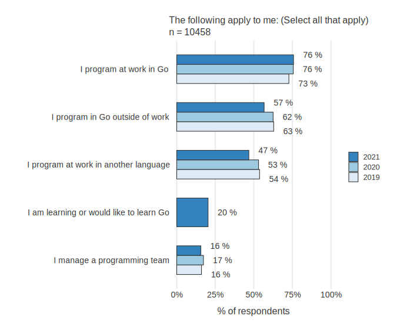
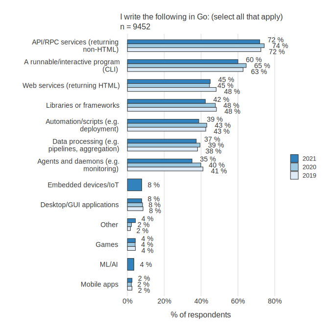

Some new demographics from 2021:
* Most respondents describe their organization as an enterprise or small to medium business, with about a quarter describing their organization as a startup. Consultancies and public institutions were much less common. 
* The vast majority of respondents work on teams of less than ten people. 
* Over half (55%) of respondents use Go at work on a daily basis. Respondents use Go less frequently outside of work.

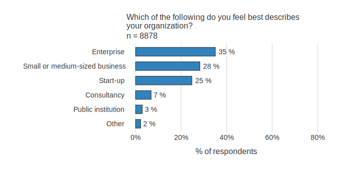

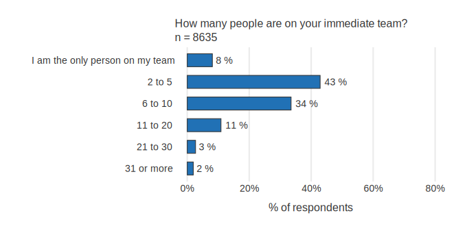

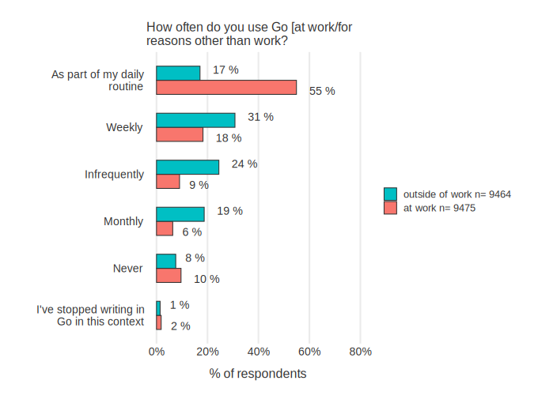

### Gender identity {#gender}
We ask about gender identity on the survey because it gives us an idea of who is being represented in the results and adds another dimension to measure the inclusivity of the community. The Go team values diversity and inclusion, not only because it’s the right thing to do, but because diverse voices help us make better decisions. This year we rephrased the gender identity question to be more inclusive of other gender identities. About the same proportion identified as women as previous years (2%). This was true in the [randomly sampled group](#changes) as well, suggesting this is not just due to sampling. 
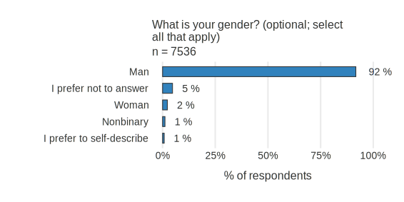

### Assistive technology

This year we again found that about 8% of respondents are using some form of assistive technology.  Most challenges concerned a need for higher contrast themes and increased font sizes on Go-related websites or in their code editors; we’re planning to act on the website feedback later this year. These accessibility needs are something we should all keep in mind when contributing to the Go ecosystem.

## A closer look at challenges to Go adoption {#adoption}
This year we revised our questions to target actual cases where Go wasn’t adopted and why. First, we asked whether or not respondents had evaluated using another language against Go in the last year. 43% of respondents said they had either evaluated switching to Go, from Go, or adopting Go when there wasn’t a previously established language. 80% of these evaluations were primarily for business reasons.

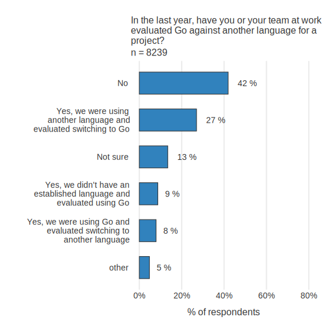

We expected the most common use cases for Go would be the most common intended uses for those evaluating Go. API/RPC services was by far the most common use, but surprisingly, data processing was the second most common intended use case.

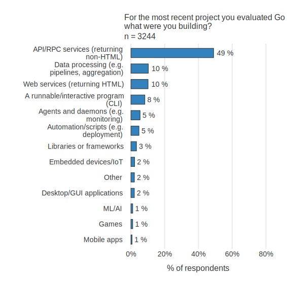

Of those respondents who evaluated Go, 75% ended up using Go. (Of course, since nearly all survey respondents report using Go, we likely are not hearing from developers who evaluated Go and decided against using it.) 

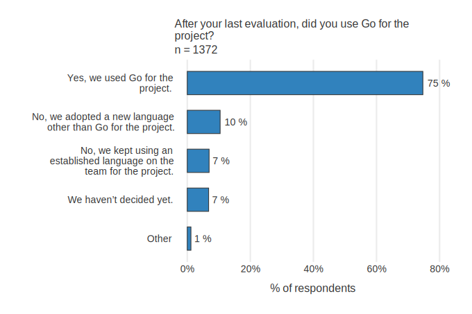

To those who evaluated Go and didn’t use it, we then asked what challenges prevented them from using Go and which of those was the primary barrier. 
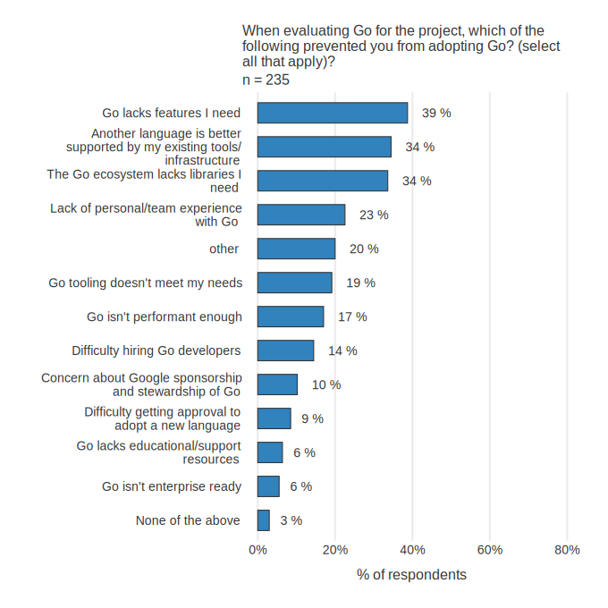

The picture we get from these results supports previous findings that missing features and lack of ecosystem / library support are the most significant technical barriers to Go adoption. 

We asked for more details on what features or libraries respondents were missing and found that generics was the most common critical missing feature—we expect this to be a less significant barrier after the introduction of generics in Go 1.18. The next most common missing features had to do with Go’s type system. We would like to see how introducing generics may influence or resolve underlying needs around Go’s type system before making additional changes. For now, we will gather more information on the contexts for these needs and may in the future explore different ways to meet those needs such as through tooling, libraries or changes to the type system.

As for missing libraries, there was no clear consensus on what addition would unblock the largest proportion of those wanting to adopt Go. That will require additional exploration.

So what did respondents use instead when they didn’t choose Go?

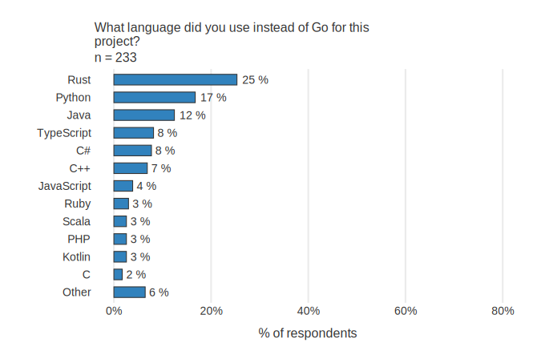

 Rust, Python, and Java are the most common choices. [Rust and Go have complementary feature sets](https://thenewstack.io/rust-vs-go-why-theyre-better-together/), so Rust may be a good option for when Go doesn’t meet feature needs for a project. The primary reasons for using Python were missing libraries and existing infrastructure support, so Python’s large package ecosystem may make it difficult to switch to Go. Similarly, the most common reason for using Java instead was because of Go’s missing features, which may be alleviated by the introduction of generics in the 1.18 release.

## Go satisfaction and prioritization {#satisfaction}
Let’s look at areas where Go is doing well and where things can be improved. 

Consistent with last year, 92% of respondents said they were very or somewhat satisfied using Go during the past year. 

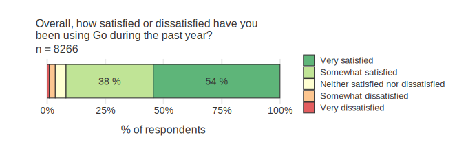

Year over year trends in community attitudes have seen minor fluctuations. Those using Go for less than 3 months tend to be less likely to agree with these statements. Respondents are increasingly finding Go critical for their company's success. 

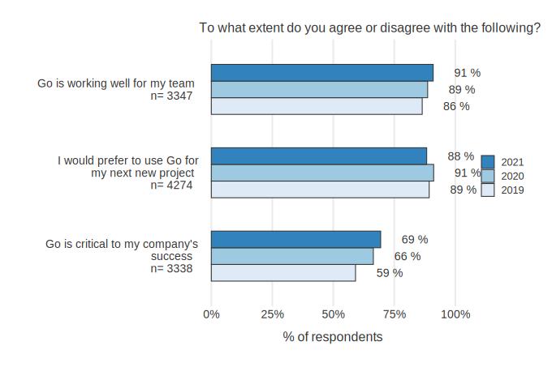
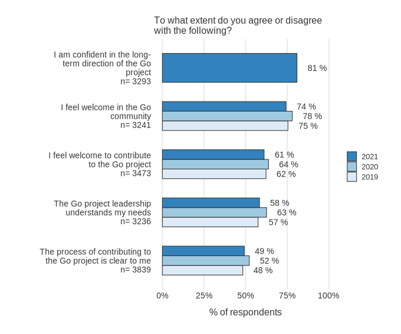

### Prioritization {#prioritization}
The last few years we’ve asked respondents to rate specific areas on how satisfied they are and how important those areas are to them; we use this information to identify areas that are important to respondents, but with which they are unsatisfied. However, most of these areas have shown only minor differences in both importance and satisfaction.

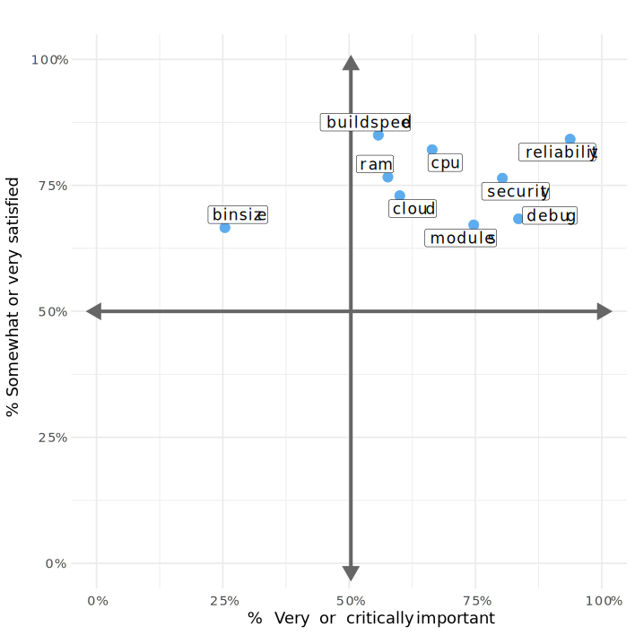

This year we introduced a new question to explore alternative ways to prioritize work on specific areas. “Let’s say you have 10 GopherCoins to spend on improving the following aspects of working with Go. How would you distribute your coins?” Two areas that stood out as receiving significantly more GopherCoins were dependency management (using modules) and diagnosing bugs, areas that we’ll be dedicating resources during 2022.

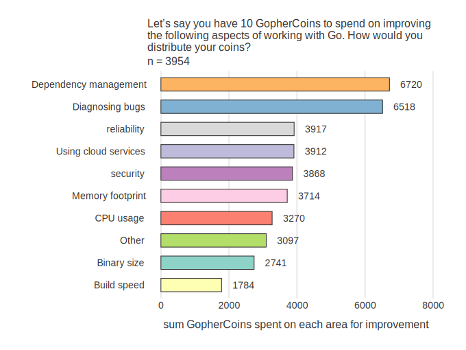

### Challenges when working with modules {#modules}
The most common module-related challenge was working across multiple modules (19% of respondents), followed by comments about versioning (including trepidation around committing to a stable v1 API). Related to versioning, 9% of responses discussed version management or updating dependencies. Rounding out the top 5 were challenges around private repos (including authentication with GitLab in particular) and remembering the different `go mod` commands plus understanding their error messages.

## Learning Go {#learning}

This year we adopted a new construct to explore relative productivity among different levels of experience with Go. The vast majority of respondents (88%) agree that they regularly reach a high level of productivity and 85% agree they’re often able to achieve a flow state when writing in Go. The proportion of agreement increases as experience with Go increases.

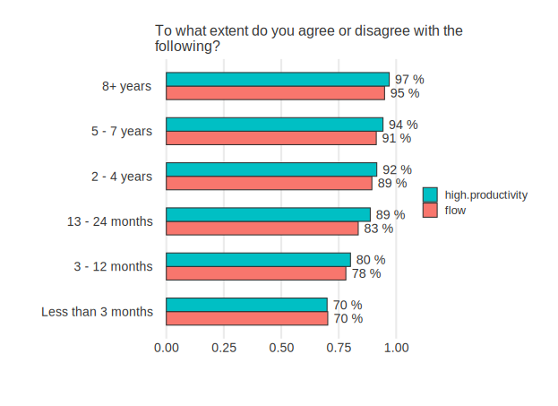

### In which areas should we invest in best practice docs?

Half of respondents wanted more guidance on best practices on performance optimization and project directory structure. Unsurprisingly, new Gophers (using Go for less than 1 year) need more guidance than more experienced Gophers, though the top areas were consistent across both groups. Notably, new Gophers asked for more guidance in concurrency than more experienced Gophers.

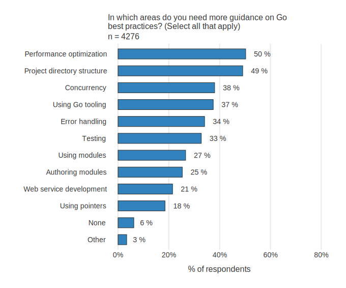

### How do developers learn a new language?
About half of respondents learned a new language at work, but almost as many (45%) learn outside of school or work. Respondents most often (90%) reported learning alone. Of those who said they learned at work, where there may be opportunities to learn as a group, 84% learned alone rather than as a group.

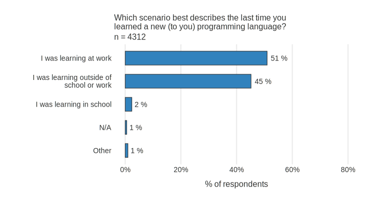
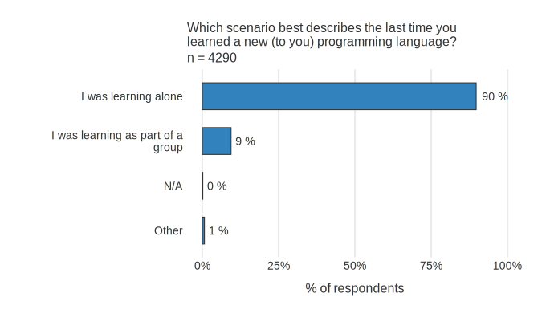

Many of the top resources highlight the importance of good documentation, but live instruction stands out as a particularly useful resource for language learning as well. 

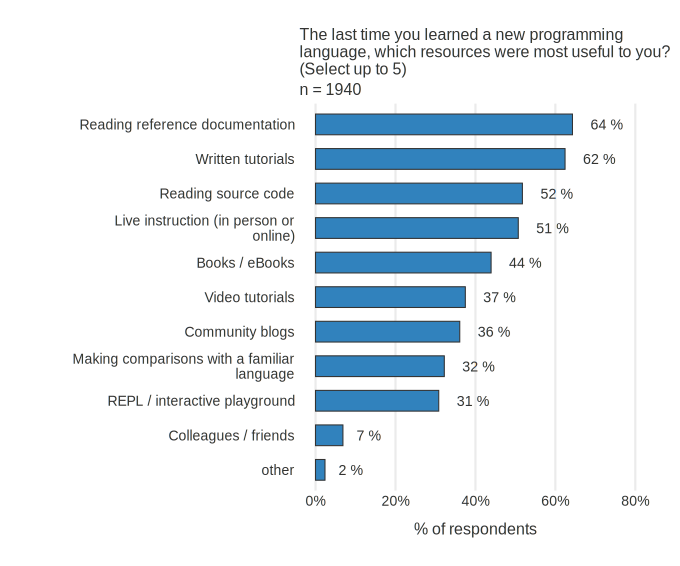

## Developer tools and practices {#devtools}
As in prior years, the vast majority of survey respondents reported working
with Go on Linux (63%) and macOS (55%) systems. The proportion of respondents who primarily develop on Linux appears to be slightly trending down over time.

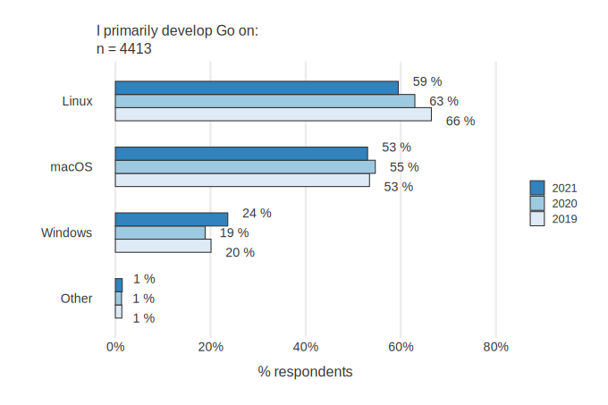

### Targeted platforms
Over 90% of respondents target Linux! Even though more respondents develop on macOS than Windows, they more often deploy to Windows than macOS. 

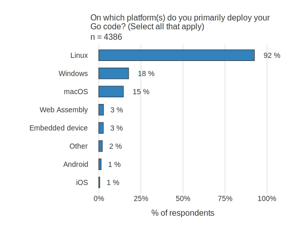

### Fuzzing
Most respondents are unfamiliar with fuzzing or still consider themselves new to fuzzing. Based on this finding, we plan to 1) ensure Go’s fuzzing documentation explains fuzzing concepts in addition to the specifics of fuzzing in Go, and 2) design output and error messages to be actionable, so as to help developers who are new to fuzzing apply it successfully. 

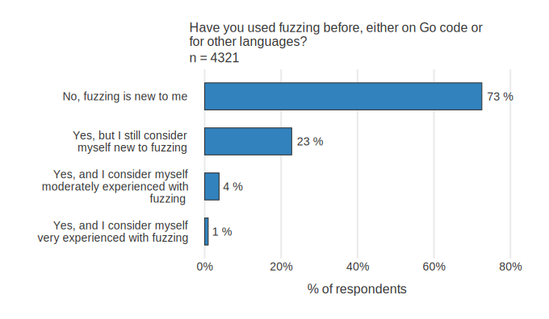

## Cloud computing {#cloud}

Go was designed with modern distributed computing in mind, and we want to continue to improve the developer experience of building cloud services with Go. The proportion of respondents deploying Go programs to three largest global cloud providers (Amazon Web Services, Google Cloud Platform, and Microsoft Azure) remained about the same this year and on-prem deployments to self-owned or company-owned servers continue to decrease.

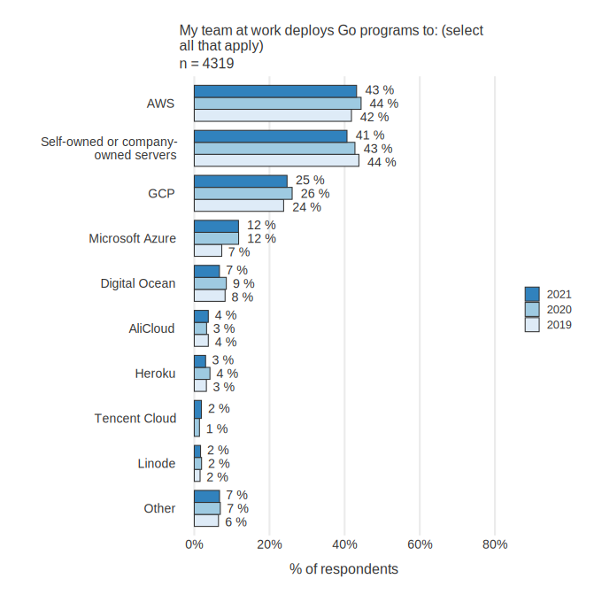

Respondents deploying to AWS saw increases in deploying to a managed Kubernetes platform, now at 35% of those who deploy to any of the three largest cloud providers. All of these cloud providers saw a drop in the proportion of users deploying Go programs to VMs. 

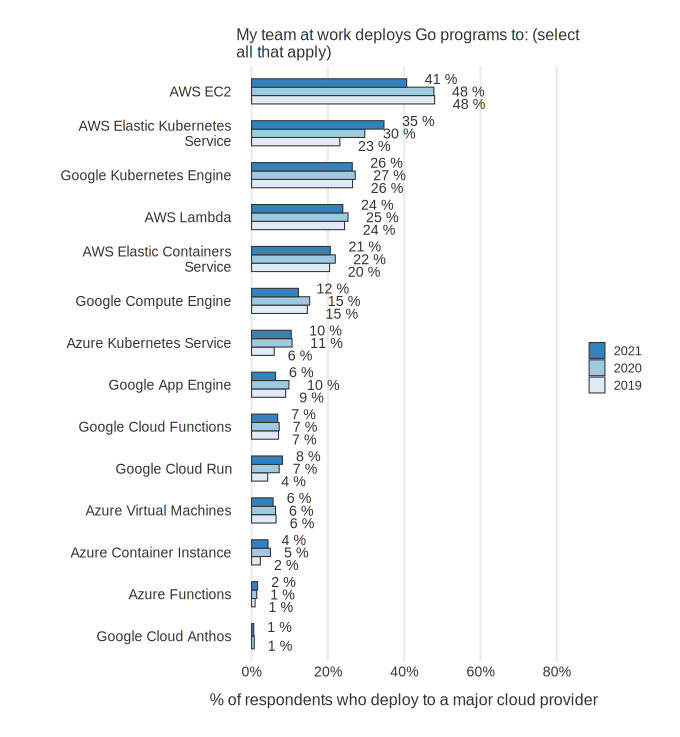

## Changes this year {#changes}

Last year we introduced a [modular survey design](https://go.dev/blog/survey2020-results) so that we could ask more questions without lengthening the survey. We continued the modular design this year, although some questions were discontinued and others were added or modified. No respondents saw all the questions on the survey. Additionally, some questions may have much smaller sample sizes because they were asked selectively based on a previous question. 

The most significant change to the survey this year was in how we recruited participants. In previous years, we announced the survey through the Go Blog, where it was picked up on various social channels like Twitter, Reddit, or Hacker News. This year, in addition to the traditional channels, we used the VS Code Go plugin to randomly select users  to be shown a prompt asking if they’d like to participate in the survey. This created a random sample that we used to compare the self-selected respondents from our traditional channels and helped identify potential effects of [self-selection bias](https://en.wikipedia.org/wiki/Self-selection_bias). 

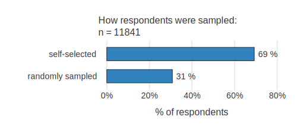

Almost a third of our respondents were sourced this way so their responses had the potential to significantly impact the responses we saw this year. Some of the key differences we see between these two groups are:

### More new Gophers
The randomly selected sample had a higher proportion of new Gophers (those using Go for less than a year). It could be that new Gophers are less plugged into the Go ecosystem or the social channels,  so they were more likely to see the survey advertised in their IDE than find it through other means. Regardless of the reason, it's great to hear from a wider slice of the Go community.

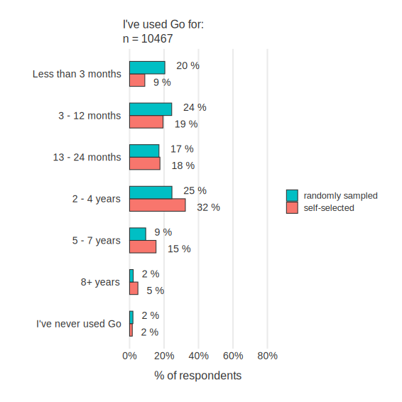

### More VS Code users
It’s unsurprising 91% of respondents who came to the survey from the VS Code plugin prefer to use VS Code when using Go. As a result, we saw much higher editor preferences for VS Code this year. When we exclude the random sample, the results are not statistically different from last year, so we know this is the result of the change in our sample and not overall preference. Similarly, VS Code users are also more likely to develop on Windows than other respondents so we see a slight increase in the preference for Windows this year. We also saw slight shifts in the usage of certain developer techniques that are common with VS Code editor usage. 

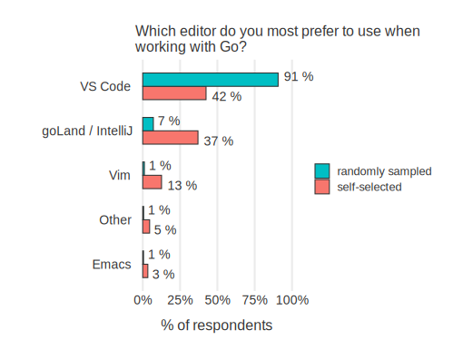

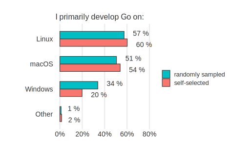

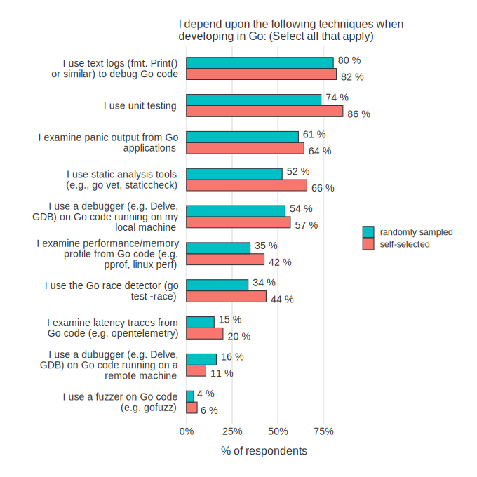

### Different resources
The randomly selected sample was less likely to rate social channels like the Go Blog as among their top resources for answering Go-related questions, so they may have been less likely to see the survey advertised on those channels.

 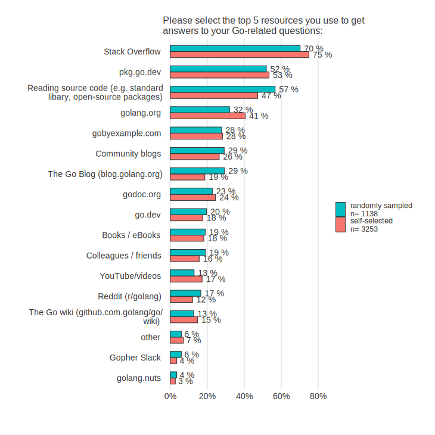

## Conclusion {#conclusion}

Thank you for joining us in reviewing the results of our 2021 developer survey! To reiterate, some key takeaways:

* Most of our year over year metrics remained stable with most changes owing to our change in sample.
* Satisfaction with Go remains high!
* Three-quarters of respondents use Go at work and many use Go on a daily basis so helping you get work done is a top priority.
* We will prioritize improvements to debugging and dependency management workflows.
* We will continue to work towards making Go an inclusive community for all kinds of Gophers.

Understanding developers’ experiences and challenges helps us measure our progress and directs the future of Go. Thanks again to everyone who contributed to this survey—we couldn't have done it without you. We hope to see you next year!

