

## Thank you respondents for bringing us these insights!

We’re excited to share with you the results of the 2023 January edition of the
Go Developer Survey. Thank you to the 5,844 respondents who shared with us how
they’re using Go, their biggest challenges in using Go, and their top
priorities for future improvements. These results help the Go team focus our
efforts on areas that matter most to the community, and we hope these insights
also help inform others who contribute to and support the Go ecosystem.

### Key findings

- __Novice Go developers are interested in web development__. We introduced a
  new segmentation this year based on self-identified experience levels.
  Novices expressed some interesting differences from other experience levels.
  Most notably they showed greater interest in using Go for web development.
- __Error handling and learning are respondents' top challenges__.
  Historically, lack of generics was the biggest challenge to using Go, but
  since the introduction of generics, we've seen comments about generics
  decline. Comments about error handling (with respect to readability and
  verbosity) and difficulty learning best practices are now the most commonly
  reported challenges.
- __An optimization guide was the most valued way to improve Go's
  performance__. When asked how they would spend resources on various
  improvements to Go's compile and runtime, respondents spent the most on an
  optimization guide rather than specific performance improvements,
  demonstrating how much documentation is valued in this area.
- __Managing dependencies and versioning are the top challenges for open
  source Go module maintainers__. Open source module maintainers face
  challenges in keeping their dependencies up to date and avoiding disruptions
  due to versioning and breaking changes. This is an area we'll explore
  further to help maintainers provide a stable and healthy ecosystem.

### How to read these results

Throughout this post, we use charts of survey responses to provide supporting
evidence for our findings. All of these charts use a similar format. The title
is the exact question that survey respondents saw. Unless otherwise noted,
questions were multiple choice and participants could only select a single
response choice; each chart’s subtitle will tell you if the question allowed
multiple response choices or was an open-ended text box instead of a multiple
choice question. For charts of open-ended text responses, a Go team member
read and manually categorized all of the responses. Many open-ended questions
elicited a wide variety of responses; to keep the chart sizes reasonable, we
condensed them to the top 10-15 themes, with additional themes all grouped
under “Other”. We also included a category for "None" where applicable.

To help readers understand the weight of evidence underlying each finding, we
include error bars showing the 95% confidence interval for responses; narrower
bars indicate increased confidence. Sometimes two or more responses have
overlapping error bars, which means the relative order of those responses is
not statistically meaningful (i.e., the responses are effectively tied). The
lower right of each chart shows the number of people whose responses are
included in the chart, in the form “_n = [number of respondents]_”.

### A note on methodology

Most survey respondents “self-selected” to take the survey by accessing it
through a link on [the Go blog](https://go.dev/blog), [@golang on
Twitter](https://twitter.com/golang), or other social Go channels. People who
don’t follow these channels might respond differently from people who _do_
closely follow them. About a quarter of respondents were randomly sampled,
meaning they responded to the survey after seeing a prompt for it in VS Code
(everyone using the VS Code Go plugin between Jan 18 - Feb 8, 2023 had a 10%
chance of receiving this random prompt). This randomly sampled group helps us
generalize these findings to the larger community of Go developers. Most
survey questions showed no meaningful difference between these groups, but in
the few cases with important differences, readers will see charts that break
down responses into “Random sample” and “Self-selected” groups.

## Taking a closer look at different groups of respondents  

Our respondent demographics did not change significantly from [our last
survey](https://go.dev/blog/survey2022-q2-results). Consistent with previous
cycles, Go is primarily used in the tech industry, and about 80% of
respondents said they program in Go at work. Overall, survey respondents
tended to be satisfied with Go over the past year, with 92% saying they were
somewhat or very satisfied.

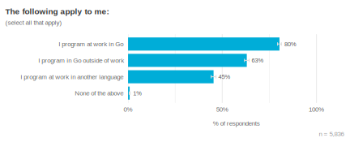 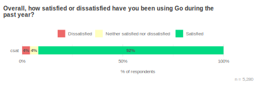

Our respondents spend a lot of time programming in Go compared to other
languages. About a third of respondents even maintain an open source Go
module. We recognize that our survey audience is made up of those who
successfully adopted Go, use Go often, and are mostly satisfied using Go. To
identify potential gaps in meeting community needs, we look at different
sub-groups of respondents to see how they might be using Go differently or
have different priorities. For example, this year we looked at how responses
differ between different sample sources (i.e., the Go Blog or through the VS
Code plugin), different job roles, organization sizes, and levels of Go
experience. The most interesting differences were between experience levels.

## Insights from novice respondents

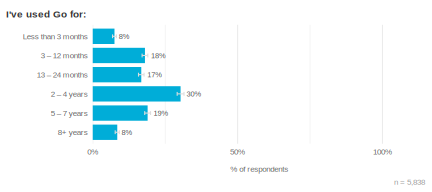

Previously, we used how much time (in months / years) respondents have used Go
as a proxy to gain insight into how results vary between levels of experience.
This year we experimented with a new segmentation question, “What is your
level of experience with Go?”, to see if self-identification might be a more
useful way of examining Go experience than lumping together various intervals
of time. Since categorical terms like “novice” or “expert” might vary from
person to person, we provided a description to help make these buckets more
objective. The options were:

* Awareness: I'm aware of Go, but could not write a simple Go program without
  assistance
* Novice: I can complete simple programming projects in Go, possibly with
  assistance
* Intermediate: I can complete significant programming projects in Go with
  some assistance
* Advanced: I can complete significant programming projects in Go without
  assistance
* Expert: I can provide guidance, troubleshoot, and answer questions related
  to Go from other engineers

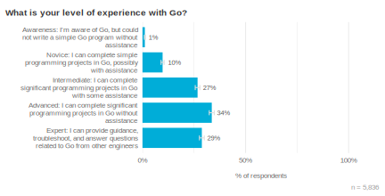

We found a moderate correlation (⍴ = .66) between how long respondents had
been using Go and their self-identified experience level. This means that the
experience level scale, although similar to the time scale, may give us some
new insights into how respondents differ by experience. For instance, the
proportion of time that a respondent spends writing in Go compared to how much
time they spend writing in other languages is more strongly correlated with
their self-identified experience level than with how long they’ve been using
Go.

In analyses where we use this segmentation we typically exclude the Awareness
category since they wouldn’t be considered to have the experience necessary to
answer the question and only represented about 1% of respondents.

### Novice respondents are more likely to prefer Windows than more experienced respondents
 
Our randomly sampled group had a higher proportion of novice respondents than
the self-selected group, suggesting that there are more new Gophers out there
that we don’t tend to hear from as often. Because they are sampled through the
Go VS Code plugin, we might expect this group to be more likely to prefer
using VS Code or to develop on Windows more than other experience levels.
While this is true, novices are also more likely to develop on Windows than
other experience levels, regardless of whether they responded through the VS
Code plugin.

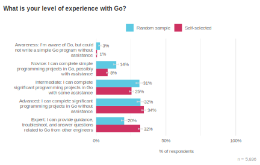 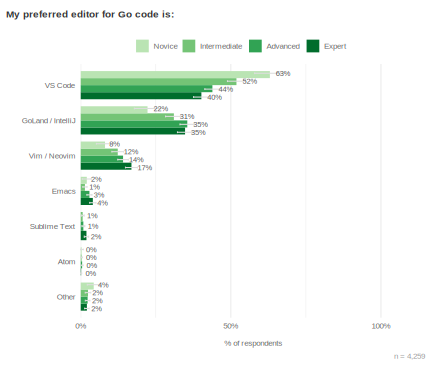 

There could be a number of reasons why we don’t see higher proportions of
Windows users at higher experience levels. For example, Windows users may be
more likely to experience difficulties and stop using Go, or there could be
wider trends in OS usage that have nothing to do with Go. In any case, we
should include more Windows users in future research around getting started
with Go to make sure we provide an inclusive onboarding experience.

### How different experience levels currently use Go (and other areas where they would like to)

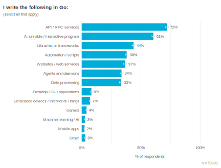 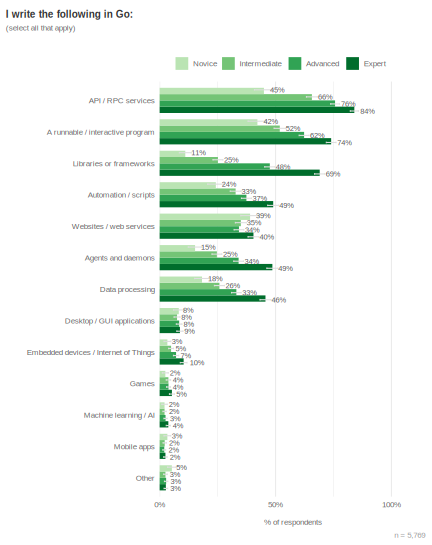

According to how respondents use Go right now, more experienced Gophers tend
to be using Go for more types of applications. For example, the average expert
used Go in at least four areas while the average novice used Go in only two
areas. That’s why there are large differences in the proportion of novices and
experts using Go for each use case. The top two uses, API / RPC services and
CLIs, however, are the top use cases across all experience levels.

We see more interesting trends for GUIs and Website / Web services (returning
HTML). All experience levels used Go for Desktop / GUI apps at about the same
rate.  This gives us evidence the desire for GUIs isn’t just coming from new
Gophers looking for a fun starter project, but from across the experience
spectrum. 

Websites / services returning HTML show a similar trend. One explanation could
be that this is a common use case early in someone’s Go journey (since it is
in the top 3 most common for novices), or that novices are more likely to be
doing work on websites or web services returning HTML. Later in the survey, we
asked respondents, "In which area (if any) are you not using Go, but would
most like to?" Although many respondents (29%) said they already use Go
everywhere they would like to, the top two areas for expanding usage were GUI
/ Desktop and AI / ML applications. This was consistent across groups at
different organization sizes and job roles, but not experience levels. The
number one area where novices would like to use Go more is for websites / web
services returning HTML.

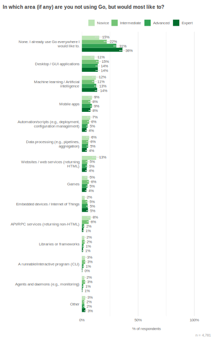

In an open text question, 12 out of 29 respondents who said they would like to
use Go for websites / web services returning HTML said they were blocked
because other languages had frameworks to better support this use case. It
could be that more experienced Go developers don’t try or expect to use Go for
this use case when other languages already have frameworks that meet those
needs. As one respondent put it,

>“It's usually easier to accomplish this in other languages such as PHP or
>Ruby. Partly due to the excellent frameworks that exist in those languages.” 

Another contributing explanation for novices' interest in web development may
be related to their usage of JavaScript / TypeScript. Novices spend more of
their time writing in JavaScript / TypeScript than more experienced
respondents. The higher interest in web could have something to do with what
novice respondents currently work on in other languages or could indicate a
general interest in web technologies. In the future we’d like to learn more
about this use case and how we can help new Gophers get started using Go in
areas most useful to them.

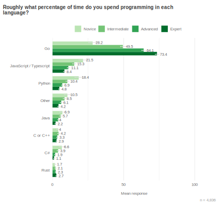

## Respondents face a long tail of challenges

Every survey cycle we ask respondents what their biggest challenge is when
using Go. Historically, lack of generics was the most commonly cited
challenge—for example, it was the most common response in 2020, and mentioned
by about 18% of respondents. Since the introduction of generics, error
handling (12%) and learning / best practices / docs (11%) have emerged at the
front of a long tail of issues rather than any single issue becoming more
frequent.

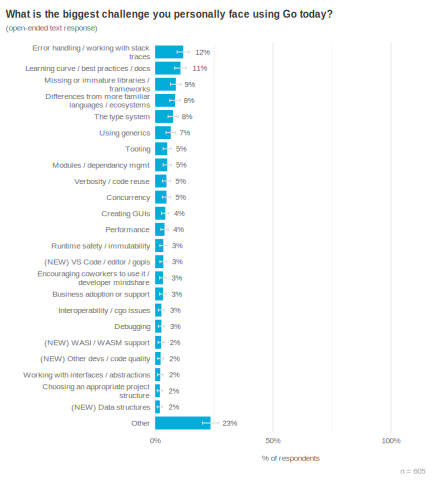

### Why is error handling such a challenge?

Feedback on error handling often describes the problem as verbosity. On the
surface, this could reflect that writing repetitive code is boring or
annoying. More than just an annoyance of writing boilerplate, however, error
handling may also impact respondents’ ability to debug.

One respondent succinctly illustrated this issue:

>“Error handling creates clutter and easily masks problems if not done
>correctly (no stack traces)”

### The struggle to learn best practices 

>"Using Go effectively. Easy to learn, hard to master."

We’ve heard that Go is easy to learn, and a [previous survey showed that over
70%](https://go.dev/blog/survey2020-results#TOC_6.2) of respondents feel
productive using Go within their first year, but learning Go best practices
came up as one of the biggest challenges to using Go. Respondents this year
told us that best practices around **code structure** and **recommended tools
and libraries** aren’t well documented, creating challenges for beginners and
teams to keep code consistent. Learning to write idiomatic Go can be
especially challenging to those coming from other programming paradigms.
Respondents who were more experienced with Go attested that when developers
don’t follow best practices for writing idiomatic Go, it hurts the consistency
and quality of shared projects.

## The biggest challenges for module maintainers

Go module maintainers are critical members of the Go community, helping to
grow and sustain the health of our package ecosystem. This year we plan to
conduct research with module maintainers to identify opportunities to support
stability and growth of the package ecosystem and help grow Go adoption within
organizations. To inform this research, we introduced a question on the survey
to get an idea of the current top challenges for open source maintainers.
 
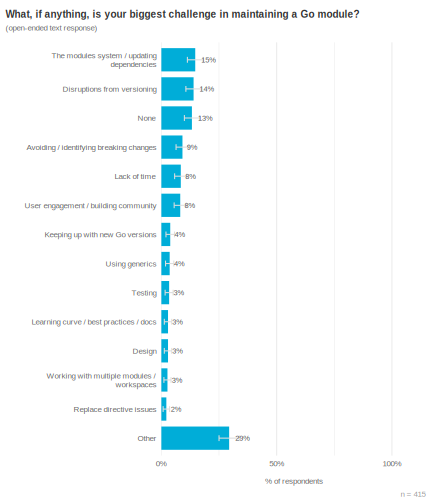

The top challenges for maintainers are keeping dependencies up to date and
difficulties around versioning, including avoiding, identifying, or knowing
when to introduce breaking changes. These insights, along with the results of
future research, will help inform strategies to support maintainers in keeping
the Go ecosystem stable and secure.

## The biggest challenges when deploying Go code

This year we asked what respondents’ biggest challenge was when deploying Go
code. Being “easy to deploy” is often cited as a reason for using Go, but we
received conflicting feedback during a recent study that prompted us to
explore potential issues when deploying Go code. In our open text responses,
by far the most common theme was difficulty cross-compiling with cgo (16%),
and support for WebAssembly or WASI was a distant second (7%).

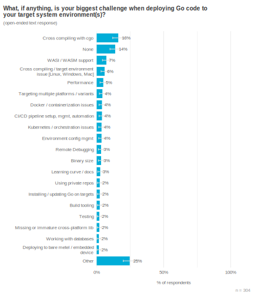

## Community priorities: what respondents want most

This year we used a prioritization question we’ve used in previous surveys
based on the buy-a-feature method of prioritization. Respondents were given 10
“gophercoins” and asked to distribute them to areas where they want to see
improvements. Respondents were randomly assigned one of three possible
questions, each containing seven items related to tooling, security, or
compiler & runtime. This approach allowed us to ask about items relevant to
each focus area without overburdening respondents with three sets of
cognitively-demanding prioritization questions.

At the end of the exercise, we gave respondents an open text prompt to tell us
about any area they thought should be the Go team’s top priority in the next
year, regardless of which items they spent their coins on. For example, if a
respondent was shown the security section, but they didn’t care all that much
about security, they still had the opportunity to tell us that in the open
text area.

### Security

We chose these items to test assumptions we held on the relative importance of
security practices to the community. These were the seven items as described
to participants:

* pkg.go.dev identifies packages that are poorly maintained (e.g.,
  unresponsive to issues, fail to keep their dependencies updated, remain
  vulnerable for long periods of time)
* pkg.go.dev identifies packages that make breaking API changes (i.e.,
  requires fixing uses of those APIs when upgrading those packages to newer
  versions)
* Support for suppressing vulnerabilities in govulncheck
* A tool to track how sensitive data flows through a Go program (detect PII
  leaks)
* A security best practices guide (e.g., how to choose and update
  dependencies; how to set up fuzzing, vulnerability checking, and thread
  sanitizer; how to use crypto)
* Secure-by-default Web & SQL libraries that help users avoid introducing
  vulnerabilities in web server code
* FIPS-140-compliant cryptographic libraries

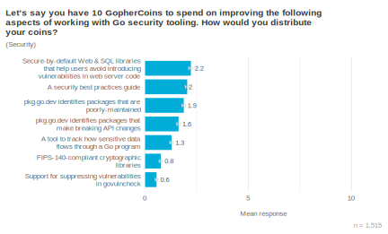

The highest funded security feature was for web & SQL libraries to be secure
by default to avoid introducing vulnerabilities in web server code, but the
top four features all relate to avoiding the introduction of vulnerabilities.
The desire for secure defaults is consistent with previous security research
that showed developers want to “shift left” on security: development teams
often don’t have time or resources to spend on addressing security issues, and
thus value tooling that reduces the likelihood of introducing them in the
first place. The second most common item was a security best practices guide,
highlighting the high value of best practices documentation compared to new
tools or features to the majority of respondents.

### Tools

Items we included in this question were inspired by feedback from VS Code
plugin users. We wanted to know which tooling and IDE improvements would be
most helpful to a wider audience who may use other IDEs or editors.
* Better refactoring tools (e.g., support for automatic code transformation:
  renamings, function extraction, API migration, etc.)
* Better support for testing in your code editor/IDE (e.g., robust and
  scalable Test Explorer UI, 3rd party test framework, subtest support, code
  coverage)
* Better support for working on multiple modules in your code editor/IDE
  (e.g., editing modules A and B, where module A depends on module B)
* Dependency insights in pkg.go.dev (e.g., vulnerabilities, breaking changes,
  scorecards)
* Dependency insights in your code editor/IDE (e.g., vulnerabilities, breaking
  changes, scorecards)
* Support for publishing modules with new module paths (e.g., repo ownership
  handoff)
* Support finding types that implement an interface & interfaces implemented
by a type in your code editor/IDE

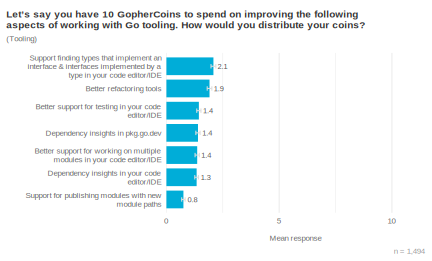

The most funded editor feature was *support for finding types that implement
an interface and interfaces implemented by a type* and *refactoring tools*. We
also saw an interesting difference in how respondents spent their gophercoins
according to preferred editor usage. Most notably, VS Code users spent more
gophercoins on refactoring than GoLand users, suggesting that automatic code
transformations are currently better supported in GoLand than in VS Code.

### Compiler & runtime

Our key question for this section was to determine whether respondents wanted
better performance by default, better optimization tooling, or just a better
understanding of how to write performant Go code.
* Reduce compute costs
* Reduce memory use
* Reduce binary size
* Reduce build times
* Better performance debugging tools
* An optimization guide (how to improve performance and reduce costs, covering
  Go’s implementation and performance debugging tools)
* Better support for using cgo when cross-compiling

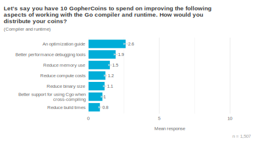

By far the most funded item in this list was an optimization guide. This was
consistent across organization size, job role, and experience level. We asked
an additional question about whether respondents had resource costs concerns.
Most respondents (55%) said they did not have any cost concerns, but those who
had concerns about resource costs spent more gophercoins (on average, 2.0) on
reducing compute costs and memory costs than those who did not. However, even
those who were concerned about resource costs still spent about as much on the
optimization guide (on average 1.9 gophercoins). This is a strong signal that
providing guidance for Go developers to understand and optimize Go performance
is currently more valuable than additional compiler and runtime performance
improvements.

## Conclusion {#conclusion}

Thank you for joining us in reviewing the results of our first developer
survey of 2023! Understanding developers’ experiences and challenges helps us
prioritize how to best serve the Go community. Some takeaways we found
particularly useful:

* Novice Go developers have more of an affinity for web development than
  respondents of other levels of experience. This is an area we’d like to
  explore further to make sure we’re meeting the needs of new Go developers.
* Secure defaults, best practice guidance on security and optimization, and
  more refactoring assistance in IDEs would be valuable additions to the
  community.
* Error handling is a high priority issue for the community and creates
  challenges in terms of verbosity and debuggability. The Go team doesn’t have
  a public proposal to share at this time but is continuing to explore options
  to improve error handling.
* Onboarding and learning best practices are among the top challenges for
  respondents and will be areas of future research.
* For Go module maintainers, keeping dependencies up to date, module
  versioning, and identifying or avoiding breaking changes are the biggest
  challenges. Helping maintainers provide a stable and healthy ecosystem is
  another topic of interest for further UX research.

Thanks again to everyone who responded and contributed to this survey—we
couldn't have done it without you. We hope to see you later this year for the
next survey.

