

## Background

This post shares the results of our most recent Go Developer Survey, conducted
in January and February 2024. Along with capturing sentiments and challenges
around using Go and Go tooling, our primary focus areas for this survey were
about how developers are starting to use Go (or other languages) for
AI-related use cases, and particular challenges for those who are learning Go
or looking to expand their Go skill set.

We recruited participants from the Go blog and through randomized prompts in
the VS Code Go plug-in. This year, with the help of
[JetBrains](https://jetbrains.com), we also included a randomized survey prompt in the
[GoLand IDE](https://jetbrains.com/go/), allowing us to recruit a more
representative sample of Go developers. We received a total of 6,224
responses! A huge thank you to all those who contributed to making this
possible.

## Highlights {#tldr}

* Developer sentiment remains high, with 93% of respondents expressing
  satisfaction with Go over the past year.
* A majority of respondents (80%) said they trust the Go team to "do what's
  best" for developers like themselves when maintaining and evolving the
  language.
* Among survey respondents who build AI-powered applications and services,
  there is a shared sense that Go is a strong platform for running these types
  of applications in production. For example, a majority of respondents
  working with AI-powered applications already use Go or would like to migrate
  to Go for their AI-powered workloads, and the most serious challenges
  developers encounter are related to the library and documentation ecosystems
  rather than the core language and runtime. That said, the most commonly
  documented paths for getting started are currently Python-centric, resulting
  in many organizations starting AI-powered work in Python before moving to a
  more production-ready language.
* The most common kinds of AI-powered services respondents are building
  include summarization tools, text generation tools, and chatbots. Responses
  suggest that many of these use cases are internal-facing, such as chatbots
  trained upon an organization's internal documentation and intended to answer
  employee questions. We hypothesize that organizations are intentionally
  starting with internal use cases to develop in-house expertise with LLMs
  while avoiding potential public embarrassment when AI-powered agents behave
  unexpectedly.
* Lack of time or opportunities was the most commonly cited challenge for
  respondents to reaching their Go-related learning goals, suggesting that
  language learning is difficult to prioritize without a specific goal or
  business case in mind. The next most common challenge was in learning new
  best practices, concepts, and idioms that are particular to Go when coming
  from other language ecosystems.

## Contents

- <a href="#sentiment">Developer sentiment</a>
- <a href="#devenv">Developer environments</a>
- <a href="#priorities">Resource and performance priorities</a>
- <a href="#mlai">Understanding AI use cases for Go</a>
- <a href="#learn">Learning challenges</a>
- <a href="#demographics">Demographics</a>
- <a href="#firmographics">Firmographics</a>
- <a href="#methodology">Methodology</a>
- <a href="#closing">Closing</a>

## Developer sentiment {#sentiment}

Overall satisfaction remains high in the survey with 93% of respondents saying
they were somewhat or very satisfied with Go during the last year. This isn't
surprising, considering our audience is those who have voluntarily taken our
survey. But even among those who were randomly sampled from both VS Code and
GoLand, we still see comparable rates of satisfaction (92%). Although the
exact percentages fluctuate slightly from survey to survey, we do not see any
statistically significant differences from [2023
H2](/blog/survey2023-h2-results), when the satisfaction rate was
90%.

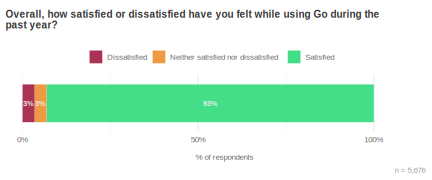

### Trust {#trust}

This year we introduced a new metric for measuring developer trust. This was
an experimental question and its wording may change over time as we learn more
about how respondents interpreted it. Because this is the first time we asked
this question, we don't have previous years to give us context for our
results. We found that 80% of respondents somewhat or strongly agree that they
trust the Go team to do what's best for users like them. Respondents with 5 or
more years of experience with Go tended to agree more (83%) than those with
less than 2 years of experience (77%). This could reflect [survivorship
bias](https://en.wikipedia.org/wiki/Survivorship_bias) in that those who trust
the Go team more are more likely to continue using Go, or may reflect how
trust is calibrated over time.

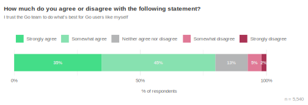

### Community satisfaction {#community}

In the last year, almost a third of respondents (32%) said they participated
in the Go developer community either online or at in-person events. More
experienced Go developers were more likely to have participated in a community
event and were more satisfied with community events overall. Although we can't
draw causal conclusions from this data, we did see a positive correlation
between community satisfaction and overall satisfaction with Go. It could be
that participating in the Go community increases satisfaction through
increased social interaction or technical support. In general, we also found
that respondents with less experience were less likely to have participated in
events in the last year. This may mean they haven't discovered events or found
opportunities yet to be involved.

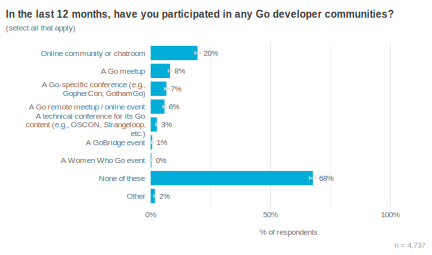 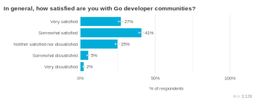

### Biggest challenges {#biggestchallenge}

For several years, this survey has asked participants about their biggest
challenge when using Go. This has always been in the form of an open text box
and has elicited a wide variety of responses. In this cycle we introduced a
closed form of the question, where we provided the most common write-in
responses from prior years. Respondents were randomly shown either the open or
closed forms of the question. The closed form helps us validate how we've
historically interpreted these responses, while also increasing the number of
Go developers we hear from: this year participants who saw the closed form
were 2.5x more likely to answer than those who saw the open form. This higher
number of responses narrows our margin of error and increases our confidence
when interpreting survey results.

In the closed-form, only 8% of respondents selected "Other", which suggests we
captured the majority of common challenges with our response choices.
Interestingly, 13% of respondents said they don't face any challenges using
Go. In the open text version of this question, only 2% of respondents gave
this response. The top responses in the closed-form were learning how to write
Go effectively (15%) and the verbosity of error handling (13%). This matches
what we saw in the open-text form, where 11% of responses mentioned learning
Go, learning best practices, or issues with documentation as their biggest
challenge, and another 11% mentioned error handling.

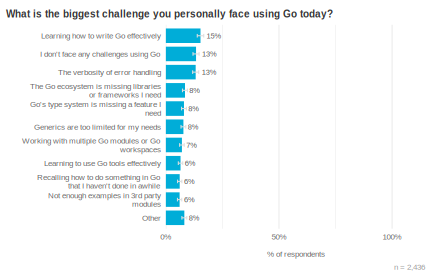 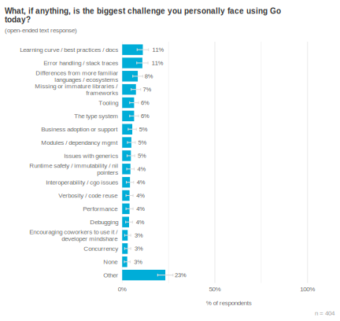

Respondents who saw the closed form of the question also received a follow-up
open-text question to give them an opportunity to tell us more about their
biggest challenge in case they had wanted to provide more nuanced answers,
additional challenges, or anything else they felt was important.The most
common response mentioned Go's type system, and often asked specifically for
enums, option types, or sum types in Go. Often we did not get much context for
these requests, but we suspect this is due to some recent proposals and
community discussions related to enums, an increase in folks coming from other
language ecosystems where these features are common, or the expectation that
these features will reduce writing boilerplate code. One of the more
comprehensive comments related to the type system explained as follows:

> "These aren't big challenges, but more conveniences I miss in the language.
> There's ways around all of them, but it would be nice not to have to think
> about it.

> Sum types/closed enums can be emulated but its a lot of faff. It's a very
> handy feature to have when interacting with APIs that only have a limited
> set of values for a particular element/field in a response and a value
> outside of it is an error. It helps with validation and catching issues at
> the point of entry and can often directly be generated from API
> specifications like JSON Schema, OpenAPI or heaven forbid XML Schema
> Definitions.

> I don't mind the error checking verbosity at all, but the nil-checking with
> pointers gets tedious especially when [I] need to drill into a deeply nested
> struct of pointer fields. Some form of Optional/Result type or an ability to
> chase through a chain of pointers and simply get a nil back instead of
> triggering a runtime panic would be appreciated."

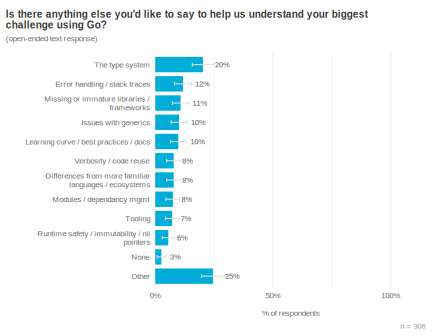

## Developer environments {#devenv}
As in previous years, most survey respondents develop with Go on Linux (61%)
and macOS (58%) systems. Although the numbers haven't changed much from year
to year, we did see some interesting differences in our self-selected sample.
The randomly sampled groups from JetBrains and VS Code were more likely (31%
and 33%, respectively) to develop on Windows than the self-selected group
(19%). We don't know exactly why the self-selected group is so different, but
we hypothesize that, because they likely encountered the survey from reading
the Go Blog, these respondents are some of the most engaged and experienced
developers in the community. Their operating system preferences might be
reflective of historical priorities of the core development team who typically
developed on Linux and macOS. Thankfully we have the random samples from
JetBrains and VS Code to provide a more representative view of developer
preferences.

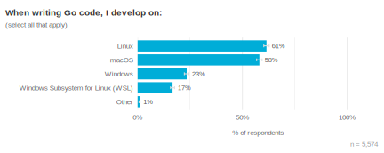 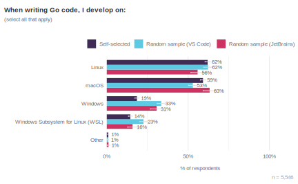 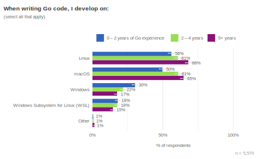

As a followup for the 17% of respondents who develop on WSL, we asked which
version they're using. 93% of respondents who develop on WSL are using version
2, so going forward, [the Go team at Microsoft has decided to focus their
efforts on WSL2.](/issue/63503)

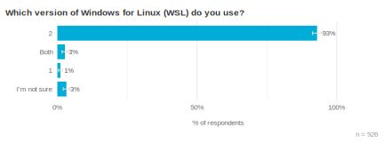

Given that two of our sample populations were recruited from within VS Code or
GoLand, they are strongly biased towards preferring those editors. To avoid
skewing the results, we show the data here from the self-selected group only.
Similar to previous years, the most common code editors among Go Developer
Survey respondents continue to be [VS Code](https://code.visualstudio.com/)
(43%) and [GoLand](https://www.jetbrains.com/go/) (33%). We don't see any
statistically significant differences from mid-2023, (44% and 31%,
respectively).

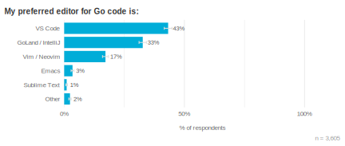

With the prevalence of Go for cloud development and containerized workloads,
it's no surprise that Go developers primarily deploy to Linux environments
(93%). We didn't see any significant changes from last year.

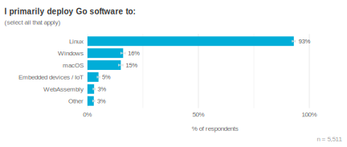

Go is a popular language for modern cloud-based development, so we typically
include survey questions to help us understand which cloud platforms Go
developers are using and how satisfied they are with the three most popular
platforms: Amazon Web Services (AWS), Microsoft Azure, and Google Cloud. This
section was only shown to respondents who said they use Go for their primary
job, about 76% of total respondents. 98% of those who saw this question work
on Go software that integrates with cloud services. Over half of respondents
used AWS (52%), while 27% used GCP for their Go development and deployments.
For both AWS and Google Cloud, we don't see any differences between small or
large companies in their likelihood to use either provider. Microsoft Azure is
the only cloud provider that is significantly more likely to be used in large
organizations (companies with > 1,000 employees) than smaller shops. We didn't
see any significant differences in usage based on the size of the organization
for any other cloud providers.

The rates of satisfaction for using Go with AWS and Google Cloud were both
77%. Historically these rates have been about the same. As in previous years,
the satisfaction rate for Microsoft Azure was lower (57%).

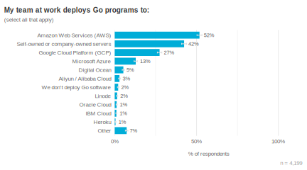 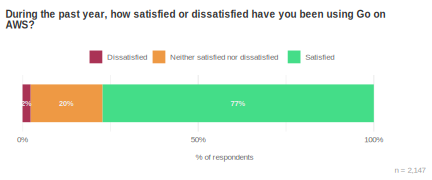
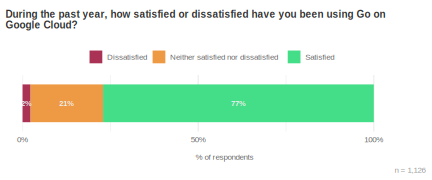 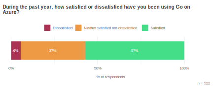

## Resource and Security Priorities {#priorities}

To help prioritize the Go team's work, we wanted to understand the top
resource cost and security concerns for teams using Go. About half of
respondents using Go at work reported having at least one resource cost
concern in the last year (52%). The engineering costs of writing and maintaining Go
services was more common (28%) than concern for the costs of running Go
services (10%) or both about equally (12%). We didn't see any significant
differences in resource concerns between small and large organizations. To
address concerns about resource costs, the Go team is continuing to optimize
Go and enhance profile-guided optimization (PGO).

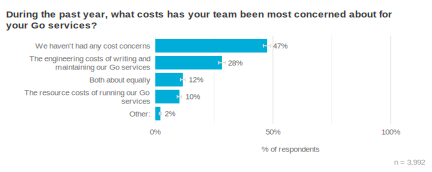

As for security priorities, we asked respondents to tell us up to three of
their top concerns. Of those who did have security concerns, overall, the top
concern was insecure coding practices (42%), followed by system
misconfiguration (29%). Our main takeaway is that respondents are especially
interested in tooling to help find and fix potential security issues while
they're writing code. This aligns with what we've learned from prior research
into how developers find and address security vulnerabilities.

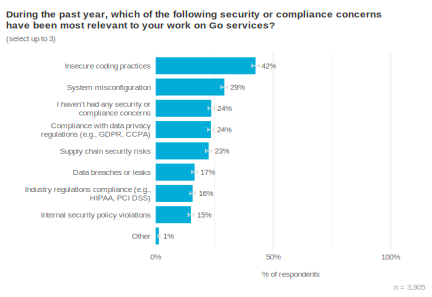

### Performance Tooling {#perf}

Our goals for this section were to measure how respondents perceive the ease
or difficulty of diagnosing performance issues and determine whether this task
is more or less difficult depending on their editor or IDE usage.
Specifically, we wanted to know if it's more difficult to diagnose performance
issues from the command line, and if we should invest in improving the
integration of performance diagnostic tooling within VS Code to make this task
easier. In our analyses, we show comparisons between respondents who prefer VS
Code or GoLand to highlight what we learned about the experience of using VS
Code compared to another common editor.

We first asked a general question about different kinds of tools and
techniques respondents use with Go to have some points of comparison. We found
that only 40% of respondents use tools to improve code performance or
efficiency. We didn't see any significant differences based on editor or IDE
preference, that is, VS Code users and GoLand users were about equally likely
to use tools to improve code performance or efficiency.

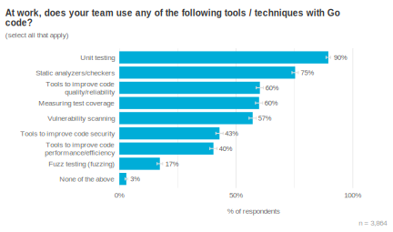

Most respondents (73%) told us that identifying and addressing performance
issues is at least moderately important. Again, we didn't see any significant
differences here between GoLand and VS Code users in how important they found
diagnosing performance issues.

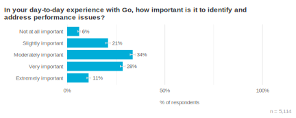

Overall, respondents did not find diagnosing performance issues easy, with 30%
reporting it was somewhat or very difficult and 46% saying it was neither easy
nor difficult. Contrary to our hypothesis, VS Code users were not more likely
to report challenges when diagnosing performance issues vs. other respondents.
Those using their command line for diagnosing performance issues, regardless
of their preferred editor, also did not report this task as more challenging
than those using their IDE. Years of experience was the only significant
factor we observed, where less experienced Go developers found it overall more
difficult to diagnose performance issues than more experienced Go developers.

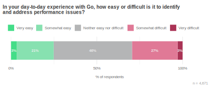 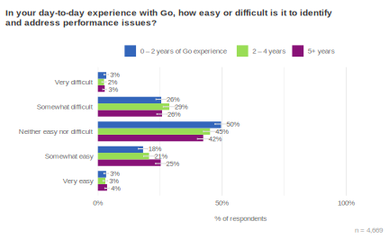 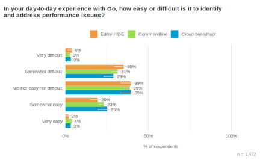

To answer our original question, most developers found it difficult to
diagnose performance issues in Go, regardless of their preferred editor or
tooling. This was especially true for developers with less than two years of
experience in Go.

We also included a follow-up for respondents who rated diagnosing performance
issues as at least slightly important to understand which issues were most
important to them. Latency, total memory, and total CPU were the top concerns.
There could be several explanations to the significance of these areas. First,
they are measurable and easily convertible into business costs. Secondly,
total memory and CPU usage represent physical constraints that necessitate
hardware upgrades or software optimizations for improvement. Moreover,
latency, total memory, and total CPU are more manageable by developers and can
impact even straightforward services. In contrast, GC performance and memory
allocation may only be relevant in rare cases or for exceptionally heavy
workloads. Additionally, latency stands out as the most user-visible metric,
as high latency results in slow services and dissatisfied users.

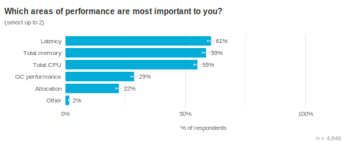

## Understanding AI use cases for Go {#mlai}

Our [previous survey](/blog/survey2023-h2-results#mlai) asked Go
developers about their early experiences with generative AI systems. To go a
bit deeper this cycle, we asked several AI-related questions to understand how
respondents are building AI-powered (more specifically, LLM-powered) services.
We found that half of survey respondents (50%) work at organizations that are
building or exploring AI-powered services. Of these, just over half (56%) said
they were involved with adding AI capabilities to their organization's
services. Our remaining AI-related questions were only shown to this slice of
respondents.

Please be cautious about generalizing these participant responses to the
overall population of Go developers. Because only about ¼ of survey
respondents are working with AI-powered services, we suggest using this data
to understand the early adopters in this space, with the caveat that early
adopters tend to be a bit different than the majority of people who will
eventually adopt a technology. As an example, we expect that this audience is
experimenting with more models and SDKs than may be the case a year or two
from now, and encountering more challenges related to integrating those
services into their existing code base.

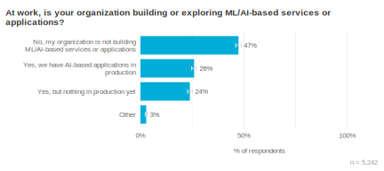 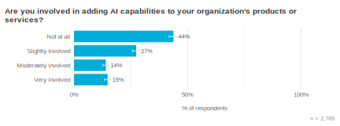

Among the audience of Go developers working professionally with generative AI
(GenAI) systems, a solid majority (81%) reported using OpenAI's ChatGPT or
DALL-E models. A collection of open-source models also saw high adoption, with
a majority of respondents (53%) using at least one of Llama, Mistral, or
another OSS model. We see some early evidence that larger organizations
(1,000+ employees) are a bit less likely to be using OpenAI models (74% vs.
83%) and a bit more likely to be using other proprietary models (22% vs. 11%).
We do not, however, see any evidence of differences in adoption of OSS models
based on organization size–both smaller companies and larger enterprises show
small majorities adopting OSS models (51% and 53%, respectively). Overall we
found that a plurality of respondents prefer to use open-source models (47%)
with only 19% preferring proprietary models; 37% said they had no preference.

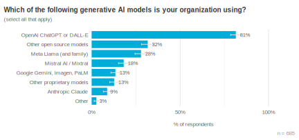 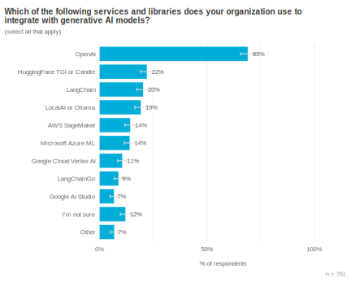

The most common kinds of services respondents are building include
summarization tools (56%), text generation tools (55%), and chatbots (46%).
Open-text responses suggested that many of these use cases are
internal-facing, such as chat bots trained upon an organization's internal
documentation and intended to answer employee questions. Respondents raised
several concerns about external-facing AI features, most notably due to
reliability (e.g., do slight changes in my question lead to very different
results?) and accuracy (e.g., are the results trustworthy?) issues. An
interesting theme running through these responses was a sense of tension
between the risk of not adopting AI tooling at all (and thereby losing a
potential competitive advantage should generative AI become necessary in the
future), balanced against the risk of negative publicity or violating
regulations/laws by using untested AI in high-criticality customer-facing
domains.

We found evidence that Go is already being used in the GenAI space, and there
appears to be an appetite for more. Roughly ⅓ of respondents who were building
AI-powered features told us they were already using Go for a variety of GenAI
tasks, including prototyping new features and integrating services with LLMs.
These proportions tick up slightly for two areas where we believe Go is a
particularly well-suited tool: data pipelines for ML/AI systems (37%) and
hosting API endpoints for ML/AI models (41%). In addition to these (likely
early) adopters, we found that about ¼ of respondents _want_ to use Go for
these types of uses, but are currently blocked by something. We'll return to
these blockers shortly, after exploring why respondents wanted to use Go for
these tasks in the first place.

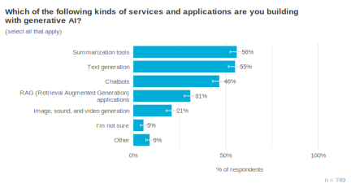 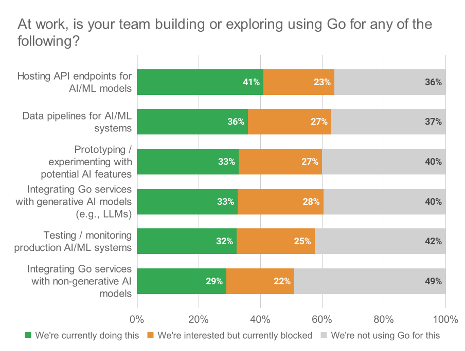

### Reasons for using Go with generative AI systems

To help us understand what benefits developers hope to derive from using Go in
their AI/ML services, we asked developers why they feel Go is a good choice
for this domain. A clear majority (61%) of respondents mentioned one or more
of Go's core principles or features, such as simplicity, runtime safety,
concurrency, or single-binary deployments. One third of respondents cited
existing familiarity with Go, including a desire to avoid introducing new
languages if they can avoid it. Rounding out the most common responses were
various challenges with Python (particularly for running production services)
at 14%.

> "I think that the robustness, simplicity, performance and native binaries
> that the language offers make it a far stronger choice for AI workloads."
> --- Open-source Go developer at a large
> organization with up to 1 year of experience

> "We want to keep our tech stack as homogenous as possible across the
> organization to make it easier for everybody to develop on all areas. Since
> we are already writing all our backends in Go, it is of interest to us to be
> able to write ML model deployments in Go and avoid having to rewrite parts
> of the stack for logging, monitoring, etc... in a separate language [like]
> Python." --- Professional Go developer at a
> mid-sized organization with 5 – 7 years of experience

> "Go is better for us at running API servers and background tasks on worker
> pools. Go's lower resource usage has allowed us to grow without using more
> resources. And we have found that Go projects are easier to maintain over
> time both in code changes and when updating dependencies. We run the models
> as a separate service written in Python and interact with them in Go."
> --- Professional Go developer at a large
> organization with 5 – 7 years of experience

It appears that among Go developers who are interested in ML/AI, there is a
shared sense that 1) Go is inherently a good language for this domain (for the
reasons articulated above), and 2) there is reluctance to introduce a new
language once organizations have already invested in Go (this point reasonably
generalizes to any language). Some respondents also expressed frustration with
Python for reasons such as type safety, code quality, and challenging
deployments.

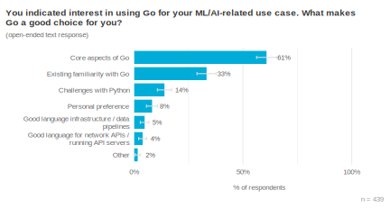

### Challenges when using Go with GenAI systems

Respondents were largely unified on what currently prevents them from using Go
with AI-powered services: the ecosystem is centered around Python, their
favorite libraries/frameworks are all in Python, getting started documentation
assumes Python familiarity, and the data scientists or researchers exploring
these models are already familiar with Python.

> "Python just seems to have all the libraries. PyTorch for example is widely
> used to run models. If there were frameworks in Go to run these models, we'd
> much rather be doing that." --- Professional Go
> developer at a large organization with 2 – 4 years of experience</space>

> "Python tools are substantially more mature and usable out of the box,
> making them a significantly lower cost to implement."
>  --- Professional Go developer at a small
> organization with 2 – 4 years of experience

> "[The] Go world is missing many AI libraries. If I have a LLM PyTorch model,
> I can't even serve it (or I'm unaware how to do it). With Python it's
> basically a few lines of code." --- Professional
> Go developer at a small organization with up to 1 year of experience

These findings triangulate well with our observation above that Go developers
believe Go _should_ be a great language for building production-ready AI
services: only 3% of respondents said that something specific to Go was
blocking their path forward, and only 2% cited specific interoperability
challenges with Python. In other words, most blockers developers face could be
resolved in the module and documentation ecosystem, rather than necessitating
core language or runtime changes.

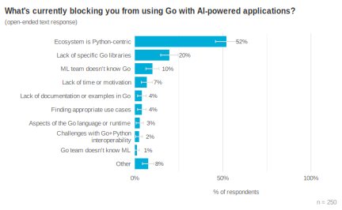

We also asked survey participants whether they were already working with
Python for GenAI, and if so, whether they'd prefer to use Go. Respondents who
said they'd prefer to use Go rather than Python also received a follow-up
about what would enable them to use Go with GenAI systems.

A solid majority (62%) of respondents reported already using Python to
integrate with generative AI models; of this group, 57% would rather use Go
instead. Given that our survey audience are all Go developers, we should
expect this to be an approximate upper bound on the proportion of overall
developers who are interested in moving from Python to Go for GenAI tasks,
given the state of each ecosystem today.

Of the respondents who are already using Python but would prefer to use Go,
the vast majority (92%) said that the availability of Go equivalents for
Python libraries would enable them to integrate Go with GenAI systems.
However, we should be cautious when interpreting this result; the open-text
responses and a separate set of contextual interviews with developers working
on GenAI services describe a Python-centric ecosystem around GenAI; it's not
only that Go lacks many libraries when compared with the Python ecosystem, but
also that the perceived level of investment into Go libraries is lower,
documentation and examples are predominantly in Python, and the network of
experts working in this area are already comfortable with Python.
Experimenting and building proofs-of-concept in Python is almost certain to
continue, and the lack of Go variants of Python libraries (for example,
[pandas](https://pandas.pydata.org/)) is only the first barrier developers
would encounter when trying to port from Python to Go. Libraries and SDKs are
necessary, but unlikely by themselves to be sufficient, to build a robust Go
ecosystem for production ML/AI applications.

Further, contextual interviews with Go developers building AI-powered services
suggest that _calling_ APIs from Go is not a major issue, particularly with
hosted models such as [GPT-4](https://openai.com/gpt-4) or
[Gemini](https://gemini.google.com/). Building, evaluating, and hosting custom
models is seen as challenging in Go (primarily due to the lack of frameworks
and libraries that support this in Python), but interview participants
distinguished between hobbyist use cases (e.g., playing around with custom
models at home) and business use cases. The hobbyist cases are dominated by
Python for all of the reasons enumerated above, but the business use cases are
more focused around reliability, accuracy, and performance while calling
hosted models. This is an area where Go can shine _without_ building a large
ecosystem of ML/AI/data science libraries, though we expect developers will
still benefit from documentation, best practice guidance, and examples.

Because the field of GenAI is so novel, best practices are still being
identified and tested. Initial contextual interviews with developers have
suggested that one of their goals is to be prepared for a future in which
GenAI becomes a competitive advantage; by making some investment in this area
now, they hope to moderate future risk. They're also still trying to
understand what GenAI systems might be helpful for and what the return on
investment (if any) may look like. Due to these unknowns, our early data
suggests that organizations (especially outside the tech industry) may be
hesitant to make long-term commitments here, and will instead pursue a lean or
scrappy approach until either a reliable use case with clear benefits emerges,
or their industry peers begin to make large, public investments in this space.

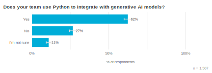 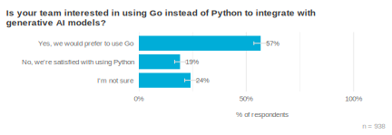 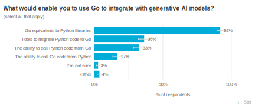 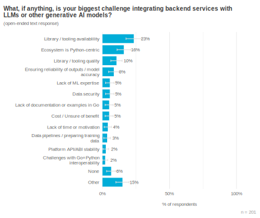

## Learning challenges {#learn}

In order to improve the experience of learning Go, we wanted to hear from
inexperienced Go developers, as well as those who might have already mastered
the basics on what they see as their biggest challenge to meeting their
learning goals. We also wanted to hear from developers who might primarily be
focused on helping others get started with Go rather than their own learning
goals, since they might have some insights on common challenges they see when
onboarding developers.

Only 3% of respondents said that they were currently learning the basics of
Go. This isn't too surprising, considering  most of our survey respondents
have at least a year of experience with Go. Meanwhile, 40% of respondents said
that they have already learned the basics but want to learn more advanced
topics and another 40% said that they help other developers learn Go. Only 15%
said they didn't have any learning goals related to Go.

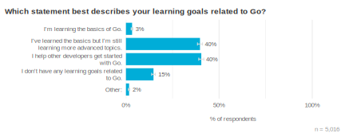

When we looked at more finely grained time segments of Go experience, we found
that 30% of those who've been using Go for less than three months say they're
learning the basics of Go, while about two-thirds of them say that they've
already learned the basics. That's good evidence that someone can at least
feel like they've learned the basics of Go in a short amount of time, but it
also means we don't have as much feedback from this group who are at the
beginning of their learning journey.

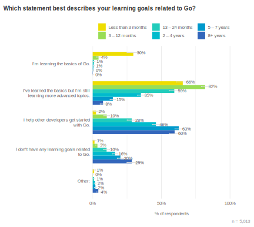

To determine what kinds of learning materials might be most needed in the
community, we asked what kind of learning content respondents preferred for
topics related to software development. They were able to select multiple
options so the numbers here exceed 100%. 87% of respondents said they
preferred written content, which was by far the most preferred format. 52%
said they preferred video content, and in particular this format was more
often preferred by developers with less experience. This could indicate a
growing desire for learning content in video format. The less experienced
demographic did not prefer written content any less than other groups,
however.  [Providing both written and video formats together has been shown to
improve learning
outcomes](https://www.sciencedirect.com/science/article/abs/pii/S0360131514001353)
and [helps developers with different learning preferences and
abilities](https://udlguidelines.cast.org/representation/perception), which
could increase the accessibility of learning content in the Go community.

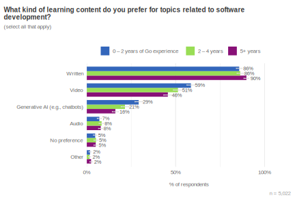

We asked respondents who said they had a learning goal related to Go what
their biggest challenge was to reaching their goal. This was intentionally
left broad enough that someone who was just getting started or who had already
mastered the basics could respond to this question. We also wanted to give
respondents the opportunity to tell us about a wide range of challenges, not
just topics they find difficult.

Overwhelmingly, the most common challenge mentioned was a lack of time or
other personal limitations such as focus or motivation to learn or  (44%).
Although we can't give respondents more time, we should be mindful when we're
producing learning materials or introducing changes in the ecosystem that
users may be operating under significant time constraints. There may also be
opportunities for educators to produce resources that are [digestible in
smaller portions](https://web.cortland.edu/frieda/id/IDtheories/26.html) or
[at a regular
cadence](https://psychology.ucsd.edu/undergraduate-program/undergraduate-resources/academic-writing-resources/effective-studying/spaced-practice.html#:~:text=This%20is%20known%20as%20spaced,information%20and%20retain%20it%20longer.)
to keep learners motivated.

Other than time, the top challenge was learning new concepts, idioms or best
practices that are unique to Go (11%). In particular, adapting to a statically
typed compiled language from Python or JavaScript and learning how to organize
Go code can be particularly challenging. Respondents also asked for more
examples (6%), both in documentation and real world applications to learn
from. Developers coming from a larger developer community expected to be able
to find more existing solutions and examples.

> "Moving from a language like Python to a statically typed, compiled language
> has been challenging, but Go itself hasn't been. I like to learn through
> quick feedback, so Python's REPL was great for that. So now I need to focus
> on really reading documentation and examples to be able to learn. Some of
> the documentation for Go is quite sparse and could do with more examples."
> --- Respondent with less than 3 years of
> experience with Go.

> "My main challenge is the lack of example projects for enterprise-level
> applications. How to organize a big Go project is something I would like to
> have more examples as reference. I would like to refactor the current
> project I am working [on] to a more modular/clean architecture style, and I
> find it difficult in Go due to lack of examples / a more opinionated
> ‘folder/package' reference." --- Respondent with
> 1–2 years of experience with Go.

> "It's a smaller ecosystem than I am used to so online searches don't yield
> as many results to specific issues. The resources that are out there are
> incredibly helpful and I usually am able to solve issues eventually, it just
> takes a little longer."--- Respondent with less
> than 3 months of experience with Go.

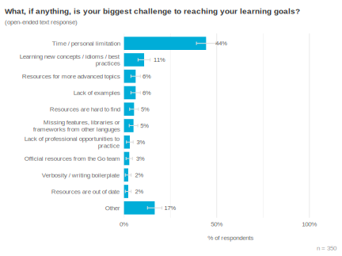

For respondents whose primary learning goal was to help others get started
with Go, we asked what might make it easier for developers to get started with
Go. We got a wide range of responses including documentation suggestions,
comments on difficult topics (e.g., using pointers or concurrency), as well as
requests for adding more familiar features from other languages. For
categories that made up less than 2% of responses, we lumped them into "Other"
responses. Interestingly, nobody mentioned "more time." We think this is
because lack of time or motivation is most often a challenge when there isn't
an immediate necessity to learn something new related to Go. For those helping
others get started with Go, there may be a business reason for doing so,
making it easier to prioritize, and hence "lack of time" is not as much of a
challenge.

Consistent with the previous results, 16% of those who help others get started
with Go told us that new Go developers would benefit from having more
realistic examples or project-based exercises to learn from. They also saw the
need to help developers coming from other language ecosystems through
comparisons between them. [Previous research tells us that experience with one
programming language can interfere with learning a new
one](https://dl.acm.org/doi/abs/10.1145/3377811.3380352), especially when new
concepts and tooling are different from what developers are used to. There are
existing resources that aim to address this issue (just try searching for
"Golang for [language] developers" for examples),  but it could be difficult
for new Go developers to search for concepts they don't have the vocabulary
for yet or these kinds of resources might not adequately address specific
tasks. In the future we would like to learn more about how and when to present
language comparisons to facilitate learning new concepts.

A related need that this group reported was more explanations behind Go's
philosophy and best practices. It could be the case that learning not only
_what_ makes Go different but also _why_ would help new Go developers
understand new concepts or ways of doing tasks that might be different from
their previous experience.

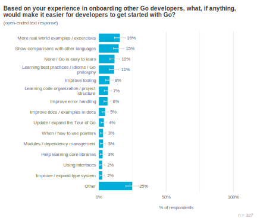

## Demographics {#demographics}

We ask similar demographic questions during each cycle of this survey so we
can understand how comparable the year-over-year results may be. For example,
if a majority of respondents reported having less than one year of experience
with Go in one survey cycle, it'd be very likely that any other differences in
results from prior cycles stem from this major demographic shift. We also use
these questions to provide comparisons between groups, such as satisfaction
according to how long respondents have been using Go.

This year we introduced some minor changes to how we ask about experience with
Go to match the JetBrains developer survey. This allowed us to make
comparisons between our survey populations and facilitated data analysis.

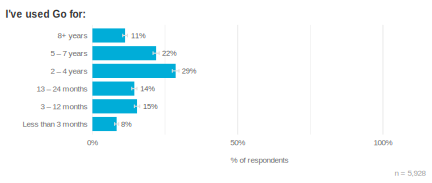

We saw some differences in experience level depending on how developers
discovered our survey. The population who responded to survey notifications in
VS Code skewed toward less experience with Go; we suspect this a reflection of
VS Code's popularity with new Go developers, who may not be ready to invest in
an IDE license while they're still learning. With respect to years of  Go
experience, the respondents randomly selected from GoLand are more similar to
our self-selected population who found the survey through the Go Blog. Seeing
consistencies between samples such as these allows us to more confidently
generalize findings to the rest of the community.

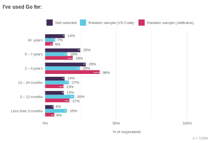

In addition to years of experience with Go, this year we also measured years
of professional coding experience. We were surprised to find that 26% of
respondents have 16 or more years of professional coding experience. For
comparison, the [JetBrains Developer Survey
audience](https://www.jetbrains.com/lp/devecosystem-2023/demographics/#code_yrs)
from 2023 had a majority of respondents with 3–5 years of professional
experience. Having a more experienced demographic could affect differences in
responses. For example, we saw significant differences in what kinds of
learning content respondents with different levels of experience preferred.

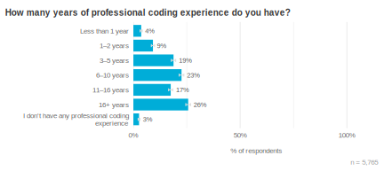

When we looked at our different samples, the self-selected group was even more
experienced than the randomly selected groups, with 29% having 16 or more
years of professional experience. This suggests that our self-selected group
is generally more experienced than our randomly selected groups and can help
explain some of the differences we see in this group.

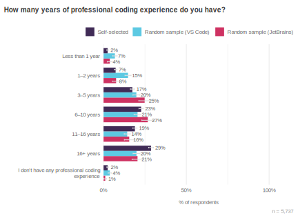

We introduced another demographic question during this cycle on employment
status to help us make comparisons with [JetBrains' Developer
Survey](https://www.jetbrains.com/lp/devecosystem-2023/demographics/#employment_status).
We found that 81% of respondents were fully employed, significantly more than
63% on the JetBrains survey. We also found significantly fewer students in our
population (4%) compared to 15% on the JetBrains survey. When we look at our
individual samples, we see a small but significant difference within our
respondents from VS Code, who are slightly less likely to be fully employed
and slightly more likely to be students. This makes sense given that VS Code
is free.

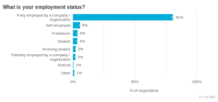

Similar to previous years, the most common use cases for Go were API/RPC
services (74%) and command line tools (63%). We've heard that Go's built-in
HTTP server and concurrency primitives, ease of cross-compilation, and
single-binary deployments make Go a good choice for these kinds of
applications.

We also looked for differences based on respondents' level of experience with
Go and organization size. More experienced Go developers reported building a
wider variety of applications in Go. This trend was consistent across every
category of app or service. We did not find any notable differences in what
respondents are building based on their organization size.

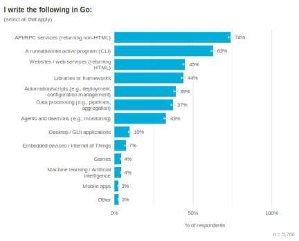

## Firmographics {#firmographics}

We heard from respondents at a variety of different organizations. About 27%
worked at large organizations with 1,000 or more employees, 25% were from
midsize organizations of 100–1,000 employees, and 43% worked at smaller
organizations with less than 100 employees. As in previous years, the most
common industry people work in was technology (48%) while the second most
common was financial services (13%) .

This is statistically unchanged from the past few Go Developer Surveys—we
continue to hear from people in different countries and in organizations of
different sizes and industries at consistent rates year after year.

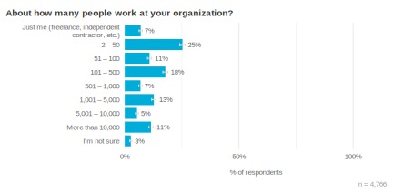

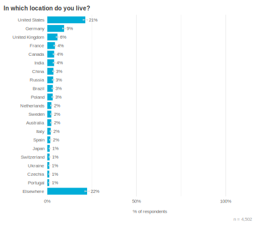

## Methodology {#methodology}

Prior to 2021, we announced the survey primarily through the Go Blog, where it
was picked up on various social channels like Twitter, Reddit, or Hacker News.
In 2021 we introduced a new way to recruit respondents by using the VS Code Go
plugin to randomly select users to be shown a prompt asking if they'd like to
participate in the survey. This created a random sample that we used to
compare the self-selected respondents from our traditional channels and helped
identify potential effects of [self-selection
bias](https://en.wikipedia.org/wiki/Self-selection_bias). For this cycle, our
friends at JetBrains generously provided us with an additional random sample
by prompting a random subset of GoLand users to take the survey!

64% of survey respondents "self-selected" to take the survey, meaning they
found it on the Go blog or other social Go channels. People who don't follow
these channels are less likely to learn about the survey from them, and in
some cases, they respond differently than people who do closely follow them.
For example, they might be new to the Go community and not yet aware of the Go
blog. About 36% of respondents were randomly sampled, meaning they responded
to the survey after seeing a prompt in VS Code (25%) or GoLand (11%). Over the
period of January 23 -- February 13, there was roughly a 10% chance that users
would have seen this prompt. By examining how the randomly sampled groups
differ from the self-selected responses, as well as from each other, we're
able to more confidently generalize findings to the larger community of Go
developers.

### How to read these results

Throughout this report we use charts of survey responses to provide supporting
evidence for our findings. All of these charts use a similar format. The title
is the exact question that survey respondents saw. Unless otherwise noted,
questions were multiple choice and participants could only select a single
response choice; each chart's subtitle will tell the reader if the question
allowed multiple response choices or was an open-ended text box instead of a
multiple choice question. For charts of open-ended text responses, a Go team
member read and manually categorized all of the responses. Many open-ended
questions elicited a wide variety of responses; to keep the chart sizes
reasonable, we condensed them to a maximum of the top 10-12 themes, with
additional themes all grouped under "Other". The percentage labels shown in
charts are rounded to the nearest integer (e.g., 1.4% and 0.8% will both be
displayed as 1%), but the length of each bar and row ordering are based on the
unrounded values.

To help readers understand the weight of evidence underlying each finding, we
included error bars showing the 95% [confidence
interval](https://en.wikipedia.org/wiki/Confidence_interval) for responses;
narrower bars indicate increased confidence. Sometimes two or more responses
have overlapping error bars, which means the relative order of those responses
is not statistically meaningful (i.e., the responses are effectively tied).
The lower right of each chart shows the number of people whose responses are
included in the chart, in the form "n = [number of respondents]". In cases
where we found interesting differences in responses between groups, (e.g.,
years of experience, organization size, or sample source) we showed a
color-coded breakdown of the differences.

## Closing {#closing}

And that's it for our semi-annual Go Developer Survey. Many thanks to everyone
who shared their thoughts on Go and everyone who contributed to making this
survey happen! It means the world to us and truly helps us improve Go.

This year we're also excited to announce the forthcoming release of this survey's
dataset. We expect to share this anonymized data by the end of April, allowing
anyone to slice and dice survey responses as needed to answer their own
questions about the Go ecosystem.

Updated 2024-05-03: We unfortunately need to delay the release of this
dataset. We're still working to make this happen, but we don't expect to be
able to share it until the second half of 2024.

--- Alice and Todd (on behalf of the Go team at Google)
