

## Background

Go was designed with a focus on developer experience, and we deeply value the
feedback we receive through proposals, issues, and community interactions.
However, these channels often represent the voices of our most experienced or
engaged users, a small subset of the broader Go community. To ensure we're
serving developers of all skill levels, including those who may not have strong
opinions on language design, we conduct this survey once or twice a year to
gather systematic feedback and quantitative evidence. This inclusive approach
allows us to hear from a wider range of Go developers, providing valuable
insights into how Go is used across different contexts and experience levels.
Your participation is critical in informing our decisions about language changes
and resource allocation, ultimately shaping the future of Go. Thank you to
everyone who contributed, and we strongly encourage your continued participation
in future surveys. Your experience matters to us. 

This post shares the results of our most recent Go Developer Survey, conducted
from September 9–23, 2024. We recruited participants from the Go blog and
through randomized prompts in the [VS Code](https://code.visualstudio.com/) Go
plug-in and [GoLand IDE](https://www.jetbrains.com/go/), allowing us to recruit
a more representative sample of Go developers. We received a total of 4,156
responses. A huge thank you to all those who contributed to making this
possible.

Along with capturing sentiments and challenges around using Go and Go tooling,
our primary focus areas for this survey were on uncovering sources of toil,
challenges to performing best practices, and how developers are using AI
assistance.

## Highlights

* **Developer sentiment towards Go remains extremely positive**, with 93% of
  survey respondents saying they felt satisfied while working with Go during the
  prior year.
* **Ease of deployment and an easy to use API/SDK** were respondents’ favorite
  things about using Go on the top three cloud providers. First-class Go support
  is critical to keeping up with developer expectations.
* 70% of respondents were using AI assistants when developing with Go. The most
  common uses were **LLM-based code completion**, writing tests, generating Go
  code from natural language descriptions, and brainstorming. There was a
  significant discrepancy between what respondents said they wanted to use AI
  for last year, and what they currently use AI for.
* The biggest challenge for teams using Go was **maintaining consistent coding
  standards** across their codebase. This was often due to team members having
  different levels of Go experience and coming from different programming
  backgrounds, leading to inconsistencies in coding style and adoption of
  non-idiomatic patterns.

## Contents

- <a href="#sentiment">Overall satisfaction</a>
- <a href="#devenv">Development environments and tools</a>
- <a href="#cloud">Go in the clouds</a>
- <a href="#ai-assistance">AI assistance</a>
- <a href="#team-challenges">Challenges for teams using Go</a>
- <a href="#simd">Single Instruction, Multiple Data (SIMD)</a>
- <a href="#demographics">Demographics</a>
- <a href="#firmographics">Firmographics</a>
- <a href="#methodology">Methodology</a>
- <a href="#how-to-read-these-results">How to read these results</a>
- <a href="#closing">Closing</a>

### Overall satisfaction {#sentiment}

Overall satisfaction remains high in the survey with 93% of respondents saying
they were somewhat or very satisfied with Go during the last year. Although the
exact percentages fluctuate slightly from cycle to cycle, we do not see any
statistically significant differences from our [2023
H2](/blog/survey2023-h2-results) or [2024 H1
](/blog/survey2024-h1-results)Surveys when the satisfaction rate
was 90% and 93%, respectively.

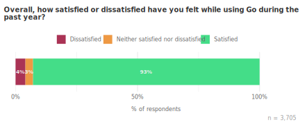

The open comments we received on the survey continue to highlight what
developers like most about using Go, for example, its simplicity, the Go
toolchain, and its promise of backwards compatibility:

*“I am a programming languages enjoyer (C-like) and I always come back to Go for
its simplicity, fast compilation and robust toolchain. Keep it up!”*

*“Thank you for creating Go! It is my favorite language, because it is pretty
minimal, the development cycle has rapid build-test cycles, and when using a
random open source project written in Go, there is a good chance that it will
work, even 10 years after. I love the 1.0 compatibility guarantee.”*

### Development environments and tools {#devenv}

#### Developer OS {#developer-os}

Consistent with previous years, most survey respondents develop with Go on Linux
(61%) and macOS (59%) systems. Historically, the proportion of Linux and macOS
users has been very close, and we didn’t see any significant changes from the
last survey. The randomly sampled groups from JetBrains and VS Code were more
likely (33% and 36%, respectively) to develop on Windows than the self-selected
group (16%). 

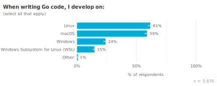 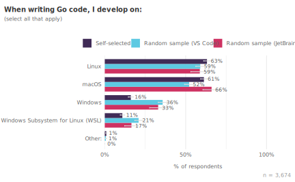

#### Deployment environments {#deployment-environments}

Given the prevalence of Go for cloud development and containerized workloads,
it’s no surprise that Go developers primarily deploy to Linux environments
(96%).

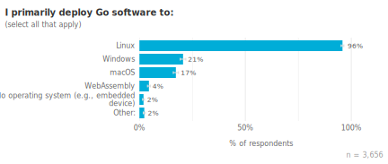

We included several questions to understand what architectures respondents are
deploying to when deploying to Linux, Windows or WebAssembly. The x86-64 /
AMD64 architecture was by far the most popular choice for those deploying to
both Linux (92%) and Windows (97%). ARM64 was second at 49% for Linux and 21%
for Windows.

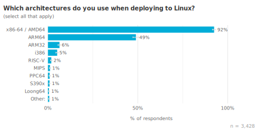 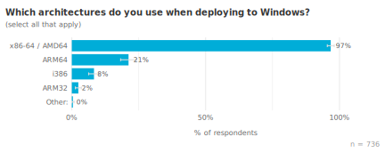

Not many respondents deployed to Web Assembly (only about 4% of overall
respondents), but 73% that do said they deploy to JS and 48% to WASI Preview 1.

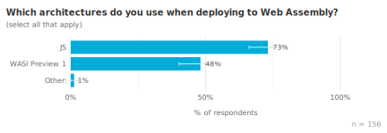

#### Editor awareness and preferences {#editor-awareness-and-preferences}

We introduced a new question on this survey to assess awareness and usage of
popular editors for Go. When interpreting these results, keep in mind that 34%
of respondents came to the survey from VS Code and 9% of respondents came from
GoLand, so it is more likely for them to use those editors regularly.

VS Code was the most widely used editor, with 66% of respondents using it
regularly, and GoLand was the second most used at 35%. Almost all respondents
had heard of both VS Code and GoLand, but respondents were much more likely to
have at least tried VS Code. Interestingly, 33% of respondents said they
regularly use 2 or more editors. They may use different editors for different
tasks or environments, such as using Emacs or Vim via SSH, where IDEs aren’t
available. 

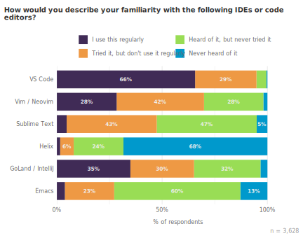

We also asked a question about editor preference, the same as we have asked on
previous surveys. Because our randomly sampled populations were recruited from
within VS Code or GoLand, they are strongly biased towards preferring those
editors. To avoid skewing the results, we show the data for the most preferred
editor here from the self-selected group only. 38% preferred VS Code and 35%
preferred GoLand. This is a notable difference from the last survey in H1, when
43% preferred VS Code and 33% preferred GoLand. A possible explanation could be
in how respondents were recruited this year. This year the VS Code notification
began inviting developers to take the survey before the Go blog entry was
posted, so a larger proportion of respondents came from the VS Code prompt this
year who might have otherwise come from the blog post. Because we only show the
self-selected respondents in this chart, data from respondents from the VS Code
prompt data are not represented here. Another contributing factor could be the
slight increase in those who prefer "Other" (4%). The write-in responses suggest
there is increased interest in editors like [Zed](https://zed.dev/), which made
up 43% of the write-in responses.

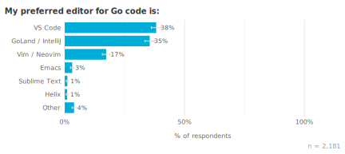

#### Code analysis tools {#code-analysis-tools}

The most popular code analysis tool was `gopls`, which was knowingly used by 65%
of respondents. Because `gopls` is used under-the-hood by default in VS Code,
this is likely an undercount. Following closely behind, `golangci-lint` was used
by 57% of respondents, and `staticcheck` was used by 34% of respondents. A much
smaller proportion used custom or other tools, which suggests that most
respondents prefer common established tools over custom solutions. Only 10% of
respondents indicated they don't use any code analysis tools.

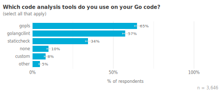

#### Go in the Clouds {#cloud}

Go is a popular language for modern cloud-based development, so we typically
include survey questions to help us understand which cloud platforms and
services Go developers are using. In this cycle, we sought to learn about
preferences and experiences of Go developers across cloud providers, with a
particular focus on the largest cloud providers: Amazon Web Services (AWS),
Microsoft Azure, and Google Cloud. We also included an additional option for
“Bare Metal Servers” for those who deploy to servers without virtualization.

Similar to previous years, almost half of respondents (50%) deploy Go programs
to Amazon Web Services. AWS is followed by self-owned or company-owned servers
(37%), and Google Cloud (30%). Respondents who work at large organizations are a
little more likely to deploy to self-owned or company-owned servers (48%) than
those who work at small-to-medium organizations (34%). They‘re also a little
more likely to deploy to Microsoft Azure (25%) than small-to-medium
organizations (12%). 

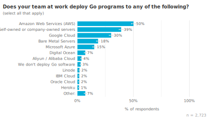

The most commonly used cloud services were AWS Elastic Kubernetes Service (41%),
AWS EC2 (39%), and Google Cloud GKE (29%). Although we’ve seen Kubernetes usage
increase over time, this is the first time we’ve seen EKS become more widely
used than EC2. Overall, Kubernetes offerings were the most popular services for
AWS, Google Cloud, and Azure, followed by VMs and then Serverless offerings.
Go's strengths in containerization and microservices development naturally align
with the rising popularity of Kubernetes, as it provides an efficient and
scalable platform for deploying and managing these types of applications. 

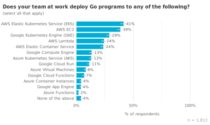

We asked a followup question to respondents who deployed Go code to the top
three cloud providers, Amazon Web Services, Google Cloud, and Microsoft Azure on
what they like most about deploying Go code to each cloud. The most popular
response across different providers was actually Go's performance and language
features rather than something about the cloud provider.

Other common reasons were:

* Familiarity with the given cloud provider compared to other clouds
* Ease of deployment of Go applications on the given cloud provider
* The cloud provider's API/SDK for Go is easy to use
* The API/SDK is well documented

Other than familiarity, the top favorite things highlight the importance of
having first class support for Go to keep up with developer expectations. 

It was also fairly common for respondents to say they don't have a favorite
thing about their cloud provider. From a previous version of the survey that
involved write-in responses, this often meant that they did not interact
directly with the Cloud. In particular, respondents who use Microsoft Azure were
much more likely to say that “Nothing” was their favorite thing (51%) compared
to AWS (27%) or Google Cloud (30%).

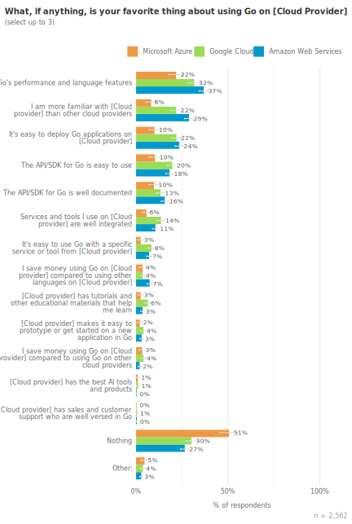

### AI assistance {#ai-assistance}

The Go team hypothesizes that AI assistance has the potential to alleviate
developers from tedious and repetitive tasks, allowing them to focus on more
creative and fulfilling aspects of their work. To gain insights into areas where
AI assistance could be most beneficial, we included a section in our survey to
identify common developer toil.

The majority of respondents (70%) are using AI assistants when developing with
Go. The most common usage of AI assistants was in LLM-based code completion
(35%). Other common responses were writing tests (29%), generating Go code from
a natural language description (27%), and brainstorming ideas (25%). There was
also a sizable minority (30%) of respondents who had not used any LLM for
assistance in the last month.

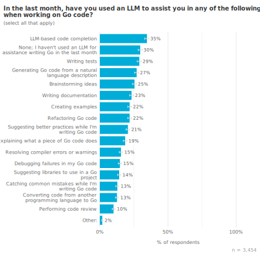

Some of these results stood out when compared to findings from our 2023 H2
survey, where we asked respondents for the top 5 use cases they would like to
see AI/ML support Go developers. Although a couple new responses were introduced
in the current survey, we can still do a rough comparison between what
respondents said they wanted AI support for, and what their actual usage was
like. In that previous survey, writing tests was the most desired use case
(49%). In our latest 2024 H2 survey, about 29% of respondents had used AI
assistants for this in the last month. This suggests that current offerings are
not meeting developer needs for writing tests. Similarly, in 2023, 47%
respondents said they would like suggestions for best practices while coding,
while only 14% a year later said they are using AI assistance for this use case.
46% said they wanted help catching common mistakes while coding, and only 13%
said they were using AI assistance for this. This could indicate that current AI
assistants are not well-equipped for these kinds of tasks, or they're not well
integrated into developer workflows or tooling. 

It was also surprising to see such high usage of AI for generating Go code from
natural language and brainstorming, since the previous survey didn't indicate
these as highly desired use cases. There could be a number of explanations for
these differences. While previous respondents might not have explicitly *wanted*
AI for code generation or brainstorming initially, they might be gravitating
towards these uses because they align with the current strengths of generative
AI—natural language processing and creative text generation. We should also keep
in mind that people[ are not necessarily the best predictors of their own
behavior](https://www.nngroup.com/articles/first-rule-of-usability-dont-listen-to-users/).

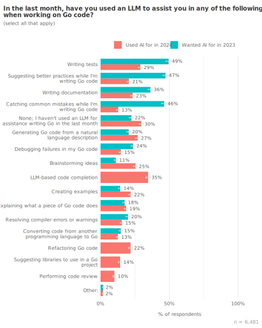

We also saw some notable differences in how different groups responded to this
question. Respondents at small to medium sized organizations were a little more
likely to have used LLMs (75%) compared to those at large organizations (66%).
There could be a number of reasons why, for example, larger organizations may
have stricter security and compliance requirements and concerns about the
security of LLM coding assistants, the potential for data leakage, or compliance
with industry-specific regulations. They also may have already invested in
other developer tools and practices that already provide similar benefits to
developer productivity.

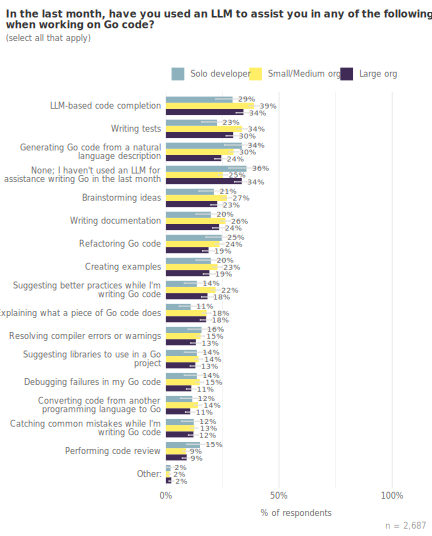

Go developers with less than 2 years of experience were more likely to use AI
assistants (75%) compared to Go developers with 5+ years of experience (67%).
Less experienced Go developers were also more likely to use them for more tasks,
on average 3.50. Although all experience levels tended to use LLM-based code
completion, less experienced Go developers were more likely to use Go for more
tasks related to learning and debugging, such as explaining what a piece of Go
code does, resolving compiler errors and debugging failures in their Go code.
This suggests that AI assistants are currently providing the greatest utility to
those who are less familiar with Go. We don't know how AI assistants affect
learning or getting started on a new Go project, something we want to
investigate in the future. However, all experience levels had similar rates of
satisfaction with their AI assistants, around 73%, so new Go developers are not
more satisfied with AI assistants, despite using them more often. 

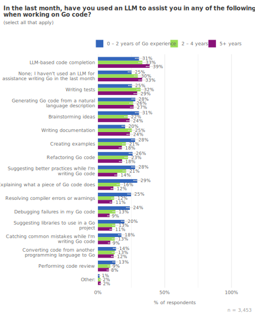

To respondents who reported using AI assistance for at least one task related to
writing Go code, we asked some follow up questions to learn more about their AI
assistant usage. The most commonly used AI assistants were ChatGPT (68%) and
GitHub Copilot (50%). When asked which AI assistant they used *most* in the last
month, ChatGPT and Copilot were about even at 36% each, so although more
respondents used ChatGPT, it wasn’t necessarily their primary assistant.
Participants were similarly satisfied with both tools (73% satisfied with
ChatGPT, vs. 78% with GitHub CoPilot). The highest satisfaction rate for any AI
assistant was Anthropic Claude, at 87%.

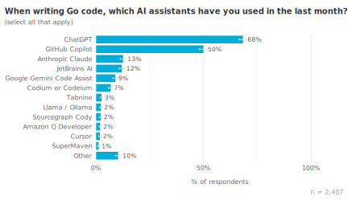 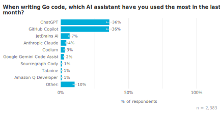

### Challenges for teams using Go {#team-challenges}

In this section of the survey, we wanted to understand which best practices or
tools should be better integrated into developer workflows. Our approach was to
identify common problems for teams using Go. We then asked respondents which
challenges would bring them the most benefit if they were “magically” solved for
them. (This was so that respondents would not focus on particular solutions.)
Common problems that would provide the most benefit if they were solved would be
considered candidates for improvement.

The most commonly reported challenges for teams were maintaining consistent coding
standards across our Go codebase (58%), identifying performance issues in a
running Go program (58%) and identifying resource usage inefficiencies in a
running Go program (57%).

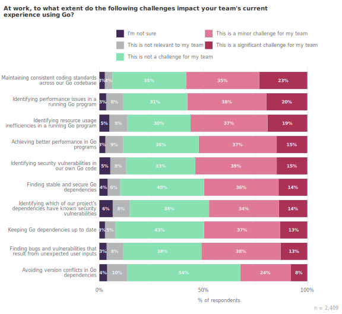

21% of respondents said their team would benefit most from maintaining
consistent coding standards across their Go codebase. This was the most common
response, making it a good candidate to address. In a follow-up question, we got
more details as to why specifically this was so challenging.

According to the write-in responses, many teams face challenges maintaining
consistent coding standards because their members have varying levels of
experience with Go and come from different programming backgrounds. This led to
inconsistencies in coding style and the adoption of non-idiomatic patterns. 

*“There's lots of polyglot engineers where I work. So the Go written is not
consistent. I do consider myself a Gopher and spend time trying to convince my
teammates what is idiomatic in Go”—Go developer with 2–4 years of experience.*

*“Most of the team members are learning Go from scratch. Coming from the
dynamically typed languages, it takes them a while to get used to the new
language. They seem to struggle maintaining the code consistency following the
Go guidelines.”—Go developer with 2–4 years of experience.*

This echoes some feedback we’ve heard before about teammates who write "Gava" or
"Guby" due to their previous language experiences. Although static analysis was
a class of tool we had in mind to address this issue when we came up with this
question, we are currently exploring different ways we might address this.

### Single Instruction, Multiple Data (SIMD) {#simd}

SIMD, or Single Instruction, Multiple Data, is a type of parallel processing
that allows a single CPU instruction to operate on multiple data points
simultaneously. This facilitates tasks involving large datasets and repetitive
operations, and is often used to optimize performance in fields like game
development, data processing, and scientific computing. In this section of the
survey we wanted to assess respondents' needs for native SIMD support in Go.

The majority of respondents (89%) say that work on projects where performance
optimizations are crucial at least some of the time. 40% said they work on such
projects at least half the time. This held true across different organization
sizes and experience levels, suggesting that performance is an important issue
for most developers. 

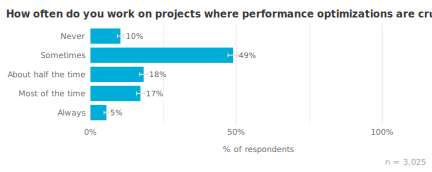

About half of respondents (54%), said they are at least a little familiar with
the concept of SIMD. Working with SIMD often requires a deeper understanding of
computer architecture and low-level programming concepts, so unsurprisingly we
find that less experienced developers were less likely to be familiar with SIMD.
Respondents with more experience and who worked on performance-crucial
applications at least half the time were the most likely to be familiar with
SIMD.

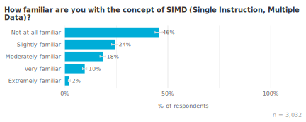

For those who were at least slightly familiar with SIMD, we asked some follow
-up questions to understand how respondents were affected by the absence of
native SIMD support in Go. Over a third, about 37%, said they had been impacted.
17% of respondents said they had been limited in the performance they could
achieve in their projects, 15% said they had to use another language instead of
Go to achieve their goals, and 13% said they had to use non-Go libraries when
they would have preferred to use Go libraries. Interestingly, respondents who
were negatively impacted by the absence of native SIMD support were a little
more likely to use Go for data processing and AI/ML. This suggests that adding
SIMD support could make Go a better option for these domains.

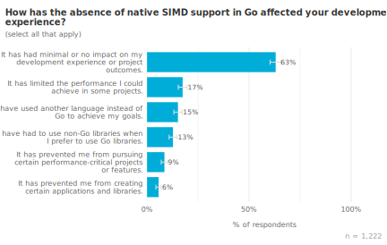 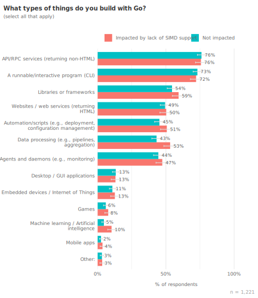

### Demographics {#demographics}

We ask similar demographic questions during each cycle of this survey so we can
understand how comparable the year-over-year results may be. For example, if we
saw changes in who responded to the survey in terms of Go experience, it’d be
very likely that other differences in results from prior cycles were due to this
demographic shift. We also use these questions to provide comparisons between
groups, such as satisfaction according to how long respondents have been using
Go. 

We didn’t see any significant changes in levels of experience among respondents
during this cycle.

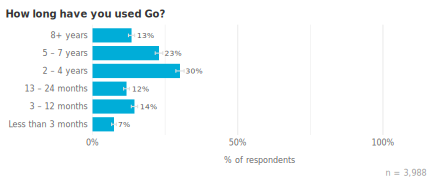

There are differences in the demographics of respondents according to whether
they came from The Go Blog, the VS Code extension, or GoLand. The population
who responded to survey notifications in VS Code skews toward less experience
with Go; we suspect this a reflection of VS Code’s popularity with new Go
developers, who may not be ready to invest in an IDE license while they’re still
learning. With respect to years of Go experience, the respondents randomly
selected from GoLand are more similar to our self-selected population who found
the survey through the Go Blog. Seeing consistencies between samples allows us
to more confidently generalize findings to the rest of the community.

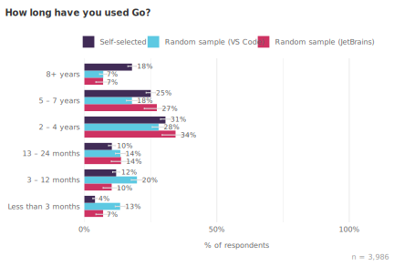

In addition to years of experience with Go, we also measured years of
professional coding experience. Our audience tends to be a pretty experienced
bunch, with 26% of respondents having 16 or more years of professional coding
experience. 

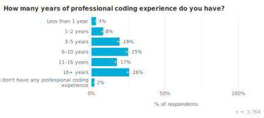

The self-selected group was even more experienced than the randomly selected
groups, with 29% having 16 or more years of professional experience. This
suggests that our self-selected group is generally more experienced than our
randomly selected groups and can help explain some of the differences we see in
this group.

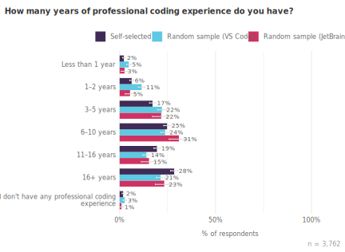

We found that 81% of respondents were fully employed. When we look at our
individual samples, we see a small but significant difference within our
respondents from VS Code, who are slightly more likely to be students. This
makes sense given that VS Code is free.

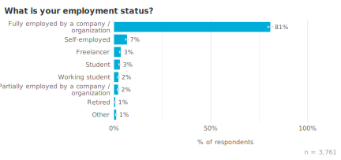
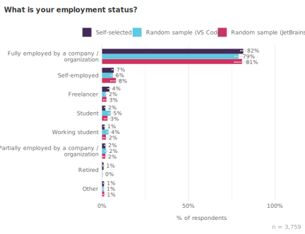

Similar to previous years, the most common use cases for Go were API/RPC
services (75%) and command line tools (62%). More experienced Go developers
reported building a wider variety of applications in Go. This trend was
consistent across every category of app or service. We did not find any notable
differences in what respondents are building based on their organization size.
Respondents from the random VS Code and GoLand samples did not display
significant differences either.

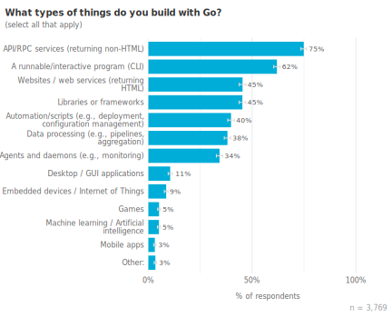

### Firmographics {#firmographics}

We heard from respondents at a variety of different organizations. About 29%
worked at large organizations with 1,001 or more employees, 25% were from
midsize organizations of 101–1,000 employees, and 43% worked at smaller
organizations with fewer than 100 employees. As in previous years, the most
common industry people work in was technology (43%) while the second most common
was financial services (13%).

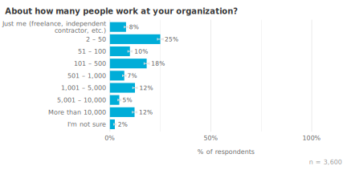 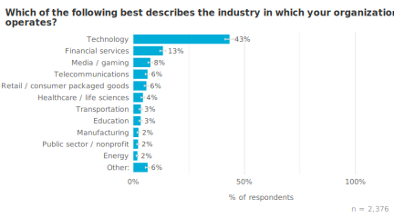

As in previous surveys, the most common location for survey respondents was the
United States (19%). This year we saw a significant shift in the proportion of
respondents coming from Ukraine, from 1% to 6%, making it the third most common
location for survey respondents. Because we only saw this difference among our
self-selected respondents, and not in the randomly sampled groups, this suggests
that something affected who discovered the survey, rather than a widespread
increase in Go adoption across all developers in Ukraine. Perhaps there was
increased visibility or awareness of the survey or the Go Blog among developers
in Ukraine.

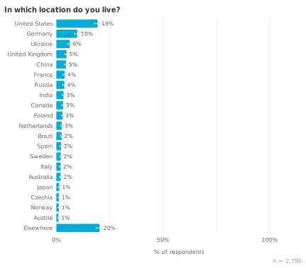

## Methodology {#methodology}

We announce the survey primarily through the Go Blog, where it is often picked
up on various social channels like Reddit, or Hacker News. We also recruit
respondents by using the VS Code Go plugin to randomly select users to whom we show
a prompt asking if they’d like to participate in the survey. With some help from
our friends at JetBrains, we also have an additional random sample from
prompting a random subset of GoLand users to take the survey. This gave us two
sources we used to compare the self-selected respondents from our traditional
channels and help identify potential effects of [self-selection
bias](https://en.wikipedia.org/wiki/Self-selection_bias). 

57% of survey respondents “self-selected” to take the survey, meaning they found
it on the Go blog or other social Go channels. People who don’t follow these
channels are less likely to learn about the survey from them, and in some cases,
they respond differently than people who do closely follow them. For example,
they might be new to the Go community and not yet aware of the Go blog. About
43% of respondents were randomly sampled, meaning they responded to the survey
after seeing a prompt in VS Code (25%) or GoLand (11%). Over the period of
September 9–23, 2024, there was roughly a 10% chance users of the VS Code plugin
would have seen this prompt. The prompt in GoLand was similarly active between
September 9–20. By examining how the randomly sampled groups differ from the
self-selected responses, as well as from each other, we’re able to more
confidently generalize findings to the larger community of Go developers. 

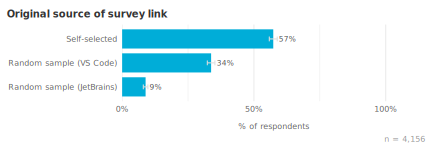

#### How to read these results {#how-to-read-these-results}

Throughout this report we use charts of survey responses to provide supporting
evidence for our findings. All of these charts use a similar format. The title
is the exact question that survey respondents saw. Unless otherwise noted,
questions were multiple choice and participants could only select a single
response choice; each chart’s subtitle will tell the reader if the question
allowed multiple response choices or was an open-ended text box instead of a
multiple choice question. For charts of open-ended text responses, a Go team
member read and manually categorized all of the responses. Many open-ended
questions elicited a wide variety of responses; to keep the chart sizes
reasonable, we condensed them to a maximum of the top 10-12 themes, with
additional themes all grouped under “Other”. The percentage labels shown in
charts are rounded to the nearest integer (e.g., 1.4% and 0.8% will both be
displayed as 1%), but the length of each bar and row ordering are based on the
unrounded values.

To help readers understand the weight of evidence underlying each finding, we
included error bars showing the 95% [confidence
interval](https://en.wikipedia.org/wiki/Confidence_interval) for responses;
narrower bars indicate increased confidence. Sometimes two or more responses
have overlapping error bars, which means the relative order of those responses
is not statistically meaningful (i.e., the responses are effectively tied). The
lower right of each chart shows the number of people whose responses are
included in the chart, in the form “n = [number of respondents]”. In cases where
we found interesting differences in responses between groups, (e.g., years of
experience, organization size, or sample source) we showed a color-coded
breakdown of the differences.

### Closing {#closing}

Thanks for reviewing our semi-annual Go Developer Survey! And many thanks to
everyone who shared their thoughts on Go and everyone who contributed to making
this survey happen. It means the world to us and truly helps us improve Go. 

--- Alice (on behalf of the Go team at Google)
