

Hello! In this article we'll discuss the results of the 2025 Go Developer
Survey, conducted during September 2025.

Thank you to the 5,379 Go developers who responded to our survey invitation
this year. Your feedback helps both the Go team at Google and the wider Go
community understand the current state of the Go ecosystem and prioritize
projects for the year ahead.

Our three biggest findings are:

- Broadly speaking, Go developers asked for help with identifying and applying
  best practices, making the most of the standard library, and expanding the
  language and built-in tooling with more modern capabilities.
- Most Go developers are now using AI-powered development tools when seeking
  information (e.g., learning how to use a module) or toiling (e.g., writing
  repetitive blocks of similar code), but their satisfaction with these tools
  is middling due, in part, to quality concerns.
- A surprisingly high proportion of respondents said they frequently need to
  review documentation for core `go` subcommands, including `go build`, `go
  run`, and `go mod`, suggesting meaningful room for improvement with the `go`
  command's help system.

Read on for the details about these findings, and much more.

## Sections

- <a href="#demographics">Who did we hear from?</a>
- <a href="#sentiment">How do people feel about Go?</a>
- <a href="#uses">What are people building with Go?</a>
- <a href="#challenges">What are the biggest challenges facing Go
  developers?</a>
- <a href="#devenv">What do their development environments look like?</a>
- <a href="#methodology">Survey methodology</a>

## Who did we hear from? {#demographics}

Most survey respondents self-identified as professional developers (87%) who
use Go for their primary job (82%). A large majority also uses Go for personal
or open-source projects (72%). Most respondents were between 25 &ndash; 45
years old (68%) with at least six years of professional development experience
(75%). Going deeper, 81% of respondents told us they had more professional
development experience than Go-specific experience, strong evidence that Go is
usually not the first language developers work with. In fact, one of the
themes that repeatedly surfaced during this year's survey analysis seems to
stem from this fact: when the way to do a task in Go is substantially
different from a more familiar language, it creates friction for developers to
first learn the new (to them) idiomatic Go pattern, and then to consistently
recall these differences as they continue to work with multiple languages.
We'll return to this theme later.

The single most common industry respondents work in was "Technology" (46%),
but a majority of respondents work outside of the tech industry (54%). We saw
representation of all sizes of organizations, with a bare majority working
somewhere with 2 &ndash; 500 employees (51%), 9% working alone, and 30%
working at enterprises of over 1,000 employees. As in prior years, a majority
of responses come from North America and Europe.

 This year we observed a decrease in the proportion of respondents who said
 they were fairly new to Go, having worked with it for less than one year
 (13%, vs. 21% in 2024). We suspect this is related to <a
 href="https://digitaleconomy.stanford.edu/wp-content/uploads/2025/08/Canaries_BrynjolfssonChandarChen.pdf">industry-wide
 declines in entry-level software engineering roles</a>; we commonly hear from
 people that they learned Go for a specific job, so a downturn in hiring would
 be expected to reduce the number of developers learning Go in that year. This
 hypothesis is further supported by our finding that over 80% of respondents
 learned Go _after_ beginning their professional career.

 Other than the above, we found no significant changes in other demographics
 since our 2024 survey.

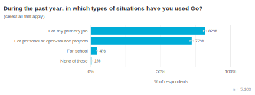 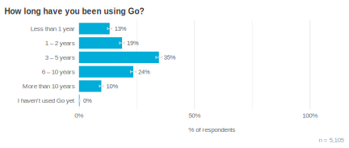 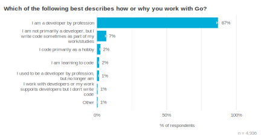 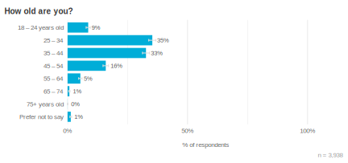 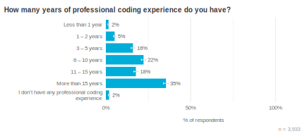 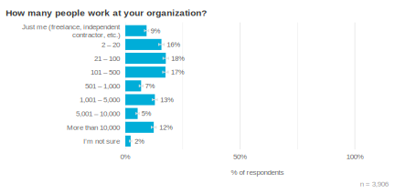 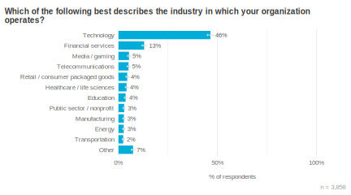 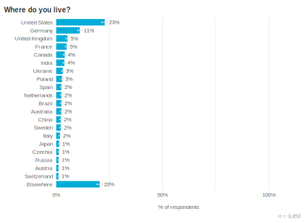

## How do people feel about Go? {#sentiment}

The vast majority of respondents (91%) said they felt satisfied while working
with Go. Almost ⅔ were "very satisfied", the highest rating. Both of these
metrics are incredibly positive, and have been stable since we began asking
this question in 2019. The stability over time is really what we monitor from
this metric &mdash; we view it as a lagging indicator, meaning by the time
this satisfaction metric shows a meaningful change, we would expect to already
have seen earlier signals from issue reports, mailing lists, or other
community feedback.

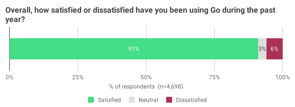

Why were respondents so positive about Go? Looking at open-text responses to
several different survey questions suggests that it's the gestalt, rather than
any one thing. These folks are telling us that they find tremendous value in
Go as a holistic platform. That doesn't mean it supports all programming
domains equally well (it surely does not), but that developers' value the
domains it _does_ nicely support via stdlib and built-in tooling.

Below are some representative quotations from respondents. To provide context
for each quote, we also identify the satisfaction level, years of experience
with Go, and industry of the respondent.

> "Go is by far my favorite language; other languages feel far too complex and
> unhelpful. The fact that Go is comparatively small, simple, with fewer bells
> and whistles plays a massive role in making it such a good long-lasting
> foundation for building programs with it. I love that it scales well to
> being used by a single programmer and in large teams."  class="quote_source">&mdash; Very satisfied / 10+ years / Technology
> company

> "The entire reason I use Go is the great tooling and standard library.  I'm
> very thankful to the team for focusing on great HTTP, crypto, math, sync,
> and other tools that make developing service-oriented applications easy and
> reliable." &mdash; Very satisfied / 10+ years /
> Energy company

> "[The] Go ecosystem is the reason why I really like the programming
> language. There are a lot of npm issues lately but not with Go."  class="quote_source">&mdash; Very satisfied / 3 &ndash; 10 years / Financial
> services

This year we also asked about the other languages that people use. Survey
respondents said that besides Go, they enjoy working with Python, Rust, and
TypeScript, among a long tail of other languages. Some shared characteristics
of these languages align with common points of friction reported by Go
developers, including  areas like error handling, enums, and object-oriented
design patterns. For example, when we sum the proportion of respondents who
said their next-favorite language included one of the following factors, we
found that majorities of respondents enjoy using languages with inheritance,
type-safe enums, and exceptions, with only a bare majority of these languages
including a static type system by default.

| Concept or feature | Proportion of respondents |
| --- | --- |
| Inheritance | 71% |
| Type-safe enums | 65% |
| Exceptions | 60% |
| Static typing | 51% |

We think this is important because it reveals the larger environment in which
developers operate &mdash; it suggests that people need to use different
design patterns for fairly mundane tasks, depending on the language of the
codebase they're currently working on. This leads to additional cognitive load
and confusion, not only among developers new to Go (who must learn idiomatic
Go design patterns), but also among the many developers who work in multiple
codebases or projects. One way to alleviate this additional load is
context-specific guidance, such as a tutorial on "Error handling in Go for
Java developers". There may even be opportunities to build some of this
guidance into code analyzers, making it easier to surface directly in an IDE.

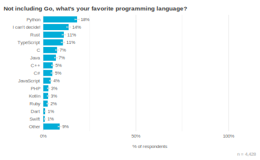

This year we asked the Go community to share their sentiment towards the Go
project itself. These results were quite different from the 91% satisfaction
rate we discussed above, and point to areas the Go Team plans to invest our
energy during 2026. In particular, we want to encourage more contributors to
get involved, and ensure the Go Team accurately understands the challenges Go
developers currently face. We hope this focus, in turn, will help to increase
developer trust in both the Go project and the Go Team leadership. As one
respondent explained the problem:

> "Now that the founding first generation of Go Team members [are] not
> involved much anymore in the decision making, I am a bit worried about the
> future of Go in terms of quality of maintenance, and its balanced decisions
> so far wrt to changes in the language and std lib. More presence in form of
> talks [by] the new core team members about the current state and future
> plans might be helpful to strengthen trust."  class="quote_source">&mdash; Very satisfied / 10+ years / Technology
> company

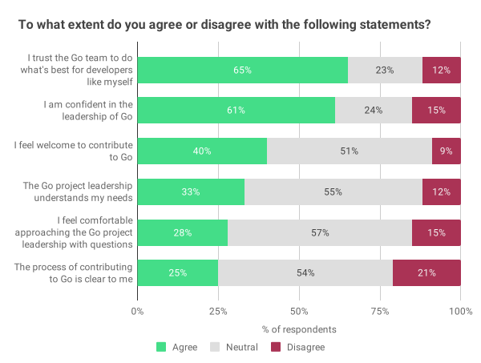

## What are people building with Go? {#uses}

We revised this list of "what types of things do you build with Go?" from 2024
with the intent of more usefully teasing apart what people are building with
Go, and avoid confusion around evolving terms like "agents". Respondent's top
use cases remain CLIs and API services, with no meaningful change in either
since 2024. In fact, a majority of respondents (55%) said they build _both_
CLIs and API services with Go. Over ⅓ of respondents specifically build cloud
infrastructure tooling (a new category), and 11% work with ML models, tools,
or agents (an expanded category). Unfortunately embedded use cases were left
off of the revised list, but we'll fix this for next year's survey.

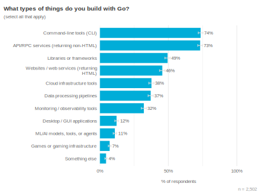

Most respondents said they are not currently building AI-powered features into
the Go software they work on (78%), with ⅔ reporting that their software does
not use AI functionality at all (66%). This appears to be a decrease in
production-related AI usage year-over-year; in 2024, 59% of respondents were
not involved in AI feature work, while 39% indicated some level of
involvement. That marks a shift of 14 points away from building AI-powered
systems among survey respondents, and may reflect some natural pullback from
the early hype around AI-powered applications: it's plausible that lots of
folks tried to see what they could do with this technology during its initial
rollout, with some proportion deciding against further exploration (at least
at this time).

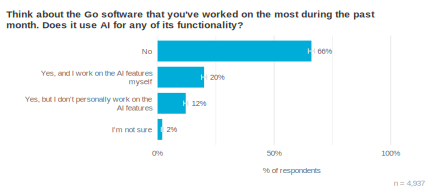

Among respondents who are building AI- or LLM-powered functionality, the most
common use case was to create summaries of existing content (45%). Overall,
however, there was little difference between most uses, with between 28%
&ndash; 33% of respondents adding AI functionality to support classification,
generation, solution identification, chatbots, and software development.

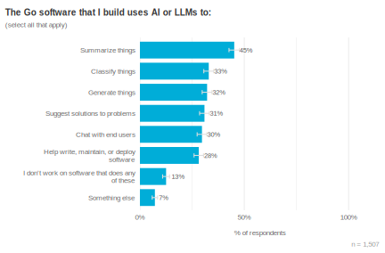

## What are the biggest challenges facing Go developers? {#challenges}

One of the most helpful types of feedback we receive from developers are
details about the challenges people run into while working with Go. The Go
Team considers this information holistically and over long time horizons,
because there is often tension between improving Go's rougher edges and
keeping the language and tooling consistent for developers. Beyond technical
factors, every change also incurs some cost in terms of developer attention
and cognitive disruption. Minimizing disruption may sound a bit dull or
boring, but we view this as an important strength of Go. As Russ Cox wrote in
2023, ["Boring is good... Boring means being able to focus on your work, not
on what's different about Go."](/blog/compat).

In that spirit, this year's top challenges are not radically different from
last year's. The top three frustrations respondents reported were "Ensuring
our Go code follows best practices / Go idioms" (33% of respondents), "A
feature I value from another language isn't part of Go" (28%), and "Finding
trustworthy Go modules and packages" (26%). We examined open-text responses to
better understand what people meant. Let's take a minute to dig into each.

Respondents who were most frustrated by writing idiomatic Go were often
looking for more official guidance, as well as tooling support to help enforce
this guidance in their codebase. As in prior surveys, questions about how to
structure Go projects were also a common theme. For example:

> "The simplicity of go helps to read and understand code from other
> developers, but there are still some aspects that can differ quite a lot
> between programmers. Especially if developers come from other languages,
> e.g. Java." &mdash; Very satisfied / 3 &ndash; 10
> years / Healthcare and life sciences

> "More opinionated way to write go code. Like how to structure a Go project
> for services/cli tool." &mdash; Very satisfied /
> < 3 years / Technology

> "It's hard to figure out what are good idioms. Especially since the core
> team doesn't keep Effective Go up-to-date."  class="quote_source">&mdash; Very satisfied / 3 &ndash; 10 years /
> Technology

The second major category of frustrations were language features that
developers enjoyed working with in other ecosystems. These open-text comments
largely focused on error handling and reporting patterns, enums and sum types,
nil pointer safety, and general expressivity / verbosity:

> "Still not sure what is the best way to do error handling."  class="quote_source">&mdash; Very satisfied / 3 &ndash; 10 years / Retail
> and consumer goods

> "Rust's enums are great, and lead to writing great type safe code."  class="quote_source">&mdash; Somewhat satisfied / 3 &ndash; 10 years /
> Healthcare and life sciences

> "There is nothing (in the compiler) that stops me from using a maybe nil
> pointer, or using a value without checking the err first. That should be
> [baked into] the type system." &mdash; Somewhat
> satisfied / < 3 years / Technology

> "I like [Go] but I didn't expect it to have nil pointer exceptions :)"  class="quote_source">&mdash; Somewhat satisfied / 3 &ndash; 10 years /
> Financial services

> "I often find it hard to build abstractions and to provide clear intention
> to the future readers of my code." &mdash;
> Somewhat dissatisfied / < 3 years / Technology

The third major frustration was finding trustworthy Go modules. Respondents
often described two aspects to this problem. One is that they considered many
3rd-party modules to be of marginal quality, making it hard for really good
modules to stand out. The second is identifying which modules are commonly
used and under which types of conditions (including recent trends over time).
These are both problems that could be addressed by showing what we'll vaguely
call "quality signals" on pkg.go.dev. Respondents provided helpful
explanations of the signals they use to identify trustworthy modules,
including project activity, code quality, recent adoption trends, or the
specific organizations that support or rely upon the module.

> "Being able to filter by criteria like stable version, number of users and
> last update age at pkg.go.dev could make things a bit easier."  class="quote_source">&mdash; Very satisfied / < 3 years / Technology

> "Many pacakges are just clones/forks or one-off pojects with no
> history/maintenance. [sic]" &mdash; Very
> satisfied / 10+ years / Financial services

> "Maybe flagging trustworthy packages based on experience, maturity and
> community feedback?" &mdash; Very satisfied / 3
> &ndash; 10 years / Healthcare and life sciences

We agree that these are all areas where the developer experience with Go could
be improved. The challenge, as discussed earlier, is doing so in such a way
that doesn't lead to breaking changes, increased confusion among Go
developers, or otherwise gets in the way of people trying to get their work
done with Go. Feedback from this survey is a major source of information we
use when discussing proposals, but if you'd like to get involved more directly
or follow along with other contributors, visit the [Go proposals on
GitHub](https://github.com/golang/go/issues?q=state%3Aopen%20label%3AProposal);
please be sure to [follow this process](https://github.com/golang/proposal) if
you'd like to add a new proposal.

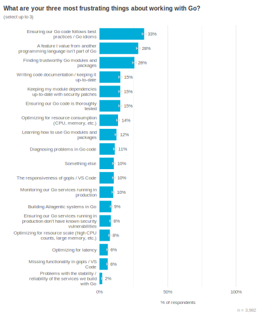

In addition to these (potentially) ecosystem-wide challenges, this year we
also asked specifically about working with the `go` command. We've informally
heard from developers that this tool's help system can be confusing to
navigate, but we haven't had a great sense of how frequently people find
themselves reviewing this documentation.

Respondents told us that except for `go test`, between 15% &ndash; 25% of them
felt they "often needed to review documentation" with working with these
tools. This was surprising, especially for commonly-used subcommands like
`build` and `run`. Common reasons included remembering specific flags,
understanding what different options do, and navigating the help system
itself. Participants also confirmed that infrequent use was one reason for
frustration, but navigating and parsing command help appears to be the
underlying cause. In other words, we all expect to need to review
documentation sometimes, but we don't expect to need help navigating the
documentation system itself. As on respondent described their journey:

> "Accessing the help is painful. go test --help # didn't work, but tell[s] me
> to type `go help test` instead... go help test # oh, actually, the info I'm
> looking for is in `testflag` go help testflag # visually parsing through
> text that looks all the same without much formatting... I just lack time to
> dig into this rabbit hole." &mdash; Very
> satisfied / 10+ years / Technology

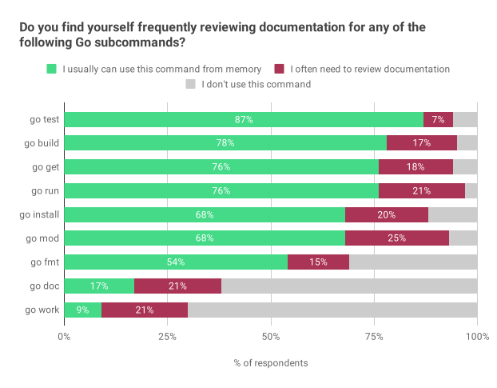

## What does their development environment look like? {#devenv}

### Operating systems and architectures

Generally, respondents told us their development platforms are UNIX-like. Most
respondents develop on macOS (60%) or Linux (58%) and deploy to Linux-based
systems, including containers (96%). The largest year-over-year change was
among "embedded devices / IoT" deployments, which increased from 2% -> 8% of
respondents; this was the only meaningful change in deployment platforms since
2024.

The vast majority of respondents develop on x86-64 or ARM64 architectures,
with a sizable group (25%) still potentially working on 32-bit x86 systems.
However, we believe the wording of this question was confusing to respondents;
next year we'll clarify the 32-bit vs. 64-bit distinction for each
architecture.

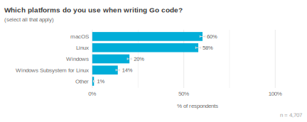 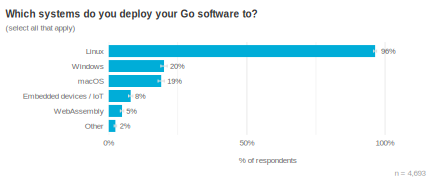 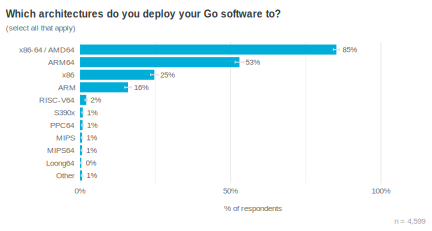

### Code editors

Several new code editors have become available in the past two years, and we
expanded our survey question to include the most popular ones. While we saw
some evidence of early adoption, most respondents continued to favor [VS
Code](https://code.visualstudio.com/) (37%) or
[GoLand](https://www.jetbrains.com/go/) (28%). Of the newer editors, Zed and
Cursor were the highest ranked, each becoming the preferred editor of 4% of
respondents. To put those numbers in context, we looked back at when VS Code
and GoLand were first introduced. VS Code (released in 2015) was favored by
16% of respondents one year after its release. IntelliJ has had a
community-led Go plugin longer than we've been surveying Go developers (💙),
but if we look at when JetBrains began officially supporting Go in IntelliJ
(2016), within one year IntelliJ was preferred by 20% of respondents.

Note: This analysis of code editors does not include respondents who were
referred to the survey directly from VS Code or GoLand.

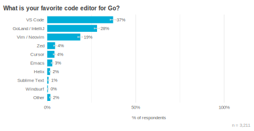

### Cloud environments

The most common deployment environments for Go continue to be Amazon Web
Services (AWS) at 46% of respondents, company-owned servers (44%), and Google
Cloud Platform (GCP) at 26%. These numbers show minor shifts since 2024, but
nothing statistically significant. We found that the "Other" category
increased to 11% this year, and this was primarily driven by Hetzner (20% of
Other responses); we plan to include Hetzner as a response choice in next
year's survey.

We also asked respondents about their development experience of working with
different cloud providers. The most common responses, however, showed that
respondents weren't really sure (46%) or don't directly interact with public
cloud providers (21%). The biggest driver behind these responses was a theme
we've heard often before: with containers, it's possible to abstract many
details of the cloud environment away from the developer, so that they don't
meaningfully interact with most provider-specific technologies. This result
suggests that even developers whose work is _deployed_ to clouds may have
limited experience with the larger suite of tools and technology associated
with each cloud provider. For example:

> "Kinda abstract to the platform, Go is very easy to put in a container and
> so pretty easy to deploy anywhere: one of its big strength[s]."  class="quote_source">&mdash; [no satisfaction response] / 3 &ndash; 10 years
> / Technology

> "The cloud provider really doesn't make much difference to me. I write code
> and deploy it to containers, so whether that's AWS or GCP I don't really
> care." &mdash; Somewhat satisfied / 3 &ndash; 10
> years / Financial services

We suspect this level of abstraction is dependant on the use case and
requirements of the service that's being deployed &mdash; it may not always
make sense or be possible to keep it highly abstracted. In the future, we plan
to further investigate how Go developers tend to interact with the platforms
where their software is ultimately deployed.

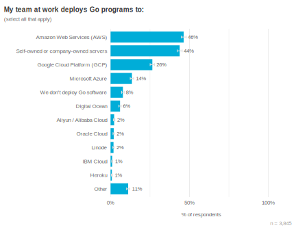

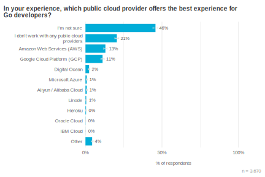

### Developing with AI

Finally, we can't discuss development environments in 2025 without also
mentioning AI-powered software development tools. Our survey suggests
bifurcated adoption &mdash; while a majority of respondents (53%) said they
use such tools daily, there is also a large group (29%) who do not use these
at all, or only used them a few times during the past month. We expected this
to negatively correlate with age or development experience, but were unable to
find strong evidence supporting this theory except for *very* new developers:
respondents with less than one year of professional development experience
(not specific to Go) did report more AI use than every other cohort, but this
group only represented 2% of survey respondents.

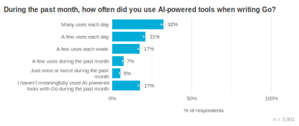

At this time, agentic use of AI-powered tools appears nascent among Go
developers, with only 17% of respondents saying this is their primary way of
using such tools, though a larger group (40%) are occasionally trying agentic
modes of operation.

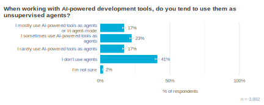

The most commonly used AI assistants remain ChatGPT, GitHub Copilot, and
Claude. Most of these agents show lower usage numbers [compared with our 2024
survey](/blog/survey2024-h2-results#ai-assistance) (Claude and Cursor are
notable exceptions), but due to a methodology change, this is not an
apples-to-apples comparison. It is, however, plausible that developers are
"shopping around" less than they were when these tools were first released,
resulting in more people using a single assistant for most of their work.

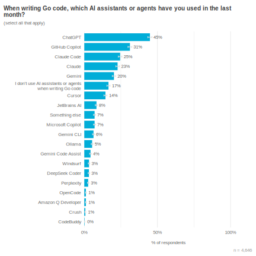

We also asked about overall satisfaction with AI-powered development tools. A
majority (55%) reported being satisfied, but this was heavily weighted towards
the "Somewhat satisfied" category (42%) vs. the "Very satisfied" group (13%).
Recall that Go itself consistently shows a 90%+ satisfaction rate each year;
this year, 62% of respondents said they are "Very satisfied" with Go. We add
this context to show that while AI-powered tooling is starting to see adoption
and finding some successful use cases, developer sentiment  towards them
remains much softer than towards more established tooling (among Go
developers, at least).

What is driving this lower rate of satisfaction? In a word: quality. We asked
respondents to tell us something good they've accomplished with these tools,
as well as something that didn't work out well. A majority said that creating
non-functional code was their primary problem with AI developer tools (53%),
with 30% lamenting that even working code was of poor quality. The most
frequently cited benefits, conversely, were generating unit tests, writing
boilerplate code, enhanced autocompletion, refactoring, and documentation
generation. These appear to be cases where code quality is perceived as less
critical, tipping the balance in favor of letting AI take the first pass at a
task. That said, respondents also told us the AI-generated code in these
successful cases still required careful review (and often, corrections), as it
can be buggy, insecure, or lack context.

> "I'm never satisfied with code quality or consistency, it never follows the
> practices I want to." &mdash; [no satisfaction
> response] / 3 &ndash; 10 years / Financial services

> "All AI tools tend to hallucinate quickly when working with medium-to-large
> codebases (10k+ lines of code). They can explain code effectively but
> struggle to generate new, complex features"  class="quote_source">&mdash; Somewhat satisfied / 3 &ndash; 10 years /
> Retail and consumer goods

> "Despite numerous efforts to make it write code in an established codebase,
> it would take too much effort to steer it to follow the practices in the
> project, and it would add subtle behaviour paths - i.e. if it would miss
> some method it would try to find its way around it or rely on some side
> effect. Sometimes those things are hard to recognize during code review. I
> also found it mentally taxing to review ai generated code and that overhead
> kills the productivity potential in writing code."  class="quote_source">&mdash; Very satisfied / 10+ years / Technology

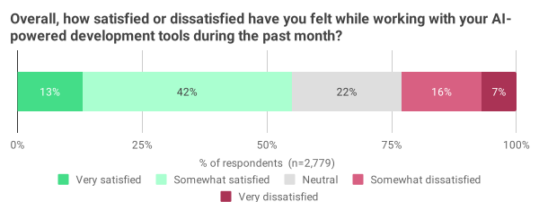

When we asked developers what they used these tools for, a pattern emerged
that is consistent with these quality concerns. The tasks with most adoption
(green in the chart below) and least resistance (red) deal with bridging
knowledge gaps, improving local code, and avoiding toil. The frustrations that
developers talk about with code-generating tools were much less evident when
they're seeking information, like how to use a specific API or configure test
coverage, and perhaps as a result, we see higher usage of AI in these areas.
Another spot that stood out was *local* code review and related suggestions
&mdash; people were less interested in using AI to review other people's code
than in reviewing their own. Surprisingly, "testing code" showed lower AI
adoption than other toilsome tasks, though we don't yet have strong
understanding of why.

Of all the tasks we asked about, "Writing code" was the most bifurcated, with
66% of respondents already or hoping to soon use AI for this, while ¼ of
respondents didn't want AI involved at all. Open-ended responses suggest
developers primarily use this for toilsome, repetitive code, and continue to
have concerns about the quality of AI-generated code.

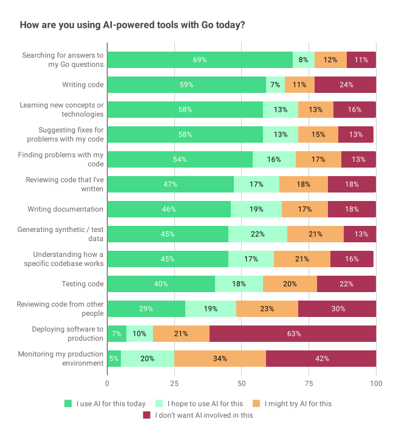 

## Closing

Once again, a tremendous thank-you to everyone who responded to this year's Go
Developer Survey!

We plan to share the raw survey dataset in Q1 2026, so the larger community
can also explore the data underlying these findings. This will only include
responses from people who opted in to share this data (82% of all
respondents), so there may be some differences from the numbers we reference
in this post.

## Survey methodology {#methodology}

This survey was conducted between Sept 9 - Sept 30, 2025. Participants were
publicly invited to respond via the Go Blog, invitations on social media
channels (including Bluesky, Mastodon, Reddit, and X), as well as randomized
in-product invitations to people using VS Code and GoLand to write Go
software. We received a total of 7,070 responses. After data cleaning to
remove bots and other very low quality responses, 5,379 were used for the
remainder of our analysis. The median survey response time was between 12
&ndash; 13 minutes.

Throughout this report we use charts of survey responses to provide supporting
evidence for our findings. All of these charts use a similar format. The title
is the exact question that survey respondents saw. Unless otherwise noted,
questions were multiple choice and participants could only select a single
response choice; each chart's subtitle will tell the reader if the question
allowed multiple response choices or was an open-ended text box instead of a
multiple choice question. For charts of open-ended text responses, a Go team
member read and manually categorized all of the responses. Many open-ended
questions elicited a wide variety of responses; to keep the chart sizes
reasonable, we condensed them to a maximum of the top 10-12 themes, with
additional themes all grouped under "Other". The percentage labels shown in
charts are rounded to the nearest integer (e.g., 1.4% and 0.8% will both be
displayed as 1%), but the length of each bar and row ordering are based on the
unrounded values.

To help readers understand the weight of evidence underlying each finding, we
included error bars showing the 95% [confidence
interval](https://en.wikipedia.org/wiki/Confidence_interval) for responses;
narrower bars indicate increased confidence. Sometimes two or more responses
have overlapping error bars, which means the relative order of those responses
is not statistically meaningful (i.e., the responses are effectively tied).
The lower right of each chart shows the number of people whose responses are
included in the chart, in the form "n = [number of respondents]".
