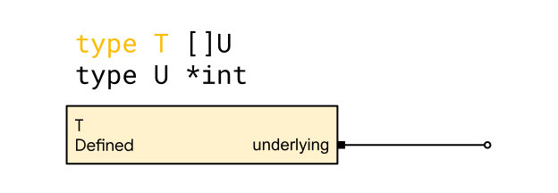
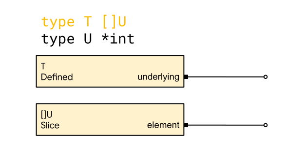
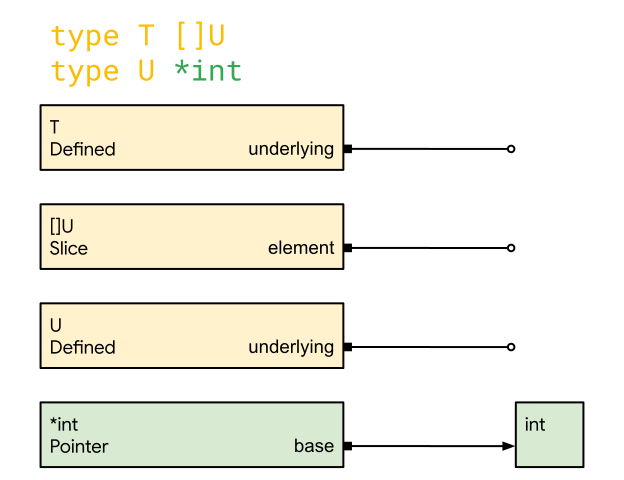
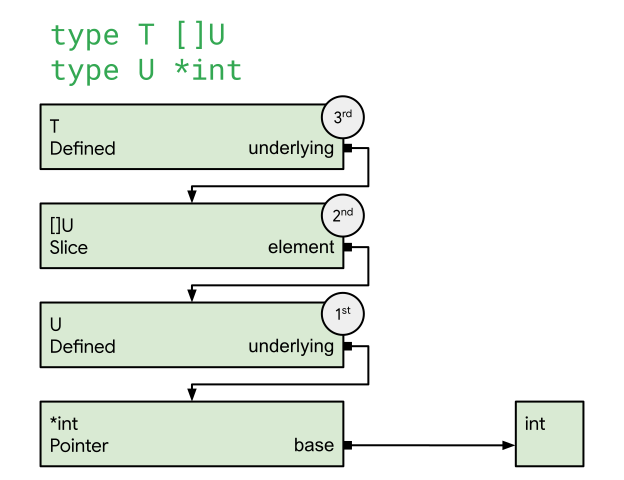
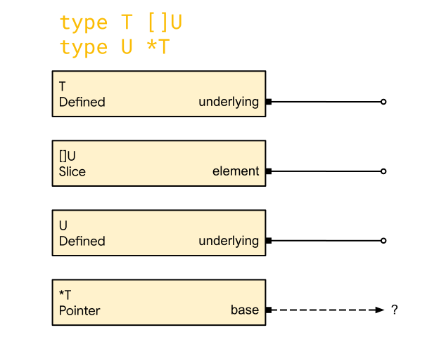
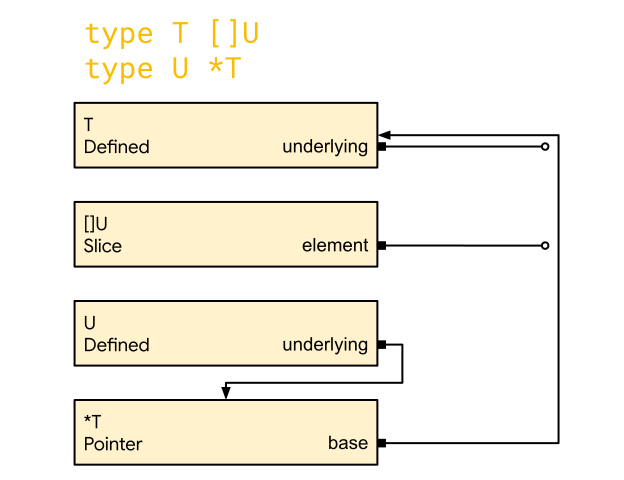
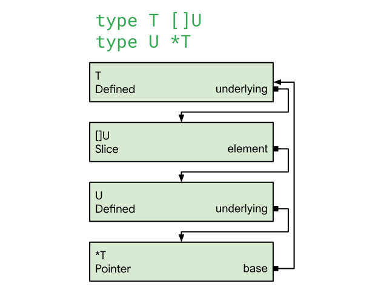
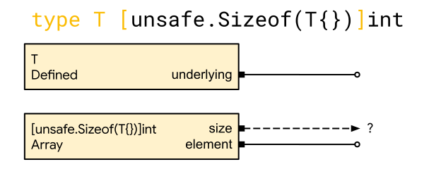
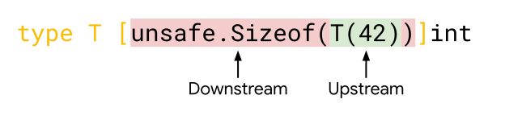

Go's static typing is an important part of why Go is a good fit for production
systems that have to be robust and reliable. When a Go package is compiled, it
is first parsed—meaning that the Go source code within that package is converted
into an abstract syntax tree (or AST). This AST is then passed to the Go
*type checker*.

In this blog post, we'll dive into a part of the type checker we significantly
improved in Go 1.26. How does this change things from a Go user's perspective?
Unless one is fond of arcane type definitions, there's no observable change
here. This refinement was intended to reduce corner cases, setting us up for
future improvements to Go. Also, it's a fun look at something that seems quite
ordinary to Go programmers, but has some real subtleties hiding within.

But first, what exactly is *type checking*? It's a step in the Go compiler that
eliminates whole classes of errors at compile time. Specifically, the Go type
checker verifies that:

1. Types appearing in the AST are valid (for example, a map's key type must be
   `comparable`).
2. Operations involving those types (or their values) are valid (for example,
   one can't add an `int` and a `string`).

To accomplish this, the type checker constructs an internal representation for
each type it encounters while traversing the AST—a process informally called
*type construction*.

As we'll soon see, even though Go is known for its simple type system, type
construction can be deceptively complex in certain corners of the language.

## Type construction

Let’s start by considering a simple pair of type declarations:

```go
type T []U
type U *int
```

When the type checker is invoked, it first encounters the type declaration for
`T`. Here, the AST records a type definition of a type name `T` and a
*type expression* `[]U`. `T` is a [defined type](/ref/spec#Types); to represent
the actual data structure that the type checker uses when constructing defined
types, we’ll use a `Defined` struct.

The `Defined` struct contains a pointer to the type for the type expression to
the right of the type name. This `underlying` field is relevant for sourcing the
type’s [underlying type](/ref/spec#Underlying_types). To help illustrate the
type checker’s state, let’s see how walking the AST fills in the data
structures, starting with:



At this point, `T` is *under construction*, indicated by the color yellow. Since
we haven’t evaluated the type expression `[]U` yet—it’s still black—`underlying`
points to `nil`, indicated by an open arrow.

When we evaluate `[]U`, the type checker constructs a `Slice` struct, the
internal data structure used to represent slice types. Similarly to `Defined`,
it contains a pointer to the element type for the slice. We don’t yet know what
the name `U` refers to, though we expect it to refer to a type. So, again, this
pointer is `nil`. We are left with:



By now you might be getting the gist, so we’ll pick up the pace a bit.

To convert the type name `U` to a type, we first locate its declaration. Upon
seeing that it represents another defined type, we construct a separate
`Defined` for `U` accordingly. Inspecting the right side of `U`, we see the type
expression `*int`, which evaluates to a `Pointer` struct, with the base type of
the pointer being the type expression `int`.

When we evaluate `int`, something special happens: we get back a predeclared
type. Predeclared types are constructed *before* the type checker even begins
walking the AST. Since the type for `int` is already constructed, there’s
nothing for us to do but point to that type.

We now have:



Note that the `Pointer` type is *complete* at this point, indicated by the color
green. Completeness means that the type’s internal data structure has all of its
fields populated and any types pointed to by those fields are complete.
Completeness is an important property of a type because it ensures that
accessing the internals, or *deconstruction*, of that type is sound: we have all
the information describing the type.

In the image above, the `Pointer` struct only contains a `base` field, which
points to `int`. Since `int` has no fields to populate, it’s “vacuously”
complete, making the type for `*int` complete.

From here, the type checker begins unwinding the stack. Since the type for
`*int` is complete, we can complete the type for `U`, meaning we can complete
the type for `[]U`, and so on for `T`. When this process ends, we are left with
only complete types, as shown below:



The numbering above shows the order in which the types were completed (after the
`Pointer`). Note that the type on the bottom completed first. Type construction
is naturally a depth-first process, since completing a type requires its
dependencies to be completed first.

## Recursive types

With this simple example out of the way, let’s add a bit more nuance. Go’s type
system also allows us to express recursive types. A typical example is something
like:

```go
type Node struct {
  next *Node
}
```

If we reconsider our example from above, we can add a bit of recursion by
swapping `*int` for `*T` like so:

```go
type T []U
type U *T
```

Now for a trace: let’s start once more with `T`, but skip ahead to illustrate
the effects of this change. As one might suspect from our previous example, the
type checker will approach the evaluation of `*T` with the below state:



The question is what to do with the base type for `*T`. We have an idea of what
`T` is (a `Defined`), but it’s currently being constructed (its `underlying` is
still `nil`).

We simply point the base type for `*T` to `T`, even though `T` is incomplete:


We do this assuming that `T` will complete when it finishes construction
*in the future* (by pointing to a complete type). When that happens, `base` will
point to a complete type, thus making `*T` complete.

In the meantime, we'll begin heading back up the stack:



When we get back to the top and finish constructing `T`, the “loop” of types
will close, completing each type in the loop simultaneously:



Before we considered recursive types, evaluating a type expression always
returned a complete type. That was a convenient property because it meant the
type checker could always deconstruct (look inside) a type returned from
evaluation.

But in the [example above](#example), evaluation of `T` returned an *incomplete*
type, meaning deconstructing `T` is unsound until it completes. Generally
speaking, recursive types mean that the type checker can no longer assume that
types returned from evaluation will be complete.

Yet, type checking involves many checks which require deconstructing a type. A
classic example is confirming that a map key is `comparable`, which requires
inspecting the `underlying` field. How do we safely interact with incomplete
types like `T`?

Recall that type completeness is a prerequisite for deconstructing a type. In
this case, type construction never deconstructs a type, it merely refers to
types. In other words, type completeness *does not* block type construction
here.

Because type construction isn't blocked, the type checker can simply delay such
checks until the end of type checking, when all types are complete (note that
the checks themselves also do not block type construction). If a type were to
reveal a type error, it makes no difference when that error is reported during
type checking—only that it is reported eventually.

With this knowledge in mind, let’s examine a more complex example involving
values of incomplete types.

## Recursive types and values

Let’s take a brief detour and have a look at Go’s
[array types](/ref/spec#Array_types). Importantly, array types have a size,
which is a [constant](/ref/spec#Array_types) that is part of the type. Some
operations, like the built-in functions `unsafe.Sizeof` and `len` can return
constants when applied to [certain values](/ref/spec#Package_unsafe) or
[expressions](/ref/spec#Length_and_capacity), meaning they can appear as array
sizes. Importantly, the values passed to those functions can be of any type,
even an incomplete type. We call these *incomplete values*.

Let's consider this example:

```go
type T [unsafe.Sizeof(T{})]int
```

In the same way as before, we'll reach a state like the one below:



To construct the `Array`, we must calculate its size. From the value expression
`unsafe.Sizeof(T{})`, that’s the size of `T`. For array types (such as `T`),
calculating their size requires deconstruction: we need to look inside the type
to determine the length of the array and size of each element.

In other words, type construction for the `Array` *does* deconstruct `T`,
meaning the `Array` cannot finish construction (let alone complete) before `T`
completes. The “loop” trick that we used earlier—where a loop of types
simultaneously completes as the type starting the loop finishes
construction—doesn’t work here.

This leaves us in a bind:

* `T` cannot be completed until the `Array` completes.
* The `Array` cannot be completed until `T` completes.
* They *cannot* be completed simultaneously (unlike before).

Clearly, this is impossible to satisfy. What is the type checker to do?

### Cycle detection

Fundamentally, code such as this is invalid because the size of `T` cannot be
determined without knowing the size of `T`, regardless of how the type checker
operates. This particular instance—cyclic size definition—is part of a class of
errors called *cycle errors*, which generally involve cyclic definition of Go
constructs. As another example, consider `type T T`, which is also in this
class, but for different reasons. The process of finding and reporting cycle
errors in the course of type checking is called *cycle detection*.

Now, how does cycle detection work for `type T [unsafe.Sizeof(T{})]int`? To
answer this, let’s look at the inner `T{}`. Because `T{}` is a composite literal
expression, the type checker knows that its resulting value is of type `T`.
Because `T` is incomplete, we call the value `T{}` an *incomplete value*.

We must be cautious—operating on an incomplete value is only sound if it doesn’t
deconstruct the value’s type. For example, `type T [unsafe.Sizeof(new(T))]int`
*is* sound, since the value `new(T)` (of type `*T`) is never deconstructed—all
pointers have the same size. To reiterate, it is sound to size an incomplete
value of type `*T`, but not one of type `T`.

This is because the “pointerness” of `*T` provides enough type information for
`unsafe.Sizeof`, whereas just `T` does not. In fact, it’s never sound to operate
on an incomplete value *whose type is a defined type*, because a mere type name
conveys no (underlying) type information at all.

#### Where to do it

Up to now we’ve focused on `unsafe.Sizeof` directly operating on potentially
incomplete values. In `type T [unsafe.Sizeof(T{})]int`, the call to `unsafe.Sizeof`
is just the "root" of the array length expression. We can readily imagine the
incomplete value `T{}` as an operand in some other value expression.

For example, it could be passed to a function (i.e.
`type T [unsafe.Sizeof(f(T{}))]int`), sliced (i.e.
`type T [unsafe.Sizeof(T{}[:])]int`), indexed (i.e.
`type T [unsafe.Sizeof(T{}[0])]int`), etc. All of these are invalid because they
require deconstructing `T`. For instance, indexing `T`
[requires checking](/ref/spec#Index_expressions) the underlying type of `T`.
Because these expressions "consume" potentially incomplete values, let's call
them *downstreams*. There are many more examples of downstream operators, some
of which are not syntactically obvious.

Similarly, `T{}` is just one example of an expression that "produces" a
potentially incomplete value—let's call these kinds of expressions *upstreams*:



Comparatively, there are fewer and more syntactically obvious value expressions
that might result in incomplete values. Also, it’s rather simple to enumerate
these cases by inspecting Go’s syntax definition. For these reasons, it'll be
simpler to implement our cycle detection logic via the upstreams, where
potentially incomplete values originate. Below are some examples of them:

```go

type T [unsafe.Sizeof(T(42))]int                // conversion

func f() T
type T [unsafe.Sizeof(f())]int                  // function call

var i interface{}
type T [unsafe.Sizeof(i.(T))]int                // assertion

type T [unsafe.Sizeof({{raw "<"}}-(make({{raw "<"}}-chan T)))]int   // channel receive

type T [unsafe.Sizeof(make(map[int]T)[42])]int  // map access

type T [unsafe.Sizeof(*new(T))]int              // dereference

// ... and a handful more
```

For each of these cases, the type checker has extra logic where that particular
kind of value expression is evaluated. As soon as we know the type of the
resulting value, we insert a simple test that checks that the type is complete.

For instance, in the conversion example `type T [unsafe.Sizeof(T(42))]int`,
there is a snippet in the type checker that resembles:

```go
func callExpr(call *syntax.CallExpr) operand {
  x := typeOrValue(call.Fun)
  switch x.mode() {
  // ... other cases
  case typeExpr:
    // T(), meaning it's a conversion
    T := x.typ()
    // ... handle the conversion, T *is not* safe to deconstruct
  }
}
```

As soon as we observe that the `CallExpr` is a conversion to `T`, we know that
the resulting type will be `T` (assuming no preceding errors). Before we pass
back a value (here, an `operand`) of type `T` to the rest of the type checker,
we need to check for completeness of `T`:

```go
func callExpr(call *syntax.CallExpr) operand {
  x := typeOrValue(call.Fun)
  switch x.mode() {
  // ... other cases
  case typeExpr:
    // T(), meaning it's a conversion
    T := x.typ()
+   if !isComplete(T) {
+     reportCycleErr(T)
+     return invalid
+   }
    // ... handle the conversion, T *is* safe to deconstruct
  }
}
```

Instead of returning an incomplete value, we return a special `invalid` operand,
which signals that the call expression could not be evaluated. The rest of the
type checker has special handling for invalid operands. By adding this, we
prevented incomplete values from “escaping” downstream—both into the rest of the
type conversion logic and to downstream operators—and instead reported a cycle
error describing the problem with `T`.

A similar code pattern is used in all other cases, implementing cycle detection
for incomplete values.

## Conclusion

Systematic cycle detection involving incomplete values is a new addition to the
type checker. Before Go 1.26, we used a more complex type construction algorithm,
which involved more bespoke cycle detection that didn’t always work. Our new,
simpler approach addressed a number of (admittedly esoteric) compiler panics
(issues [\#75918](/issue/75918), [\#76383](/issue/76383),
[\#76384](/issue/76384), [\#76478](/issue/76478), and more), resulting in a more
stable compiler.

As programmers, we’ve become accustomed to features like recursive type
definitions and sized array types such that we might overlook the nuance of
their underlying complexity. While this post does skip over some finer details,
hopefully we’ve conveyed a deeper understanding of (and perhaps appreciation
for) the problems surrounding type checking in Go.
