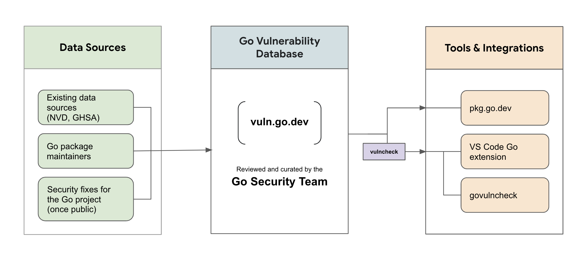

We are excited to announce Go’s new support for vulnerability management, our
first step towards helping Go developers learn about known vulnerabilities that
may affect them.

This post provides an overview of what’s available today and next steps for this project.

## Overview

Go provides tooling to analyze your codebase and surface known vulnerabilities.
This tooling is backed by the Go vulnerability database,
which is curated by the Go security team.
Go’s tooling reduces noise in your results by only surfacing vulnerabilities
in functions that your code is actually calling.

<div class="image">
  <center>
    </img>
  </center>
</div>

## Go vulnerability database

The Go vulnerability database (https://vuln.go.dev) is a comprehensive source
of information about known vulnerabilities in importable packages in public Go modules.

Vulnerability data comes from existing sources (such as CVEs and GHSAs)
and direct reports from Go package maintainers.
This information is then reviewed by the Go security team and added to the database.

We encourage package maintainers to [contribute](/s/vulndb-report-new)
information about public vulnerabilities in their own projects and [update](https://go.dev/s/vulndb-report-feedback)
existing information about vulnerabilities in their Go packages.
We aim to make reporting a low friction process,
so please [send us your suggestions](https://golang.org/s/vuln-feedback) for
any improvements.

The Go vulnerability database can be viewed in your browser at [pkg.go.dev/vuln](https://pkg.go.dev/vuln).
For more information about the database, see [go.dev/security/vuln/database](https://go.dev/security/vuln/database).

## Vulnerability detection using govulncheck

The new [govulncheck command](https://pkg.go.dev/golang.org/x/vuln/cmd/govulncheck) is a low-noise,
reliable way for Go users to learn about known vulnerabilities that may
affect their projects.
Govulncheck analyzes your codebase and only surfaces vulnerabilities that
actually affect you,
based on which functions in your code are transitively calling vulnerable functions.

You can install the latest version of govulncheck using
[go install](https://pkg.go.dev/cmd/go#hdr-Compile_and_install_packages_and_dependencies):
```
$ go install golang.org/x/vuln/cmd/govulncheck@latest
```

Then, run govulncheck inside your project directory:
```
$ govulncheck ./...
```

Govulncheck is a standalone tool to allow frequent updates and rapid iteration
while we gather feedback from users.
In the long term, we plan to integrate the govulncheck tool into the main Go distribution.

### Integrations

It’s always better to learn about vulnerabilities as early as possible
in the development and deployment process. To integrate vulnerability
checking into your own tools and processes, use
[govulncheck -json](https://pkg.go.dev/golang.org/x/vuln/cmd/govulncheck#hdr-Flags).

We have integrated vulnerability detection into existing Go tools and services,
such as the [Go package discovery site](https://pkg.go.dev).
For example, [this page](https://pkg.go.dev/golang.org/x/text?tab=versions)
shows the known vulnerabilities in each version of golang.org/x/text.
Vulnerability checking functionality through the VS Code Go extension is also coming soon.


## Next Steps

We hope you’ll find Go’s support for vulnerability management useful and help us improve it!

Go’s support for vulnerability management is a new feature that is under active development.
You should expect some bugs and [limitations](https://pkg.go.dev/golang.org/x/vuln/cmd/govulncheck#hdr-Limitations).

We would love for you to contribute and help us make improvements in the
following ways:

- [Contribute new](https://golang.org/s/vulndb-report-new) and
  [update existing](https://go.dev/s/vulndb-report-feedback) information about
  public vulnerabilities for Go packages that you maintain
- [Take this survey](https://golang.org/s/govulncheck-feedback) to share your
  experience using govulncheck
- [Send us feedback](https://golang.org/s/vuln-feedback) about issues and
  feature requests

We are excited to work with you to build a better and more secure Go ecosystem.
