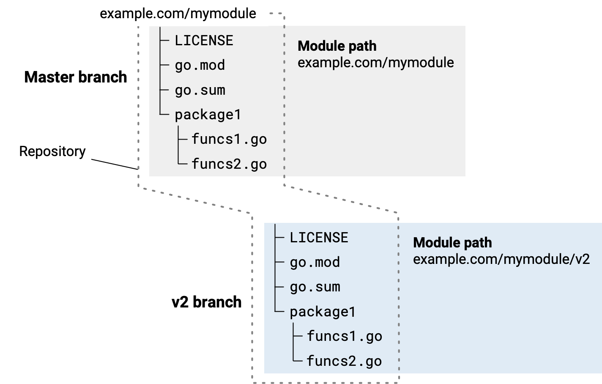

<!--{
  "Title": "Developing a major version update"
}-->

You must update to a major version when changes you're making in a potential new
version can't guarantee backward compatibility for the module's users. For
example, you'll make this change if you change your module's public API such
that it breaks client code using previous versions of the module.

> **Note:** Each release type -- major, minor, patch, or pre-release -- has a
different meaning for a module's users. Those users rely on these differences to
understand the level of risk a release represents to their own code. In other
words, when preparing a release, be sure that its version number accurately
reflects the nature of the changes since the preceding release. For more on
version numbers, see [Module version numbering](/doc/modules/version-numbers).

**See also**

* For an overview of module development, see [Developing and publishing
  modules](developing).
* For an end-to-end view, see [Module release and versioning
  workflow](release-workflow).

## Considerations for a major version update {#considerations}

You should only update to a new major version when it's absolutely necessary.
A major version update represents significant churn for both you and your
module's users. When you're considering a major version update, think about
the following:

* Be clear with your users about what releasing the new major version means
  for your support of previous major versions.

  Are previous versions deprecated? Supported as they were before? Will you be
  maintaining previous versions, including with bug fixes?

* Be ready to take on the maintenance of two versions: the old and the new.
  For example, if you fix bugs in one, you'll often be porting those fixes into
  the other.

* Remember that a new major version is a new module from a dependency management
  perspective. Your users will need to update to use a new module after you
  release, rather than simply upgrading.

  That's because a new major version has a different module path from the
  preceding major version. For example, for a module whose module path is
  example.com/mymodule, a v2 version would have the module path
  example.com/mymodule/v2.

* When you're developing a new major version, you must also update import paths
  wherever code imports packages from the new module. Your module's users must
  also update their import paths if they want to upgrade to the new major version.

## Branching for a major release {#branching}

The most straightforward approach to handling source when preparing to develop a
new major version is to branch the repository at the latest version of the
previous major version.

For example, in a command prompt you might change to your module's root
directory, then create a new v2 branch there.

```
$ cd mymodule
$ git checkout -b v2
Switched to a new branch "v2"
```




Once you have the source branched, you'll need to make the following changes to
the source for your new version:

* In the new version's go.mod file, append new major version number to the
  module path, as in the following example:
  * Existing version: `example.com/mymodule`
  * New version: `example.com/mymodule/v2`

* In your Go code, update every imported package path where you import a package
  from the module, appending the major version number to the module path portion.
  * Old import statement: `import "example.com/mymodule/package1"`
  * New import statement: `import "example.com/mymodule/v2/package1"`

For publishing steps, see [Publishing a module](/doc/modules/publishing).
