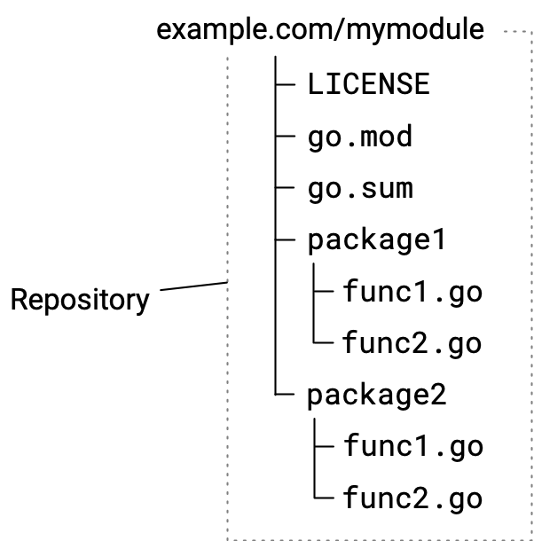

<!--{
  "Title": "Managing module source"
}-->

When you're developing modules to publish for others to use, you can help ensure
that your modules are easier for other developers to use by following the
repository conventions described in this topic.

This topic describes actions you might take when managing your module
repository. For information about the sequence of workflow steps you'd take when
revising from version to version, see [Module release and versioning
workflow](release-workflow).

Some of the conventions described here are required in modules, while others are
best practices. This content assumes you're familiar with the basic module use
practices described in [Managing dependencies](/doc/modules/managing-dependencies).

Go supports the following repositories for publishing modules: Git, Subversion,
Mercurial, Bazaar, and Fossil.

For an overview of module development, see [Developing and publishing
modules](developing).

## How Go tools find your published module {#tools}

In Go's decentralized system for publishing modules and retrieving their code,
you can publish your module while leaving the code in your repository. Go tools
rely on naming rules that have repository paths and repository tags indicating a
module's name and version number. When your repository follows these
requirements, your module code is downloadable from your repository by Go tools
such as the [`go get`
command](/ref/mod#go-get).

When a developer uses the `go get` command to get source code for packages their
code imports, the command does the following:

1. From `import` statements in Go source code, `go get` identifies the module
  path within the package path.
1. Using a URL derived from the module path, the command locates the module
  source on a module proxy server or at its repository directly.
1. Locates source for the module version to download by matching the module's
  version number to a repository tag to discover the code in the repository.
  When a version number to use is not yet known, `go get` locates the latest
  release version.
1. Retrieves module source and downloads it to the developer's local module cache.

## Organizing code in the repository {#repository}

You can keep maintenance simple and improve developers' experience with your
module by following the conventions described here. Getting your module code
into a repository is generally as simple as with other code.

The following diagram illustrates a source hierarchy for a simple module with
two packages.



Your initial commit should include files listed in the following table:

<table id="module-files" class="DocTable">
  <thead>
    <tr class="DocTable-head">
      <th class="DocTable-cell" width="20%">File</td>
      <th class="DocTable-cell">Description</th>
    </tr>
  </thead>
  <tbody>
    <tr class="DocTable-row">
      <td class="DocTable-cell">LICENSE</td>
      <td class="DocTable-cell">The module's license.</td>
    </tr>
    <tr class="DocTable-row">
      <td class="DocTable-cell">go.mod</td>
      <td class="DocTable-cell"><p>Describes the module, including its module
        path (in effect, its name) and its dependencies. For more, see the
        <a href="gomod-ref">go.mod reference</a>.</p>
      <p>The module path will be given in a module directive, such as:</p>
      <pre>module example.com/mymodule</pre>
      <p>For more about choosing a module path, see
          <a href="/doc/modules/managing-dependencies#naming_module">Managing
          dependencies</a>.</p>
      <p>Though you can edit the go.mod file, you'll find it more reliable to
          make changes through <code>go</code> commands.</p>
      </td>
    </tr>
    <tr class="DocTable-row">
      <td class="DocTable-cell">go.sum</td>
      <td class="DocTable-cell"><p>Contains cryptographic hashes that represent
        the module's dependencies. Go tools use these hashes to authenticate
        downloaded modules, attempting to confirm that the downloaded module is
        authentic. Where this confirmation fails, Go will display a security error.<p>
      <p>The file will be empty or not present when there are no dependencies.
        You shouldn't edit this file except by using the <code>go mod tidy</code>
        command, which removes unneeded entries.</p>
      </td>
    </tr>
    <tr class="DocTable-row">
      <td class="DocTable-cell">Package directories and .go sources.</td>
      <td class="DocTable-cell">Directories and .go files that comprise the Go
      packages and sources in the module.</td>
    </tr>
  </tbody>
</table>

From the command-line, you can create an empty repository, add the files that
will be part of your initial commit, and commit with a message. Here's an
example using git:


```
$ git init
$ git add --all
$ git commit -m "mycode: initial commit"
$ git push
```

## Choosing repository scope {#repository-scope}

You publish code in a module when the code should be versioned independently
from code in other modules.

Designing your repository so that it hosts a single module at its root directory
will help keep maintenance simpler, particularly over time as you publish new
minor and patch versions, branch into new major versions, and so on. However, if
your needs require it, you can instead maintain a collection of modules in a
single repository.

### Sourcing one module per repository {#one-module-source}

You can maintain a repository that has a single module's source in it. In this
model, you place your go.mod file at the repository root, with package
subdirectories containing Go source beneath.

This is the simplest approach, making your module likely easier to manage over
time. It helps you avoid the need to prefix a module version number with a
directory path.


### Sourcing multiple modules in a single repository {#multiple-module-source}

You can publish multiple modules from a single repository. For example, you
might have code in a single repository that constitutes multiple modules, but
want to version those modules separately.

Each subdirectory that is a module root directory must have its own go.mod file.

Sourcing module code in subdirectories changes the form of the version tag you
must use when publishing a module. You must prefix the version number part of
the tag with the name of the subdirectory that is the module root. For more
about version numbers, see [Module version numbering](/doc/modules/version-numbers).

For example, for module `example.com/mymodules/module1` below, you would have
the following for version v1.2.3:

*   Module path: `example.com/mymodules/module1`
*   Version tag: `module1/v1.2.3`
*   Package path imported by a user: `example.com/mymodules/module1/package1`
*   Module path as given in a user's require directive: `example.com/mymodules/module1 module1/v1.2.3`


