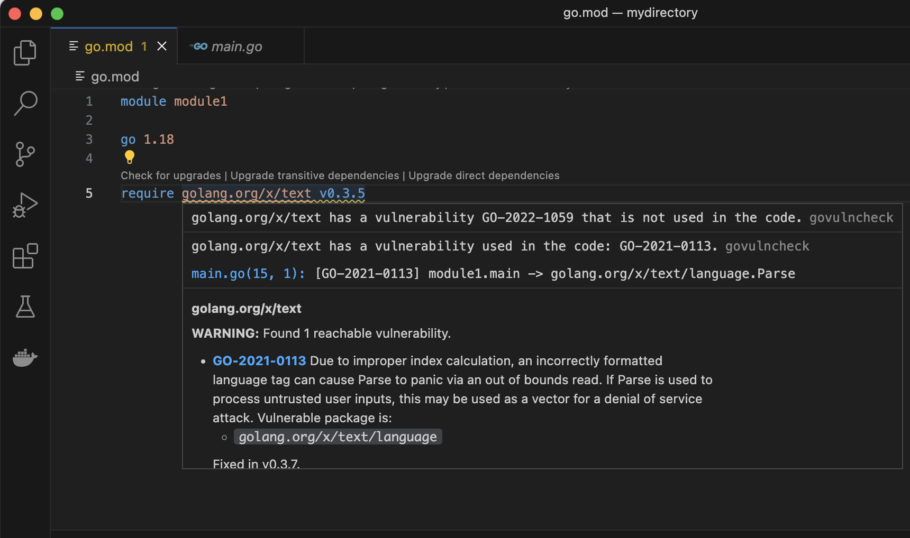

<!--{
  "Title": "Tutorial: Find and fix vulnerable dependencies with VS Code Go",
  "Breadcrumb": true
}-->

[Back to Go Security](/security)

You can scan your code for vulnerabilities directly out of your editor with the Go extension for Visual Studio Code.

Note: for an explanation of the vulnerability fix included in the images below, see the [govulncheck tutorial](https://go.dev/doc/tutorial/govulncheck).

## Prerequisites:

- **Go 1.18 or later.** Govulncheck is designed to work with Go 1.18 onwards. For installation instructions, see [Installing Go](https://go.dev/doc/install). We recommend using the latest version of Go to follow this tutorial.
- **VS Code**, updated to the latest version. [Download here](https://code.visualstudio.com/). You can also use Vim (see [here](https://go.dev/security/vuln/editor#editor-specific-instructions) for details), but this tutorial focuses on VS Code Go.
- **VS Code Go extension**, which can be [downloaded here](https://marketplace.visualstudio.com/items?itemName=golang.go).
- **Editor-specific settings changes.** You will need to modify your IDE settings according to [these specifications](https://go.dev/security/vuln/editor#editor-specific-instructions) before being able to replicate the results below.


## How to scan for vulnerabilities using VS Code Go

**Step 1.** Run "Go: Toggle Vulncheck"

The [Toggle Vulncheck](https://github.com/golang/vscode-go/wiki/Commands#go-toggle-vulncheck) command displays vulnerability analysis for all the dependencies listed in your modules. To use this command, open the [command palette](https://code.visualstudio.com/docs/getstarted/userinterface#_command-palette) in your IDE (Ctrl+Shift+P on Linux/Windows or Cmd+Shift+P on Mac OS) and run “Go: Toggle Vulncheck.” In your go.mod file, you will see the diagnostics for vulnerable dependencies that are used both directly and indirectly in your code.

<div class="image">
  <center>
    </img>
  </center>
</div>

Note: To reproduce this tutorial on your own editor, copy the code below into your main.go file.

```
// This program takes language tags as command-line
// arguments and parses them.

package main

import (
  "fmt"
  "os"

  "golang.org/x/text/language"
)

func main() {
  for _, arg := range os.Args[1:] {
    tag, err := language.Parse(arg)
    if err != nil {
      fmt.Printf("%s: error: %v\n", arg, err)
    } else if tag == language.Und {
      fmt.Printf("%s: undefined\n", arg)
    } else {
      fmt.Printf("%s: tag %s\n", arg, tag)
    }
  }
}
```

Then, make sure the corresponding go.mod file for the program looks like this:


```
module module1

go 1.18

require golang.org/x/text v0.3.5
```

Now, run `go mod tidy` to ensure that your go.sum file is updated.

**Step 2.** Run govulncheck via a code action.

Running govulncheck using a code action allows you to focus on the dependencies that are actually called in your code. Code actions in VS Code are marked by lightbulb icons; hover over the relevant dependency to see information about the vulnerability, then select “Quick Fix” to be shown a menu of options. Of these, choose “run govulncheck to verify.” This will return the relevant govulncheck output in your terminal.

<div class="image">
  <center>
    </img>
  </center>
</div>

<div class="image">
  <center>
    </img>
  </center>
</div>

**Step 3**. Hover over a dependency listed in your go.mod file.

The relevant govulncheck output about a specific dependency can also be found by hovering over the dependency in the go.mod file. For a quick look at dependency information, this option is even more efficient than using a code action.

<div class="image">
  <center>
    </img>
  </center>
</div>

**Step 4.** Upgrade to a "fixed in" version of your dependency.

Code actions can also be used to quickly upgrade to a version of your dependency where the vulnerability is fixed. Do this by selecting the “Upgrade” option in the code action drop-down menu.

<div class="image">
  <center>
    </img>
  </center>
</div>


## Additional resources

- See [this page](https://go.dev/security/vuln/editor) for more information about vulnerability scanning in your IDE. The [Notes and Caveats section](https://go.dev/security/vuln/editor#notes-and-caveats), in particular, discusses special cases for which vulnerability scanning may be more complex than in the example above.
- The [Go Vulnerability Database](https://pkg.go.dev/vuln/) contains information from many existing sources in addition to direct reports by Go package maintainers to the Go security team.
- See [Go Vulnerability Management](https://go.dev/security/vuln/) page provides a high-level view of Go's architecture for detecting, reporting and managing vulnerabilities.