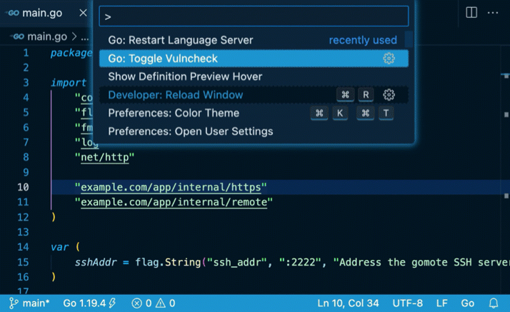

[Back to Go Security](/security)

Editors integrated with the [Go language server](https://pkg.go.dev/golang.org/x/tools/cmd/gopls), such as [VS Code with the Go extension](https://marketplace.visualstudio.com/items?itemName=golang.go), can detect vulnerabilities in your dependencies.

There are two modes for detecting vulnerabilities in dependencies. Both are backed by the [Go vulnerability database](https://vuln.go.dev) and complement each other.

* Imports-based analysis: in this mode, editors report vulnerabilities by scanning the set of packages imported in the workspace, and surface the findings as diagnostics in the `go.mod` files. This is fast, but may report false positives in case your code imports the packages that contain vulnerable symbols but the functions with the vulnerability are not reachable. This mode can be enabled by the [`"vulncheck": "Imports"`](https://github.com/golang/tools/blob/master/gopls/doc/settings.md#vulncheck-enum) gopls setting.
* `Govulncheck` analysis: this is based on the [`govulncheck`](https://pkg.go.dev/golang.org/x/vuln/cmd/govulncheck) command-line tool, which is embedded in `gopls`.  This provides a low-noise, reliable way to confirm whether your code actually invokes vulnerable functions. Because this analysis can be expensive to compute, it must be manually triggered by using the "Run govulncheck to verify" code action associated with the diagnostic reports from the Import-based analysis, or using the [`"codelenses.run_govulncheck"`](https://github.com/golang/tools/blob/master/gopls/doc/settings.md#run-govulncheck) code lens on `go.mod` files.

<div style="text-align: center;">

<em>Go: Toggle Vulncheck</em> <a
href="https://user-images.githubusercontent.com/4999471/206977512-a821107d-9ffb-4456-9b27-6a6a4f900ba6.mp4">(vulncheck.mp4)</a>
</div>

These features are available in `gopls` v0.11.0 or newer. Please share your feedback at https://go.dev/s/vsc-vulncheck-feedback.

## Editor-specific Instructions

### VS Code

The [Go extension](https://marketplace.visualstudio.com/items?itemName=golang.go) offers the integration with gopls. The following settings are required to enable the vulnerability scanning features:

```
"go.diagnostic.vulncheck": "Imports", // enable the imports-based analysis by default.
"gopls": {
  "ui.codelenses": {
    "run_govulncheck": true  // "Run govulncheck" code lens on go.mod file.
  }
}
```

The ["Go Toggle Vulncheck"](https://github.com/golang/vscode-go/wiki/Commands#go-toggle-vulncheck) command can be used to toggle the imports-based analysis on and off for the current workspace.

### Vim/NeoVim

When using [coc.nvim](https://www.vim.org/scripts/script.php?script_id=5779), the following setting will enable the import-based analysis.

```
{
    "codeLens.enable": true,
    "languageserver": {
        "go": {
            "command": "gopls",
            ...
            "initializationOptions": {
                "vulncheck": "Imports",
            }
        }
    }
}
```

## Notes and Caveats

- The extension does not scan private packages nor send any information on private modules. All the analysis is done by pulling a list of known vulnerable modules from the Go vulnerability database and then computing the intersection locally.
- The import-based analysis uses the list of packages in the workspace modules, which may be different from what you see from `go.mod` files if `go.work` or module `replace`/`exclude` is used.
- The govulncheck analysis result can become stale as you modify code or the Go vulnerability database is updated. In order to invalidate the analysis results manually, use the `"Reset go.mod diagnostics"` codelens shown on the top of the `go.mod` file. Otherwise, the result will be automatically invalidated after an hour.
- These features currently don't report vulnerabilities in the standard libraries or tool chains. We are still investigating UX on where to surface the findings and how to help users handle the issues.
