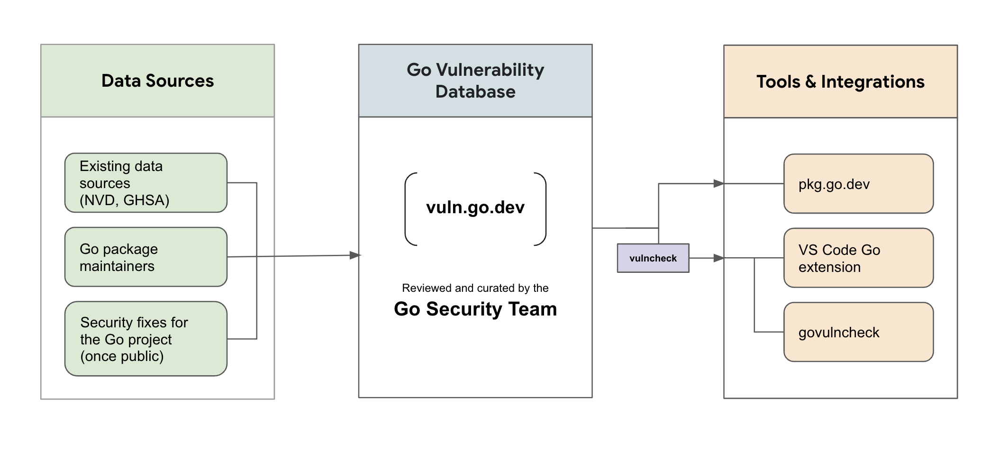

[Back to Go Security](/security)

## Overview

Go helps developers detect, assess, and resolve errors or weaknesses that are
at risk of being exploited by attackers. Behind the scenes, the Go team runs a
pipeline to curate reports about vulnerabilities, which are stored in the Go
vulnerability database. Various libraries and tools can read and analyze those
reports to understand how specific user projects may be affected. This
functionality is integrated into the
[Go package discovery site](https://pkg.go.dev) and a new CLI tool,
govulncheck.

This project is a work in progress and under active development.
We welcome your [feedback](#feedback) to help us improve!

**NOTE**: To report a vulnerability in the Go project, please see the [Go Security Policy](/security/policy).

## Architecture

<div class="image">
  <center>
    </img>
  </center>
</div>

Vulnerability management in Go consists of the following high-level pieces:

1. A **data pipeline** collects vulnerability information from various sources,
including the  [National Vulnerability Database (NVD)](https://nvd.nist.gov/),
the [GitHub Advisory Database](https://github.com/advisories),
and [directly from Go package maintainers](/s/vulndb-report-new).
2. A **vulnerability database** is populated with reports using information
from the data pipeline.
All reports in the database are reviewed and curated by the Go Security team.
Reports are formatted in the [Open Source Vulnerability (OSV) format](https://ossf.github.io/osv-schema/)
and accessible through the [API](/security/vuln/database#api).
3. **Integrations** with [pkg.go.dev](https://pkg.go.dev)
and govulncheck to enable developers to find vulnerabilities in
their projects. The
[govulncheck command](https://pkg.go.dev/golang.org/x/vuln/cmd/govulncheck)
analyzes your codebase and only surfaces vulnerabilities that actually affect
you, based on which functions in your code are transitively calling vulnerable
functions. Govulncheck provides a low-noise, reliable way to find known
vulnerabilities in your projects.

## Resources

### Go Vulnerability Database

The [Go vulnerability database](https://vuln.go.dev) contains information
from many existing sources in addition to direct reports by Go package maintainers
to the Go security team.
Each entry in the database is reviewed to ensure that the vulnerability’s description,
package and symbol information, and version details are accurate.

See [go.dev/security/vuln/database](/security/vuln/database) for more information
about the Go vulnerability database,
and [pkg.go.dev/vuln](https://pkg.go.dev/vuln) to view vulnerabilities in
the database in your browser.

We encourage package maintainers to [contribute](#feedback)
information about public vulnerabilities in their own projects and
[send us suggestions](https://golang.org/s/vuln-feedback) on how to reduce
friction.

### Vulnerability Detection for Go

Go’s vulnerability detection aims to provide a low-noise, reliable way for Go
users to learn about known vulnerabilities that may affect their projects.
Vulnerability checking is integrated into Go's tools and services, including
a new command line tool, [govulncheck](https://pkg.go.dev/golang.org/x/vuln/cmd/govulncheck),
the [Go package discovery site](https://pkg.go.dev), [major editors](/security/vuln/editor) like VS Code with the Go extension.

To start using govulncheck, run the following from your project:

```
$ go install golang.org/x/vuln/cmd/govulncheck@latest
$ govulncheck ./...
```

To enable vulnerability detection in your editor, see the instruction in the [editor integration](/security/vuln/editor) page.

### Go CNA

The Go security team is a [CVE Numbering Authority](https://www.cve.org/ProgramOrganization/CNAs).
See [go.dev/security/vuln/cna](/security/vuln/cna) for more information.

## Feedback

We would love for you to contribute and help us make improvements in the
following ways:

- [Contribute new](https://golang.org/s/vulndb-report-new) and
  [update existing](https://go.dev/s/vulndb-report-feedback) information about
  public vulnerabilities for Go packages that you maintain
- [Take this survey](https://golang.org/s/govulncheck-feedback) to share your
  experience using govulncheck
- [Send us feedback](https://golang.org/s/vuln-feedback) about issues and
  feature requests

## FAQs

**How do I report a vulnerability in the Go project?**

Report all security bugs in the Go project by email to [security@golang.org](mailto:security@golang.org).
Read [Go’s Security Policy](/security/policy) for more information about our processes.

**How do I add a public vulnerability to the Go vulnerability database?**

To request addition of a public vulnerability to the Go vulnerability database,
[fill out this form](/s/vulndb-report-new).

A vulnerability is considered public if it has already been disclosed publicly,
or if it exists in a package you maintain (and you are ready to disclose it).
The form is only for public vulnerabilities in importable Go packages that
are not maintained by the Go Team (anything outside the Go standard library,
Go toolchain, and golang.org modules).

The form can also be used to request a new CVE ID.
[Read more here](/security/vuln/cna) about the Go CVE Numbering Authority.

**How do I suggest an edit to a vulnerability?**

To suggest an edit to an existing report in the Go vulnerability database,
[fill out the form here](/s/vulndb-report-feedback).

**How do I report an issue or give feedback about govulncheck?**

Submit your issue or feedback [on the Go issue tracker](/s/vuln-feedback).

**I found this vulnerability in another database. Why is it not in the Go vulnerability database?**

Reports may be excluded from the Go vulnerability database for various reasons,
including the relevant vulnerability not being present in a Go package,
the vulnerability being in an installable command instead of an importable package,
or the vulnerability being subsumed by another vulnerability that is already
present in the database.
You can learn more about the Go Security team’s
[reasons for excluding reports here](/security/vuln/database#excluded-reports).
If you think that a report was incorrectly excluded from vuln.go.dev,
[please let us know](/s/vulndb-report-feedback).

**Why does the Go vulnerability database not use severity labels?**

Most vulnerability reporting formats use severity labels such as "LOW," "MEDIUM",
and "CRITICAL" to indicate the impact of different vulnerabilities and
to help developers prioritize security issues.
For several reasons, however, Go avoids using such labels.

The impact of a vulnerability is rarely universal,
which means that severity indicators can often be deceptive.
For example, a crash in a parser may be a critical severity issue if it
is used to parse user-supplied input and can be leveraged in a DoS attack,
but if the parser is used to parse local configuration files,
even calling the severity "low" might be an overstatement.

Labeling severity is also necessarily subjective.
This is true even for [the CVE program](https://www.cve.org/About/Overview),
which posits a formula to break down relevant aspects of a vulnerability,
such as attack vector, complexity, and exploitability.
All of these, however, require subjective evaluation.

We believe good descriptions of vulnerabilities are more useful than severity indicators.
A good description can break down what an issue is,
how it can be triggered, and what consumers should consider when determining
the impact on their own software.

Feel free to [file an issue](/s/vuln-feedback)
if you would like to share your thoughts with us on this topic.
