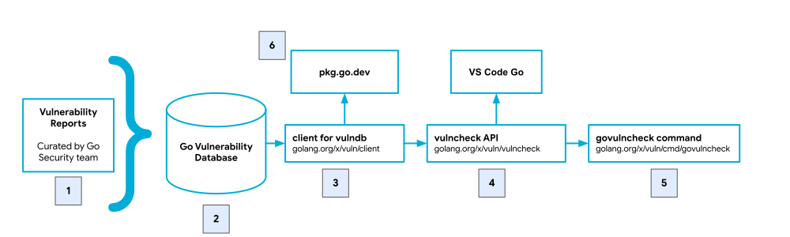

## Overview

This page describes the Go vulnerability management system.

_This project is a work in progress._

## Architecture

  

    </img>
  

The Go vulnerability management system consists of the following high-level
pieces:

1. A **data pipeline** that populates the vulnerability database. Data about
   new vulnerabilities come directly from Go package maintainers or sources such as
   MITRE and GitHub. Reports are curated by the Go Security team.

2. A **vulnerability database** that stores all information presented by
   govulncheck and can be consumed by other clients.

3. A **client library**
   ([golang.org/x/vuln/client](https:/golang.org/x/vuln/client)), which reads data
   from the Go vulnerability database. This is also used by pkg.go.dev to surface
   vulnerabilities.

4. A **vulncheck API**
   ([golang.org/x/vuln/vulncheck](https:/golang.org/x/vuln/vulncheck)), which is
   used to find vulnerabilities affecting Go packages and perform static analysis.
   This API is made available for clients that do not want to run the govulncheck
   binary, such as VS Code Go.

5. The **govulncheck command**
   ([golang.org/x/vuln/cmd/govulncheck](https:/golang.org/x/vuln/cmd/govulncheck),
   a wrapper around the vulncheck library for use on the command line.

6. A **web portal** that presents information about vulnerabilities, hosted at
   [pkg.go.dev/vuln](https://pkg.go.dev/vuln).

## Protocol

The Go vulnerability database is rooted at `https://vuln.go.dev` and
provides data as JSON. We recommend using
[client.Client](https://pkg.go.dev/golang.org/x/vuln/client#Client) to read
data from the Go vulnerability database.

Do not rely on the contents of the x/vulndb repository. The YAML files in that
repository are maintained using an internal format that is subject to change
without warning.

The endpoints in the table below are supported. For each path:

- `$base` is the path portion of a Go vulnerability database URL (`https://vuln.go.dev`).
- `$module` is a module path
- `$vuln` is a Go vulnerabilitiy ID (for example, `GO-2021-1234`)

<table>
  <thead>
    <tr>
      <th>Path</th>
      <th>Description</th>
    </tr>
  </thead>
  <tbody>
    <tr>
      <td><code>$base/index.json</code></td>
      <td>
        List of module paths in the database mapped to its last modified
        timestamp (<a href="https://vuln.go.dev/index.json">link</a>).
      </td>
    </tr>
    <tr>
      <td><code>$base/$module.json</code></td>
      <td>
        List of vulnerability entries for that module (<a href="https://vuln.go.dev/golang.org/x/crypto.json">example</a>).
      </td>
    </tr>
    <tr>
      <td><code>$base/ID/index.json</code></td>
      <td>
        List of all the vulnerability entries in the database.
      </td>
    </tr>
    <tr>
      <td><code>$base/ID/$vuln.json</code></td>
      <td>
        An individual Go vulnerability report.
      </td>
    </tr>
  </tbody>
</table>

Note that these paths and format are provisional and likely to change until an
approved proposal.
